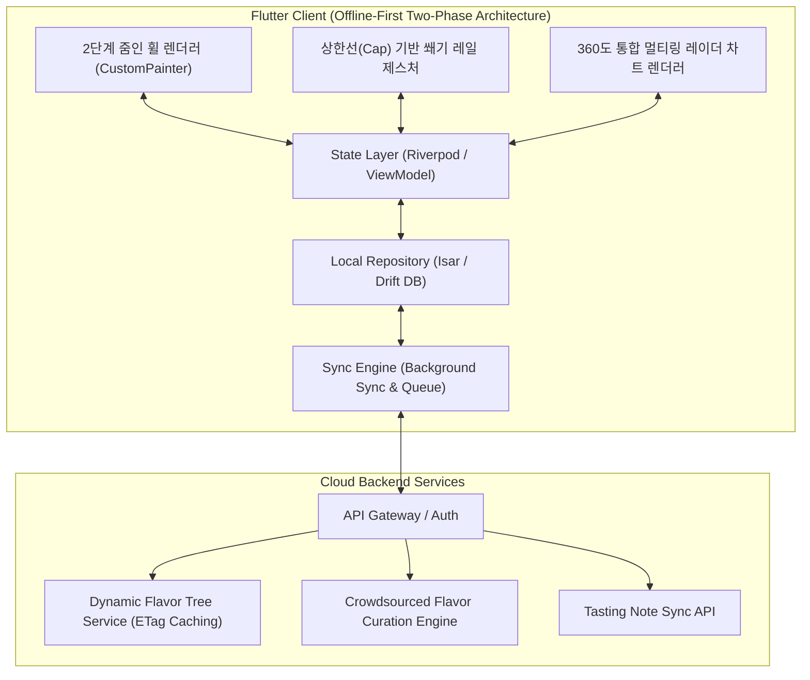
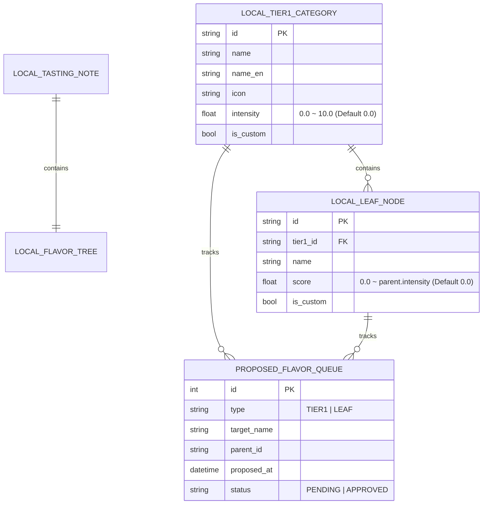

# 🥃 Flavor Wheel (플레이버 휠) - 제품 기획 및 기술 설계서 (PRD & System Spec)

> **"향과 맛 애호가들을 위한 Offline-First 스마트 테이스팅 노트 & 2단계 줌인 플레이버 휠 플랫폼"**  
> *"초기 0점 시작, 대분류 평점 선지정 후 자동 줌인 소분류 분할 평가, 그리고 대분류 안에 소분류가 나누어 들어간 360도 통합 멀티링 레이더 차트 완성을 제공합니다."*

---

## 📌 목차 (Table of Contents)
1. [프로젝트 비전 및 핵심 설계 철학](#1-프로젝트-비전-및-핵심-설계-철학)
2. [핵심 아키텍처 규칙 5대 원칙](#2-핵심-아키텍처-규칙-5대-원칙)
   - 2.1 [Offline-First 영속성 및 동기화 규칙](#21-offline-first-영속성-및-동기화-규칙)
   - 2.2 [초기 0점 및 2단계 줌인(Two-Phase Zoom-in) 인차트 플로우](#22-초기-0점-및-2단계-줌인two-phase-zoom-in-인차트-플로우)
   - 2.3 [대분류 상한선(Cap) 기반 소분류 쐐기 레일 분할 평가](#23-대분류-상한선cap-기반-소분류-쐐기-레일-분할-평가)
   - 2.4 [360도 통합 멀티링 레이더 차트 (대분류-소분류 일체형 결과 뷰)](#24-360도-통합-멀티링-레이더-차트-대분류-소분류-일체형-결과-뷰)
   - 2.5 [인차트 대·소분류 양방향 커스텀 생성 & 큐레이션 생태계](#25-인차트-대소분류-양방향-커스텀-생성--큐레이션-생태계)
3. [시스템 아키텍처 다이어그램](#3-시스템-아키텍처-다이어그램)
4. [상세 기능 요구사항 명세 (FRD)](#4-상세-기능-요구사항-명세-frd)
5. [데이터베이스 스키마 및 JSON 스펙](#5-데이터베이스-스키마-및-json-스펙)
6. [단계별 로드맵 & 마일스톤](#6-단계별-로드맵--마일스톤)
7. [인터랙티브 프로토타입 안내](#7-인터랙티브-프로토타입-안내)

---

## 1. 프로젝트 비전 및 핵심 설계 철학

위스키를 비롯한 주류 및 미식(와인, 커피, 맥주 등) 애호가들이 장소와 네트워크 환경에 구애받지 않고 시음 경험을 정밀하게 기록하고 탐색할 수 있는 플랫폼을 구축합니다.

* **No Blank Screen (항상 즉시 동작)**: 지하 바(Bar)나 위스키 축제 등 오프라인 환경에서도 100% 정상 작동하는 **Offline-First**.
* **Zero Initial Bias (초기 0점 출발)**: 모든 향미 평점은 0점에서 시작하여, 사용자가 시음하며 실제로 감지한 향미만 선별적으로 점수를 부여.
* **Two-Phase Zoom-in Flow (2단계 줌인 평가)**: 대분류 총점을 먼저 정하고 $\rightarrow$ 그 영역 안으로 줌인하여 소분류를 분할 평가하는 구조적이고 명확한 멘탈 모델.
* **Unified 360° Multi-ring Radar (통합 결과 차트)**: 평가를 마치면 대분류 영역 안에 소분류들이 세부 분할 채워진 완성형 360도 플레이버 휠 레이더 차트로 시각화.

---

## 2. 핵심 아키텍처 규칙 5대 원칙

### 2.1 Offline-First 영속성 및 동기화 규칙

1. **Local DB = Single Source of Truth**: 모든 읽기/쓰기 작업은 로컬 데이터베이스(`Isar` 또는 `Drift`)를 최우선으로 통과합니다.
2. **낙관적 업데이트 (Optimistic Updates)**: 서버 응답을 기다리지 않고 로컬에 즉시 커밋 후 UI에 0ms로 반영합니다.
3. **ETag & 버전 해시 기반 델타 캐싱**: 향미 마스터 트리는 앱 최초 실행 시 로컬에 저장되며, 서버 호출 시 ETag 헤더를 비교하여 변경사항이 있을 때만 증분 다운로드(`304 Not Modified` 처리)합니다.

---

### 2.2 초기 0점 및 2단계 줌인(Two-Phase Zoom-in) 인차트 플로우

```mermaid
journey
    title 2단계 줌인 테이스팅 플로우
    section Step 1: 대분류 선지정
      모든 대분류 0점에서 휠 회전 탐색: 5: 유저
      외곽 림 아크를 위로 끌어올려 대분류 총점 확정: 5: 유저
    section Step 2: 자동 줌인 & 소분류 평가
      대분류 점수 확정 시 부드러운 자동 줌인: 5: 시스템
      대분류 점수 상한선 안에서 소분류 쐐기 레일 슬라이드: 5: 유저
      상단 ◀ 버튼으로 줌아웃 후 다음 대분류 이동: 4: 유저
    section Step 3: 최종 360도 차트 완성
      전체 대분류 작성 완료 후 [결과 보기] 클릭: 5: 유저
      대분류 안에 소분류가 나뉜 360도 통합 레이더 차트 렌더링: 5: 시스템
```

---

### 2.3 대분류 상한선(Cap) 기반 소분류 쐐기 레일 분할 평가

* **상한선 규칙 (Bounding Rule)**:
  대분류의 점수($S_{\text{parent}} \in [0.0, 10.0]$)가 해당 섹터 내부 소분류들의 **최대 상한선(Cap)**이 됩니다:
  $$0.0 \le S_{\text{subnode}, i} \le S_{\text{parent}}$$
* 사용자는 대분류로 확보된 부채꼴 영역 안에서, 각 소분류 쐐기 레일의 노브를 조작하여 강도를 배분합니다.

---

### 2.4 360도 통합 멀티링 레이더 차트 (대분류-소분류 일체형 결과 뷰)

모든 분류의 평가를 마치고 저장을 진행하면, **대분류 안에 소분류가 정밀 분할되어 채워진 360도 완성형 플레이버 휠 레이더 차트**가 렌더링됩니다.

```
                  [ 360도 완성형 플레이버 휠 ]
                          ( 10.0 )
                         .---'---.
                     .-'           '-.
                   .'   [Sweet: 8.0]  '.
                  /  ┌───┬───┬───┐      \
                 ;   │바 │벌 │캐 │       ;
                 |   │닐 │   │러 │       |  <- 대분류 안에 소분류들이
                 ;   │라 │꿀 │멜 │       ;     부채꼴 쐐기로 나누어 채워짐
                  \  └───┴───┴───┘      /
                   '.   [Woody: 6.0]  .'
                     '-.           .-'
                         '---.---'
                          ( 0.0 )
```

---

### 2.5 인차트 대·소분류 양방향 커스텀 생성 & 큐레이션 생태계

* **인차트 소분류 추가**: 줌인된 섹터 내 `[+]` 쐐기 레일을 통해 소분류 즉시 생성.
* **인차트 대분류 추가**: 휠 회전 끝의 `[+]` 섹터에서 새 대분류 즉시 생성.
* **크라우드소싱 큐레이션**: 로컬에 즉시 반영(0ms)되고, 노트 저장 시 서버로 전송되어 관리자 승인 후 공식 트리로 승격.

---

## 3. 시스템 아키텍처 다이어그램



---

## 4. 상세 기능 요구사항 명세 (FRD)

| ID | 기능 영역 | 세부 기능 | 우선순위 | 상세 기술 명세 |
| :--- | :--- | :--- | :---: | :--- |
| **FR-01** | **2단계 플로우** | **대분류 평점 선지정** | **P1** | 초기 0점에서 외곽 림을 드래그하여 대분류 점수(0~10)를 먼저 확정 |
| **FR-02** | **2단계 플로우** | **자동 줌인 소분류 평가**| **P1** | 대분류 점수 확정 시 자동 줌인되며 대분류 점수 상한선(Cap) 내에서 쐐기 레일 평가 |
| **FR-03** | **결과 렌더링** | **360도 통합 레이더 차트**| **P1** | 대분류 안에 소분류가 나누어 들어간 완성형 360도 플레이버 휠 카드 뷰 제공 |
| **FR-04** | **커스텀 생성** | **인차트 대·소분류 생성** | **P1** | 줌인 섹터 내 [+] 레일 및 휠 끝 [+] 섹터에서 양방향 즉시 생성 (0ms 영속) |
| **FR-05** | **Offline-First** | **로컬 저장 및 동기화** | **P1** | 로컬 Isar DB에 노트/커스텀 노드 즉시 영속화, 네트워크 복구 시 자동 백그라운드 큐 동기화 |

---

## 5. 데이터베이스 스키마 및 JSON 스펙



---

## 6. 단계별 로드맵 & 마일스톤

| 단계 | 마일스톤 | 산출물 및 검증 기준 | 상태 |
| :--- | :--- | :--- | :---: |
| **1단계** | **설계 & 프로토타입** | • PRD 및 2단계 줌인 인차트 규칙 확립<br>• 360도 통합 멀티링 레이더 차트 HTML 프로토타입 | 🟢 **완료** |
| **2단계** | **Flutter 기반 엔진** | • Isar 로컬 DB 및 Sync Engine 구축<br>• CustomPainter 기반 2단계 줌인 & 360도 통합 휠 위젯 | ⚪ 예정 |
| **3단계** | **동적 API & 큐레이션** | • Dynamic Flavor Tree API & 대/소분류 승격 파이프라인 연동<br>• 음성 STT & LLM 요약 자동 완성 파이프라인 | ⚪ 예정 |
| **4단계** | **검색/추천 & 배포** | • 위스키 색인 오프라인 검색 엔진<br>• 플레이버 벡터 유사도 추천 및 베타 배포 | ⚪ 예정 |

---

## 7. 인터랙티브 프로토타입 안내

프로젝트 내 [prototype/index.html](file:///Users/chanholee/Desktop/project/FlavorWheelProject/prototype/index.html)에서 위 규칙이 모두 반영된 모바일 프로토타입을 즉시 테스트하실 수 있습니다:

* **초기 0점 시작**: 휠을 돌려 대분류를 탐색하고, 외곽 림을 위로 드래그해 대분류 점수를 선지정
* **자동 줌인 & 소분류 쐐기 레일 평가**: 대분류 점수 상한선 안에서 소분류 노브들을 슬라이드 조작
* **360도 통합 멀티링 레이더 차트**: 하단 `[🏆 완성된 차트 보기 / 저장]` 클릭 시 대분류 안에 소분류가 나뉜 완성형 차트 뷰 제공
