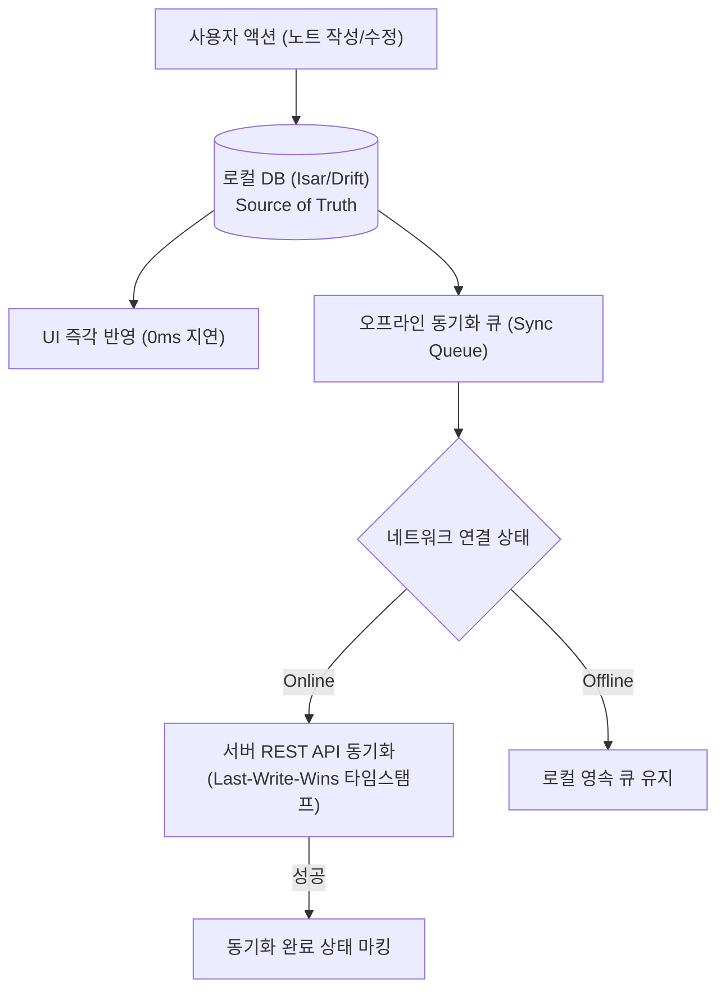
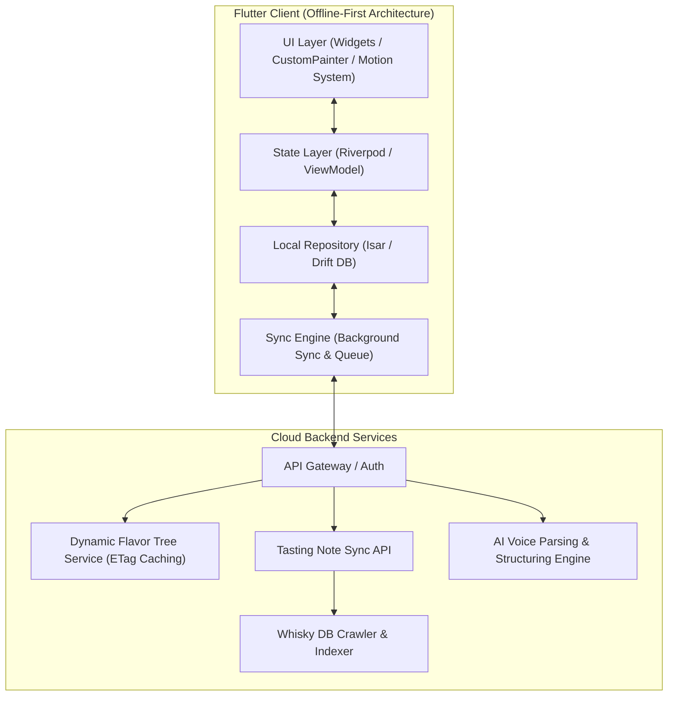
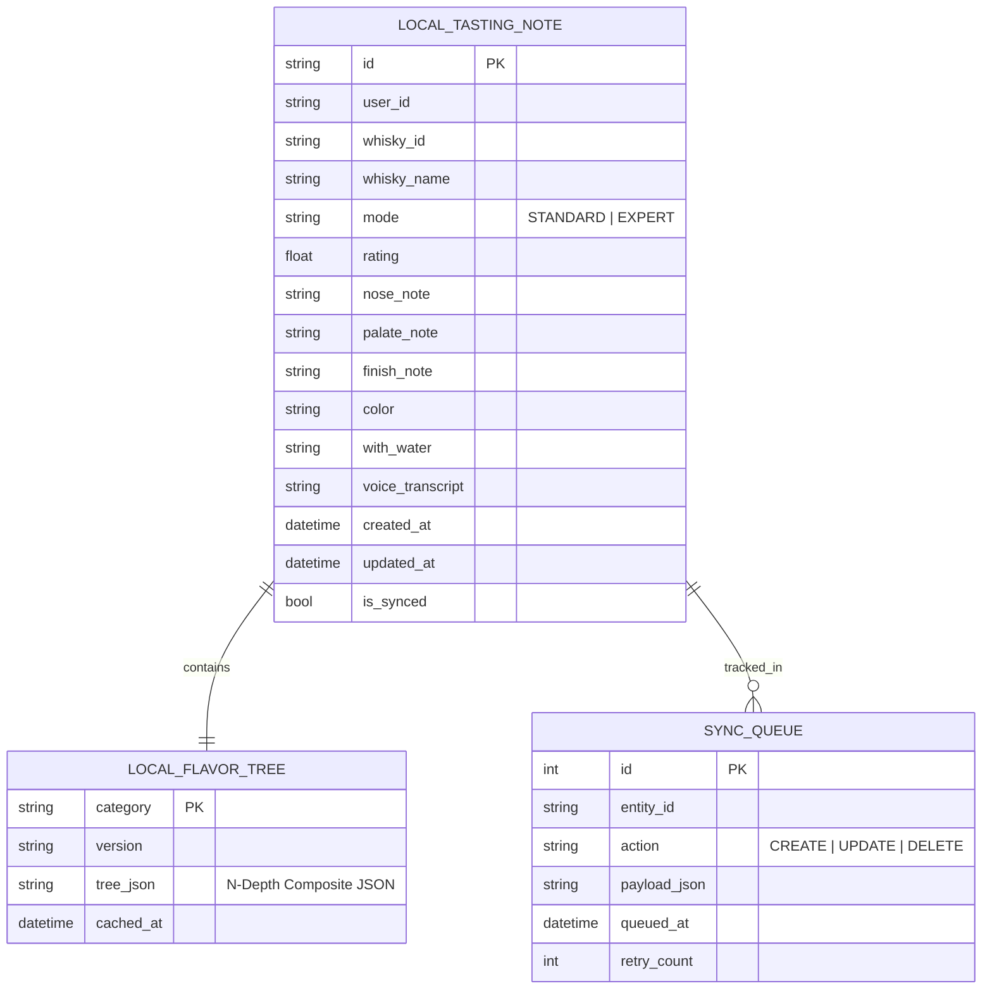

# 🥃 Flavor Wheel (플레이버 휠) - 제품 기획 및 기술 설계서 (PRD & System Spec)

> **"향과 맛 애호가들을 위한 Offline-First 스마트 테이스팅 노트 & 동적 플레이버 휠 플랫폼"**  
> *"API 기반 동적 계층형 향미 트리, 유려한 60fps 인터랙티브 모션, 그리고 완벽한 오프라인 경험을 제공합니다."*

---

## 📌 목차 (Table of Contents)
1. [프로젝트 비전 및 핵심 설계 철학](#1-프로젝트-비전-및-핵심-설계-철학)
2. [핵심 아키텍처 규칙 4대 원칙](#2-핵심-아키텍처-규칙-4대-원칙)
   - 2.1 [Offline-First 영속성 및 동기화 규칙](#21-offline-first-영속성-및-동기화-규칙)
   - 2.2 [동적 계층형 데이터 구조 (N-Depth Flavor Tree)](#22-동적-계층형-데이터-구조-n-depth-flavor-tree)
   - 2.3 [표현 방식 및 멀티링 렌더링 규칙](#23-표현-방식-및-멀티링-렌더링-규칙)
   - 2.4 [UI/UX 모션 & 인터랙션 디자인 시스템](#24-uiux-모션--인터랙션-디자인-시스템)
3. [시스템 아키텍처 다이어그램](#3-시스템-아키텍처-다이어그램)
4. [상세 기능 요구사항 명세 (FRD)](#4-상세-기능-요구사항-명세-frd)
5. [데이터베이스 스키마 및 JSON 스펙](#5-데이터베이스-스키마-및-json-스펙)
6. [단계별 로드맵 & 마일스톤](#6-단계별-로드맵--마일스톤)
7. [인터랙티브 프로토타입 안내](#7-인터랙티브-프로토타입-안내)

---

## 1. 프로젝트 비전 및 핵심 설계 철학

위스키를 비롯한 주류 및 미식(와인, 커피, 맥주 등) 애호가들이 장소와 네트워크 환경에 구애받지 않고 시음 경험을 정밀하게 기록하고 탐색할 수 있는 플랫폼을 구축합니다.

* **No Blank Screen (항상 즉시 동작)**: 지하 바(Bar)나 위스키 축제 등 네트워크가 불안정한 환경에서도 100% 정상 작동하는 **Offline-First**.
* **Zero Hardcoded Domain (확장 가능한 구조)**: 위스키뿐 아니라 향후 와인/커피로의 확장을 위해 모든 향미 분류 체계와 UI 구조는 **API를 통한 동적 트리 주입 방식**을 채택.
* **Fluid Micro-Interactions (감각적 사용자 경험)**: 정적인 차트가 아닌, 손끝의 터치에 실시간으로 반응하고 부드럽게 모핑(Morphing)되는 **60fps 모션 시스템**.

---

## 2. 핵심 아키텍처 규칙 4대 원칙

### 2.1 Offline-First 영속성 및 동기화 규칙



1. **Local DB = Single Source of Truth**:  
   모든 읽기/쓰기 작업은 로컬 데이터베이스(`Isar` 또는 `Drift`)를 최우선으로 통과합니다.
2. **낙관적 업데이트 (Optimistic Updates)**:  
   서버 응답을 기다리지 않고 로컬에 즉시 커밋 후 UI에 반영하며, 백그라운드 워커가 변경분을 서버로 동기화합니다.
3. **충돌 해결 전략 (Conflict Resolution)**:  
   `updated_at` 타임스탬프 기반의 **Last-Write-Wins (LWW)** 원칙을 기본으로 적용합니다.
4. **ETag & 버전 해시 기반 델타 캐싱**:  
   향미 마스터 트리는 앱 최초 실행 시 로컬에 저장되며, 서버 호출 시 ETag 헤더를 비교하여 변경사항이 있을 때만 증분 다운로드(`304 Not Modified` 처리)합니다.

---

### 2.2 동적 계층형 데이터 구조 (N-Depth Flavor Tree)

하드코딩된 열거형(Enum) 대신, 깊이(Depth) 제한 없는 **재귀적 복합체(Composite Node) JSON 스키마**를 통해 API에서 향미 분류 체계를 동적으로 수신합니다.

#### 📌 향미 트리 JSON 스펙 예시
```json
{
  "category": "whisky",
  "version": "1.0.4",
  "hash": "a8f3b9c2",
  "nodes": [
    {
      "id": "sweet_vanilla",
      "name": "달콤함/바닐라",
      "nameEn": "Sweet & Vanilla",
      "icon": "🍯",
      "colorHex": "#F59E0B",
      "depth": 1,
      "intensity": 0.0,
      "children": [
        {
          "id": "vanilla",
          "name": "바닐라",
          "depth": 2,
          "children": [
            { "id": "creme_brulee", "name": "크렘 브륄레", "depth": 3 },
            { "id": "custard", "name": "커스터드", "depth": 3 }
          ]
        },
        {
          "id": "honey_syrup",
          "name": "벌꿀/시럽",
          "depth": 2,
          "children": [
            { "id": "wildflower_honey", "name": "야생화 꿀", "depth": 3 },
            { "id": "maple_syrup", "name": "메이플 시럽", "depth": 3 }
          ]
        }
      ]
    }
  ]
}
```

* **동적 카테고리 엔드포인트**:  
  `GET /api/v1/flavor-trees?category={whisky|wine|coffee}` 파라미터에 따라 완전히 다른 도메인의 향미 트리와 테마 색상을 클라이언트에 실시간 주입.

---

### 2.3 표현 방식 및 멀티링 렌더링 규칙


1. **하이브리드 멀티링 (Multi-ring / Sunburst & Radar) 휠**:
   * **Outer Base**: 1단계 대분류 8개 축(Peaty, Fruity, Sweet, Floral, Woody, Spicy, Malty, Winey)의 레이더 차트 다이얼.
   * **Expanding Radial Ring**: 대분류 섹터를 터치하면 2~3단계 하위 세부 향미가 바깥쪽으로 부드럽게 방사형(Radial)으로 펼쳐지며 확장.
2. **동적 가중치 전파 (Hierarchical Weight Propagation)**:
   * 하위 소분류(Tier-3) 아로마를 선택하거나 강도를 높이면 부모 대분류(Tier-1)의 총 강도 수치에 가중치가 실시간 자동 반영.

---

### 2.4 UI/UX 모션 & 인터랙션 디자인 시스템

모든 UI 상태 전이와 차트 변형에는 불연속적인 점프(Pop-in) 없이 정교한 모션 토큰과 이징 곡선을 적용합니다.

```
+------------------+-------------------------------------------------------+
| Motion Token     | Duration & Purpose                                    |
+------------------+-------------------------------------------------------+
| durationMicro    | 100ms : 터치 탭, 햅틱 연동, 버튼 눌림 피드백          |
| durationFast     | 150ms : 태그 칩 활성화, 토글 스위치, 체크박스         |
| durationNormal   | 300ms : 폼 확장/축소, 탭 전환, 바텀시트 슬라이드      |
| durationMorph    | 500ms : 레이더 폴리곤 정점 모핑, 멀티링 방사형 펼침   |
+------------------+-------------------------------------------------------+
```

* **표준 이징 곡선**:
  * **진입 및 펼침**: `Curves.easeOutCubic` (초기 속도감 후 부드러운 안착)
  * **형태 변형 (Morphing)**: `Curves.easeInOutCubic` (자연스러운 유기적 팽창)
* **CustomPainter 정점 보간 (Lerp)**:
  * 드래그 및 슬라이더 조작 시 캔버스 렌더러가 이전 정점 좌표와 목표 좌표를 선형 보간(`lerpDouble`)하여 60fps의 매끄러운 형태 변형 보장.

---

## 3. 시스템 아키텍처 다이어그램



---

## 4. 상세 기능 요구사항 명세 (FRD)

| ID | 기능 영역 | 세부 기능 | 우선순위 | 상세 기술 명세 |
| :--- | :--- | :--- | :---: | :--- |
| **FR-01** | **Offline-First** | **로컬 저장 및 동기화** | **P1** | 로컬 Isar DB에 노트 즉시 영속화, 네트워크 복구 시 자동 백그라운드 큐 동기화 |
| **FR-02** | **동적 휠 엔진** | **N-Depth 멀티링 휠** | **P1** | API JSON 트리를 파싱하여 8대 축 + 하위 세부 향미 방사형 렌더링 및 0~5점 조절 |
| **FR-03** | **모션 시스템** | **60fps 정점 모핑** | **P1** | 휠 조작 및 하위 태그 선택 시 500ms easeOutCubic으로 부드러운 폴리곤 모핑 |
| **FR-04** | **테이스팅 폼** | **표준 / 전문가 모드** | **P1** | 토글 시 300ms 애니메이션으로 색상(Color), 가수(With Water), 바디감 폼 확장 |
| **FR-05** | **AI 음성 파이프라인**| **음성 구조화 요약** | **P2** | 음성 스트림 인식 후 LLM이 Nose/Palate/Finish 및 휠 수치를 자동 파싱 |
| **FR-06** | **위스키 검색** | **오프라인 캐시 검색** | **P1** | 기기에 캐시된 위스키 마스터 데이터를 기반으로 즉각적인 오프라인 자동완성 검색 |
| **FR-07** | **테이스팅 카드** | **카드 시각화 & 공유** | **P1** | 작성된 노트를 완성형 카드 뷰로 렌더링 및 이미지/SNS 내보내기 |

---

## 5. 데이터베이스 스키마 및 JSON 스펙



---

## 6. 단계별 로드맵 & 마일스톤

| 단계 | 마일스톤 | 산출물 및 검증 기준 | 상태 |
| :--- | :--- | :--- | :---: |
| **1단계** | **설계 & 프로토타입** | • PRD 및 아키텍처 규칙 확립<br>• 동적 N-Depth 멀티링 휠 HTML 프로토타입 | 🟢 **완료** |
| **2단계** | **Flutter 기반 엔진** | • Isar 로컬 DB 및 Sync Engine 구축<br>• CustomPainter 기반 60fps 멀티링 휠 위젯 개발 | ⚪ 예정 |
| **3단계** | **동적 API & AI 연동** | • Dynamic Flavor Tree API 연동 (ETag)<br>• 음성 STT & LLM 요약 자동 완성 파이프라인 | ⚪ 예정 |
| **4단계** | **검색/추천 & 배포** | • 위스키 색인 오프라인 검색 엔진<br>• 플레이버 벡터 유사도 추천 및 베타 배포 | ⚪ 예정 |

---

## 7. 인터랙티브 프로토타입 안내

프로젝트 내 [prototype/index.html](file:///Users/chanholee/Desktop/project/FlavorWheelProject/prototype/index.html)에서 위 규칙이 모두 반영된 모바일 프로토타입을 즉시 테스트하실 수 있습니다:

* **동적 트리 시뮬레이션**: API로부터 계층형 JSON을 받아 대분류(Tier-1) 및 하위 세부 향미(Tier-2/3)를 방사형으로 펼치는 인터랙션
* **60fps 모션 토큰**: 휠 조작 및 태그 선택 시 부드러운 면적 모핑과 방사형 펼침 애니메이션
* **Offline-First 시뮬레이터**: 로컬 즉시 저장 피드백 및 모드 전환
