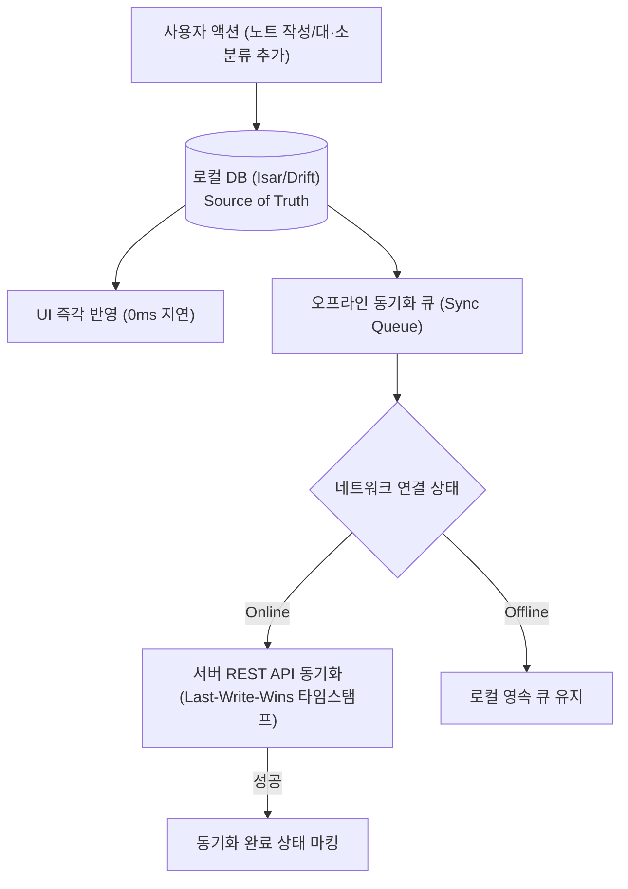
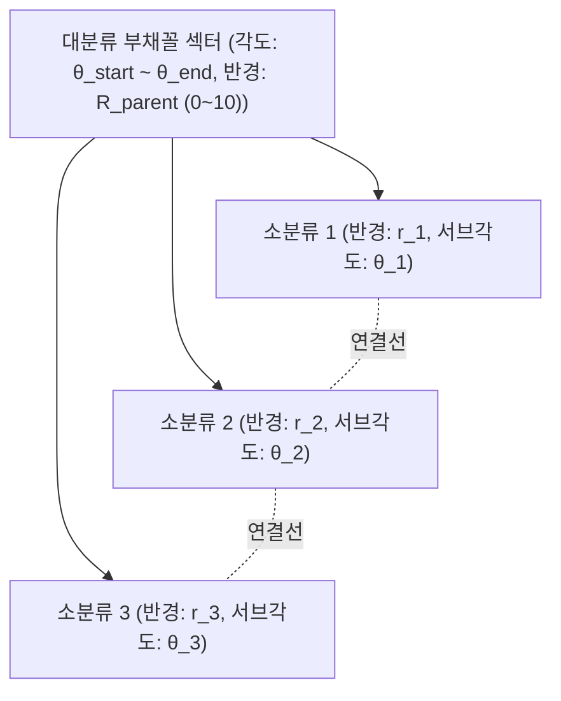
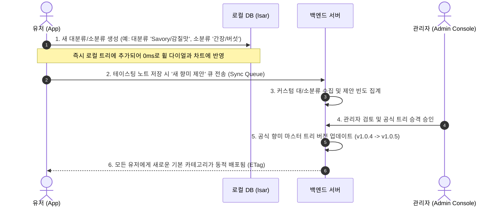
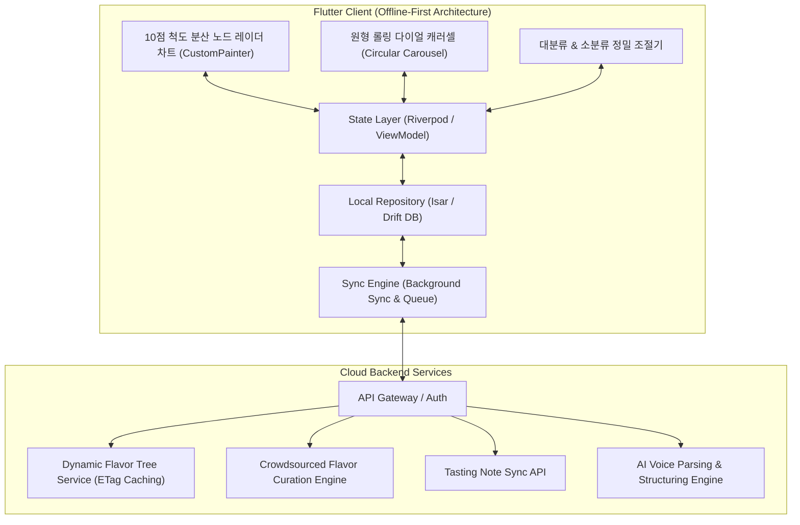
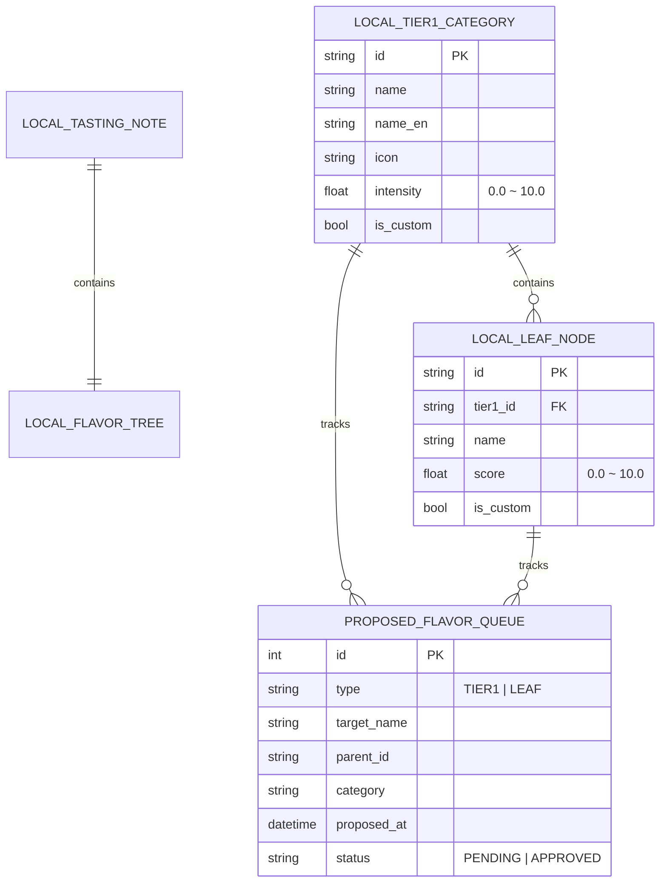

# 🥃 Flavor Wheel (플레이버 휠) - 제품 기획 및 기술 설계서 (PRD & System Spec)

> **"향과 맛 애호가들을 위한 Offline-First 스마트 테이스팅 노트 & 원형 롤링 다이얼 플레이버 휠 플랫폼"**  
> *"10점 척도 대분류 섹터 내 소분류 분산 노드 차트, 원형 롤링 다이얼 캐러셀 UX, 대분류/소분류 양방향 커스텀 생성 및 크라우드소싱 큐레이션 생태계를 제공합니다."*

---

## 📌 목차 (Table of Contents)
1. [프로젝트 비전 및 핵심 설계 철학](#1-프로젝트-비전-및-핵심-설계-철학)
2. [핵심 아키텍처 규칙 5대 원칙](#2-핵심-아키텍처-규칙-5대-원칙)
   - 2.1 [Offline-First 영속성 및 동기화 규칙](#21-offline-first-영속성-및-동기화-규칙)
   - 2.2 [10점 척도 & 대분류 섹터 내 소분류 분산 노드 차트 모델](#22-10점-척도--대분류-섹터-내-소분류-분산-노드-차트-모델)
   - 2.3 [원형 롤링 다이얼 캐러셀 UX (Circular Dial Carousel)](#23-원형-롤링-다이얼-캐러셀-ux-circular-dial-carousel)
   - 2.4 [대분류 및 소분류 양방향 커스텀 생성 & 큐레이션 생태계](#24-대분류-및-소분류-양방향-커스텀-생성--큐레이션-생태계)
   - 2.5 [UI/UX 모션 & 인터랙션 디자인 시스템 (60fps)](#25-uiux-모션--인터랙션-디자인-시스템-60fps)
3. [시스템 아키텍처 다이어그램](#3-시스템-아키텍처-다이어그램)
4. [상세 기능 요구사항 명세 (FRD)](#4-상세-기능-요구사항-명세-frd)
5. [데이터베이스 스키마 및 JSON 스펙](#5-데이터베이스-스키마-및-json-스펙)
6. [단계별 로드맵 & 마일스톤](#6-단계별-로드맵--마일스톤)
7. [인터랙티브 프로토타입 안내](#7-인터랙티브-프로토타입-안내)

---

## 1. 프로젝트 비전 및 핵심 설계 철학

위스키를 비롯한 주류 및 미식(와인, 커피, 맥주 등) 애호가들이 장소와 네트워크 환경에 구애받지 않고 시음 경험을 정밀하게 기록하고 탐색할 수 있는 플랫폼을 구축합니다.

* **No Blank Screen (항상 즉시 동작)**: 지하 바(Bar)나 위스키 축제 등 오프라인 환경에서도 100% 정상 작동하는 **Offline-First**.
* **Distributed Subnodes in Sector (섹터 내 분산 노드 시각화)**: 대분류 영역(0~10) 안에 소분류 노드들이 독립된 점과 연결망으로 분산 렌더링되어 풍미 분포를 한눈에 파악.
* **Circular Dial Navigation (원형 롤링 다이얼 UX)**: 원형으로 돌아가는 다이얼을 스크롤하며 대분류를 탐색하고, 대분류 내에서 소분류 점수를 부여하는 감각적인 인터랙션.
* **Bidirectional Custom Tree Evolution (양방향 커스텀 확장)**: 소분류뿐 아니라 **대분류까지 사용자가 직접 추가**할 수 있으며, 서버 큐레이션을 거쳐 공식 기본 카테고리로 승격되는 자가 진화형 향미 사전.

---

## 2. 핵심 아키텍처 규칙 5대 원칙

### 2.1 Offline-First 영속성 및 동기화 규칙



1. **Local DB = Single Source of Truth**: 모든 읽기/쓰기 작업은 로컬 데이터베이스(`Isar` 또는 `Drift`)를 최우선으로 통과합니다.
2. **낙관적 업데이트 (Optimistic Updates)**: 서버 응답을 기다리지 않고 로컬에 즉시 커밋 후 UI에 0ms로 반영합니다.
3. **ETag & 버전 해시 기반 델타 캐싱**: 향미 마스터 트리는 앱 최초 실행 시 로컬에 저장되며, 서버 호출 시 ETag 헤더를 비교하여 변경사항이 있을 때만 증분 다운로드(`304 Not Modified` 처리)합니다.

---

### 2.2 10점 척도 & 대분류 섹터 내 소분류 분산 노드 차트 모델

모든 대분류 및 소분류의 강도는 **`0.0 ~ 10.0` 10점 척도**로 정밀 조절됩니다.



* **대분류 영역 (Parent Sector)**: 대분류의 설정 강도(예: 6.0/10.0)가 해당 부채꼴 섹터의 외곽 기준 영역을 형성.
* **소분류 분산 노드 (Distributed Subnodes)**:
  - 대분류 섹터 각도 범위($[\theta_{\text{start}}, \theta_{\text{end}}]$) 내에서 각 소분류 노드가 자신의 점수($r_i \in [0, 10]$)에 비례하는 반경 거리와 고유한 서브 각도에 배치.
  - 각 소분류 노드는 발광 도트(Glow Point)와 세부 아로마 라벨, 그리고 인접 노드 간의 네온 연결선으로 렌더링되어 섹터 내부의 향미 밀도를 시각화.

---

### 2.3 원형 롤링 다이얼 캐러셀 UX (Circular Dial Carousel)

```
[ 상단 ] 10점 척도 전체 레이더 차트 (대분류 섹터 + 소분류 분산 노드 60fps 실시간 렌더링)
   ▲
   │ (실시간 포커싱 & 회전)
   ▼
[ 중앙 ] ──( 🪵 Woody )──[ 🍯 Sweet & Vanilla (선택됨) ]──( 🍎 Fruity )──[ ➕ 새 대분류 ]──
         (원형 롤링 다이얼을 좌우로 스크롤하여 대분류를 탐색 및 선택)
   ▲
   │
   ▼
[ 하단 ] 🍯 Sweet & Vanilla
         • 대분류 총 강도: [━━━━●━━━━] 6.0 / 10.0
         • 소분류 1 [바닐라]: [━━━━━━●━] 8.0 / 10.0
         • 소분류 2 [벌  꿀]: [━━━━●━━━━] 6.0 / 10.0
         • 소분류 3 [캐러멜]: [━━●━━━━━━] 4.0 / 10.0
         [ ➕ 새 소분류 추가하기 ]
```

1. **원형 롤링 스크롤**: 중앙의 대분류 다이얼을 휠 형태로 돌려가며 원하는 대분류를 선택.
2. **하단 소분류 편집**: 선택된 대분류의 총 강도(0~10) 및 하위 소분류들의 개별 점수(0~10)를 슬라이더로 조절.
3. **다음 대분류 이동**: 다이얼을 돌려 다음 대분류로 이동하여 동일하게 작성.

---

### 2.4 대분류 및 소분류 양방향 커스텀 생성 & 큐레이션 생태계

원하는 대분류 또는 소분류가 기본 트리에 없을 경우, 사용자가 즉시 생성할 수 있습니다.



---

### 2.5 UI/UX 모션 & 인터랙션 디자인 시스템 (60fps)

```
+------------------+-------------------------------------------------------+
| Motion Token     | Duration & Purpose                                    |
+------------------+-------------------------------------------------------+
| durationMicro    | 100ms : 터치 탭, 햅틱 연동, 버튼 눌림 피드백          |
| durationFast     | 150ms : 슬라이더 드래그 반응, 소분류 노드 하이라이트   |
| durationNormal   | 300ms : 원형 다이얼 롤링 스냅, 폼 확장/축소           |
| durationMorph    | 500ms : 레이더 폴리곤 정점 모핑 (Curves.easeInOutCubic)|
+------------------+-------------------------------------------------------+
```

---

## 3. 시스템 아키텍처 다이어그램



---

## 4. 상세 기능 요구사항 명세 (FRD)

| ID | 기능 영역 | 세부 기능 | 우선순위 | 상세 기술 명세 |
| :--- | :--- | :--- | :---: | :--- |
| **FR-01** | **차트 렌더링** | **섹터 내 소분류 분산 노드**| **P1** | 대분류 영역(0~10) 안에 각 소분류 노드가 독립 점수(0~10) 반경 거리로 분산 렌더링 |
| **FR-02** | **네비게이션** | **원형 롤링 다이얼 캐러셀** | **P1** | 원형 스크롤로 대분류를 회전 선택하고, 선택된 대분류의 소분류 편집 패널 즉시 연동 |
| **FR-03** | **커스텀 생성** | **대분류 / 소분류 생성** | **P1** | 다이얼 끝의 [+ 새 대분류] 및 패널의 [+ 새 소분류]를 통해 양방향 커스텀 생성 (0ms 영속) |
| **FR-04** | **서버 큐레이션**| **공식 트리 승격 파이프라인**| **P2** | 유저 제안 수집 -> 관리자 승격 승인 -> 전체 유저 기본 카테고리 동적 배포 |
| **FR-05** | **Offline-First** | **로컬 저장 및 동기화** | **P1** | 로컬 Isar DB에 노트/커스텀 노드 즉시 영속화, 네트워크 복구 시 자동 백그라운드 큐 동기화 |
| **FR-06** | **테이스팅 폼** | **표준 / 전문가 모드** | **P1** | 토글 시 300ms 애니메이션으로 색상(Color), 가수(With Water), 바디감 폼 확장 |
| **FR-07** | **AI 음성 파이프라인**| **음성 구조화 요약** | **P2** | 음성 스트림 인식 후 LLM이 Nose/Palate/Finish 및 대/소분류별 10점 척도 점수를 자동 파싱 |

---

## 5. 데이터베이스 스키마 및 JSON 스펙



---

## 6. 단계별 로드맵 & 마일스톤

| 단계 | 마일스톤 | 산출물 및 검증 기준 | 상태 |
| :--- | :--- | :--- | :---: |
| **1단계** | **설계 & 프로토타입** | • PRD 및 10점 척도 분산 노드 차트 규칙 확립<br>• 원형 롤링 다이얼 캐러셀 HTML 프로토타입 | 🟢 **완료** |
| **2단계** | **Flutter 기반 엔진** | • Isar 로컬 DB 및 Sync Engine 구축<br>• CustomPainter 기반 10점 척도 분산 노드 휠 위젯 | ⚪ 예정 |
| **3단계** | **동적 API & 큐레이션** | • Dynamic Flavor Tree API & 대/소분류 승격 파이프라인 연동<br>• 음성 STT & LLM 요약 자동 완성 파이프라인 | ⚪ 예정 |
| **4단계** | **검색/추천 & 배포** | • 위스키 색인 오프라인 검색 엔진<br>• 플레이버 벡터 유사도 추천 및 베타 배포 | ⚪ 예정 |

---

## 7. 인터랙티브 프로토타입 안내

프로젝트 내 [prototype/index.html](file:///Users/chanholee/Desktop/project/FlavorWheelProject/prototype/index.html)에서 위 규칙이 모두 반영된 모바일 프로토타입을 즉시 테스트하실 수 있습니다:

* **10점 척도 분산 노드 차트**: 대분류 섹터 영역 안에 각 소분류 노드가 자신의 점수(0~10)에 맞게 발광 점과 연결선으로 분산 표시
* **원형 롤링 다이얼 캐러셀**: 중앙 다이얼을 좌우로 스크롤하여 대분류를 부드럽게 회전 선택
* **대분류 & 소분류 양방향 생성**: `[+ 새 대분류 추가]` 및 `[+ 새 소분류 추가]` 모달을 통해 자유롭게 카테고리 확장
