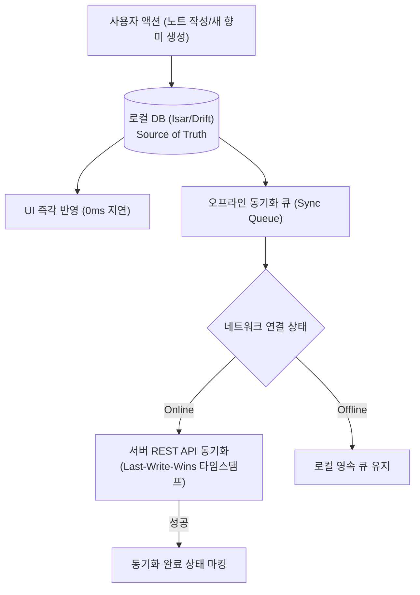
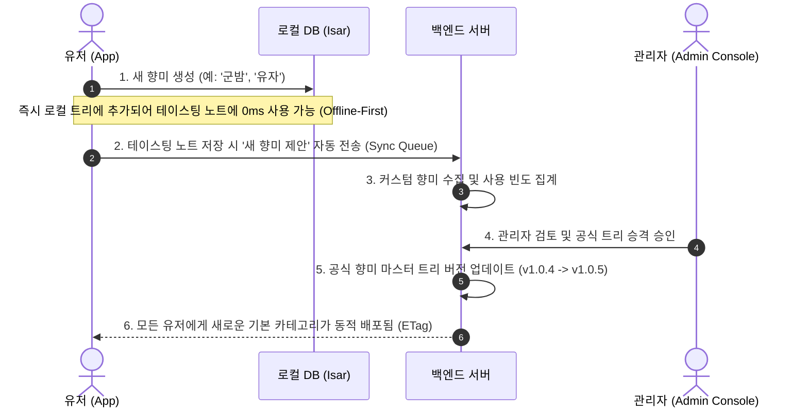
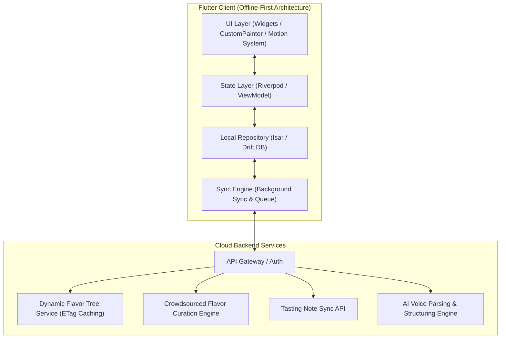
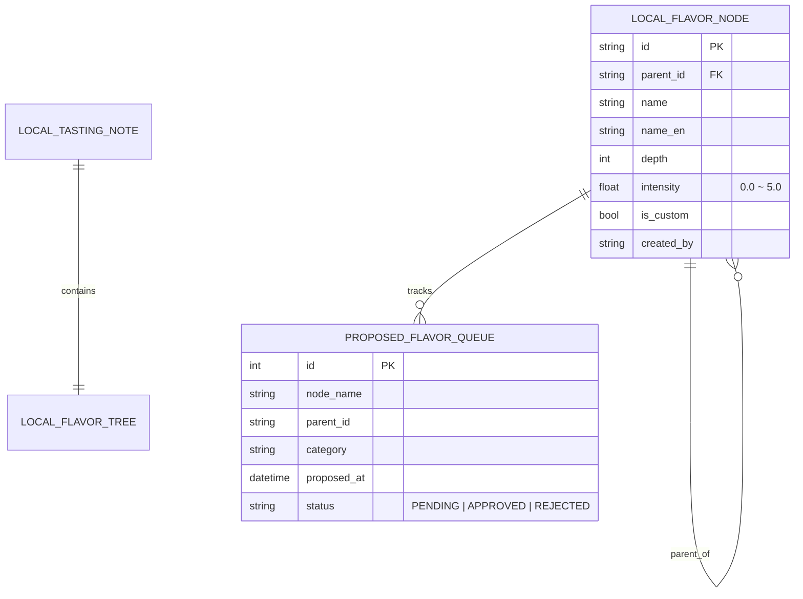

# 🥃 Flavor Wheel (플레이버 휠) - 제품 기획 및 기술 설계서 (PRD & System Spec)

> **"향과 맛 애호가들을 위한 Offline-First 스마트 테이스팅 노트 & 동적 플레이버 휠 플랫폼"**  
> *"API 기반 동적 계층형 향미 트리, 최하단(Leaf) 개별 점수화, 사용자 커스텀 향미 생성 및 크라우드소싱 큐레이션 생태계를 제공합니다."*

---

## 📌 목차 (Table of Contents)
1. [프로젝트 비전 및 핵심 설계 철학](#1-프로젝트-비전-및-핵심-설계-철학)
2. [핵심 아키텍처 규칙 5대 원칙](#2-핵심-아키텍처-규칙-5대-원칙)
   - 2.1 [Offline-First 영속성 및 동기화 규칙](#21-offline-first-영속성-및-동기화-규칙)
   - 2.2 [동적 계층형 데이터 구조 (N-Depth Flavor Tree)](#22-동적-계층형-데이터-구조-n-depth-flavor-tree)
   - 2.3 [최하단(Leaf) 개별 점수화 및 상위 집계 공식](#23-최하단leaf-개별-점수화-및-상위-집계-공식)
   - 2.4 [사용자 커스텀 향미 생성 및 서버 큐레이션 생태계](#24-사용자-커스텀-향미-생성-및-서버-큐레이션-생태계)
   - 2.5 [UI/UX 모션 & 인터랙션 디자인 시스템](#25-uiux-모션--인터랙션-디자인-시스템)
3. [시스템 아키텍처 다이어그램](#3-시스템-아키텍처-다이어그램)
4. [상세 기능 요구사항 명세 (FRD)](#4-상세-기능-요구사항-명세-frd)
5. [데이터베이스 스키마 및 JSON 스펙](#5-데이터베이스-스키마-및-json-스펙)
6. [단계별 로드맵 & 마일스톤](#6-단계별-로드맵--마일스톤)
7. [인터랙티브 프로토타입 안내](#7-인터랙티브-프로토타입-안내)

---

## 1. 프로젝트 비전 및 핵심 설계 철학

위스키를 비롯한 주류 및 미식(와인, 커피, 맥주 등) 애호가들이 장소와 네트워크 환경에 구애받지 않고 시음 경험을 정밀하게 기록하고 탐색할 수 있는 플랫폼을 구축합니다.

* **No Blank Screen (항상 즉시 동작)**: 지하 바(Bar)나 위스키 축제 등 오프라인 환경에서도 100% 정상 작동하는 **Offline-First**.
* **Zero Hardcoded Domain (확장 가능한 구조)**: 모든 향미 분류 체계와 UI 구조는 **API를 통한 동적 트리 주입 방식**을 채택.
* **Granular Leaf Scoring (정밀한 최하단 점수화)**: 대분류에 그치지 않고, 사용자가 직접 느끼는 세부 향미(꿀, 바닐라 등) 각각에 독립적인 점수(0.0~5.0)를 부여.
* **Crowdsourced Tree Evolution (자가 진화형 향미 사전)**: 사용자가 자유롭게 새로운 향미를 생성하고, 서버 큐레이션을 거쳐 공식 기본 카테고리로 승격되는 살아있는 생태계 구축.

---

## 2. 핵심 아키텍처 규칙 5대 원칙

### 2.1 Offline-First 영속성 및 동기화 규칙



1. **Local DB = Single Source of Truth**: 모든 읽기/쓰기 작업은 로컬 데이터베이스(`Isar` 또는 `Drift`)를 최우선으로 통과합니다.
2. **낙관적 업데이트 (Optimistic Updates)**: 서버 응답을 기다리지 않고 로컬에 즉시 커밋 후 UI에 0ms로 반영합니다.
3. **ETag & 버전 해시 기반 델타 캐싱**: 향미 마스터 트리는 앱 최초 실행 시 로컬에 저장되며, 서버 호출 시 ETag 헤더를 비교하여 변경사항이 있을 때만 증분 다운로드(`304 Not Modified` 처리)합니다.

---

### 2.2 동적 계층형 데이터 구조 (N-Depth Flavor Tree)

깊이(Depth) 제한 없는 **재귀적 복합체(Composite Node) JSON 스키마**를 통해 API에서 향미 분류 체계를 동적으로 수신합니다.

* `Tier-1 (대분류)`: Sweet & Vanilla, Peaty, Fruity 등 (레이더 차트의 주 축)
* `Tier-2 (중분류 / 하위 카테고리)`: 꿀, 바닐라, 캐러멜 등 (최하단 리프 노드)
* `Tier-3 (필요시 세부 리프)`: 아카시아 꿀, 크렘 브륄레 등

---

### 2.3 최하단(Leaf) 개별 점수화 및 상위 집계 공식

사용자는 최하단(Leaf) 카테고리 각각에 **0.0 ~ 5.0점**을 직접 매길 수 있으며, 상위 부모 노드는 하위 리프들의 점수를 기반으로 자동 계산됩니다:

$$\text{Parent Score} = \frac{1}{N} \sum_{i=1}^{N} \text{LeafScore}_i$$

* 하위 점수가 변경되면 상위 부모 휠의 레이더 차트 폴리곤이 **60fps로 실시간 부드럽게 팽창/수축**합니다.
* 사용자가 상위 휠 다이얼을 직접 터치하여 미세 조율(Override)하는 것도 양방향으로 지원합니다.

---

### 2.4 사용자 커스텀 향미 생성 및 서버 큐레이션 생태계

사용자가 시음 중 원하는 향미가 기본 트리에 없을 경우, 직접 새로운 향미를 생성할 수 있습니다.



1. **로컬 즉시 생성 (0ms)**: 사용자가 `[+ 새 향미 추가]`를 누르면 즉시 해당 상위 카테고리 아래에 리프 슬라이더가 생성되어 바로 점수를 매길 수 있습니다 (`is_custom: true`).
2. **제안 큐 적재 (Crowdsourcing)**: 테이스팅 노트 저장 시 제안된 커스텀 향미 데이터가 서버로 함께 전달됩니다.
3. **공식 트리 승격 (Curated Tree Evolution)**: 관리자가 유저들의 제안 빈도와 적합성을 검토하여 승인하면, 공식 향미 트리의 버전이 판올림되어 모든 사용자에게 자동으로 동적 추가됩니다.

---

### 2.5 UI/UX 모션 & 인터랙션 디자인 시스템

```
+------------------+-------------------------------------------------------+
| Motion Token     | Duration & Purpose                                    |
+------------------+-------------------------------------------------------+
| durationMicro    | 100ms : 터치 탭, 햅틱 연동, 버튼 눌림 피드백          |
| durationFast     | 150ms : 리프 슬라이더 드래그 피드백, 칩 토글          |
| durationNormal   | 300ms : 폼 확장/축소, 새 향미 카드 삽입 애니메이션    |
| durationMorph    | 500ms : 레이더 폴리곤 정점 모핑 (Curves.easeInOutCubic)|
+------------------+-------------------------------------------------------+
```

---

## 3. 시스템 아키텍처 다이어그램



---

## 4. 상세 기능 요구사항 명세 (FRD)

| ID | 기능 영역 | 세부 기능 | 우선순위 | 상세 기술 명세 |
| :--- | :--- | :--- | :---: | :--- |
| **FR-01** | **향미 점수화** | **최하단(Leaf) 개별 점수화** | **P1** | 하위 카테고리(꿀, 바닐라 등)별 0.0~5.0점 독립 슬라이더 조절 및 상위 휠 평균 자동 연동 |
| **FR-02** | **커스텀 향미** | **사용자 새 향미 생성** | **P1** | 사용자가 원하는 부모 카테고리에 새 향미 노드 즉시 생성 (0ms 로컬 영속화) |
| **FR-03** | **서버 큐레이션**| **공식 트리 승격 파이프라인** | **P2** | 유저 커스텀 향미 제안 수집 -> 관리자 승격 승인 -> 전체 유저 기본 카테고리 동적 배포 |
| **FR-04** | **Offline-First** | **로컬 저장 및 동기화** | **P1** | 로컬 Isar DB에 노트/커스텀 노드 즉시 영속화, 네트워크 복구 시 자동 백그라운드 큐 동기화 |
| **FR-05** | **동적 휠 엔진** | **N-Depth 멀티링 휠** | **P1** | API JSON 트리를 파싱하여 8대 축 + 하위 세부 향미 방사형 렌더링 및 60fps 정점 모핑 |
| **FR-06** | **테이스팅 폼** | **표준 / 전문가 모드** | **P1** | 토글 시 300ms 애니메이션으로 색상(Color), 가수(With Water), 바디감 폼 확장 |
| **FR-07** | **AI 음성 파이프라인**| **음성 구조화 요약** | **P2** | 음성 스트림 인식 후 LLM이 Nose/Palate/Finish 및 각 리프별 점수를 자동 파싱 |

---

## 5. 데이터베이스 스키마 및 JSON 스펙



---

## 6. 단계별 로드맵 & 마일스톤

| 단계 | 마일스톤 | 산출물 및 검증 기준 | 상태 |
| :--- | :--- | :--- | :---: |
| **1단계** | **설계 & 프로토타입** | • PRD 및 아키텍처 규칙 확립<br>• 리프 개별 점수화 & 커스텀 향미 생성 HTML 프로토타입 | 🟢 **완료** |
| **2단계** | **Flutter 기반 엔진** | • Isar 로컬 DB 및 Sync Engine 구축<br>• CustomPainter 기반 60fps 멀티링 휠 & 리프 슬라이더 위젯 | ⚪ 예정 |
| **3단계** | **동적 API & 큐레이션** | • Dynamic Flavor Tree API & 관리자 승격 파이프라인 연동<br>• 음성 STT & LLM 요약 자동 완성 파이프라인 | ⚪ 예정 |
| **4단계** | **검색/추천 & 배포** | • 위스키 색인 오프라인 검색 엔진<br>• 플레이버 벡터 유사도 추천 및 베타 배포 | ⚪ 예정 |

---

## 7. 인터랙티브 프로토타입 안내

프로젝트 내 [prototype/index.html](file:///Users/chanholee/Desktop/project/FlavorWheelProject/prototype/index.html)에서 위 규칙이 모두 반영된 모바일 프로토타입을 즉시 테스트하실 수 있습니다:

* **최하단(Leaf) 개별 점수 슬라이더**: 선택된 대분류 아래의 세부 향미(꿀, 바닐라, 캐러멜 등)마다 0.0~5.0점 독립 조절
* **실시간 평균 집계 & 60fps 차트 연동**: 리프 점수 조절 시 상위 레이더 휠 폴리곤이 부드럽게 실시간 팽창
* **`[+ 새 향미 추가]` 모달 인터랙션**: 사용자가 직접 "군밤", "유자" 등의 향미를 생성하여 즉시 점수 매김
* **오프라인 우선 저장 & 제안 큐 적재 피드백**: 저장 시 로컬 DB 영속화 및 서버 제안 알림 토스트
