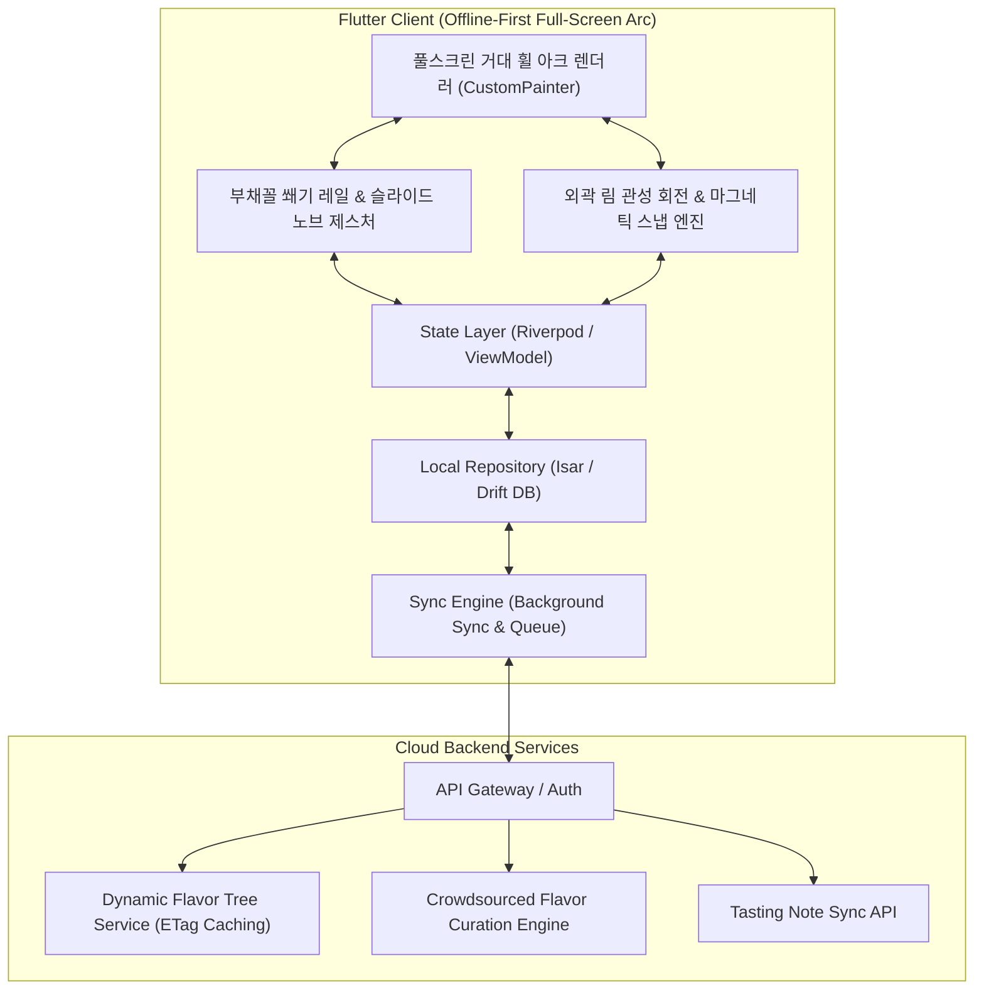
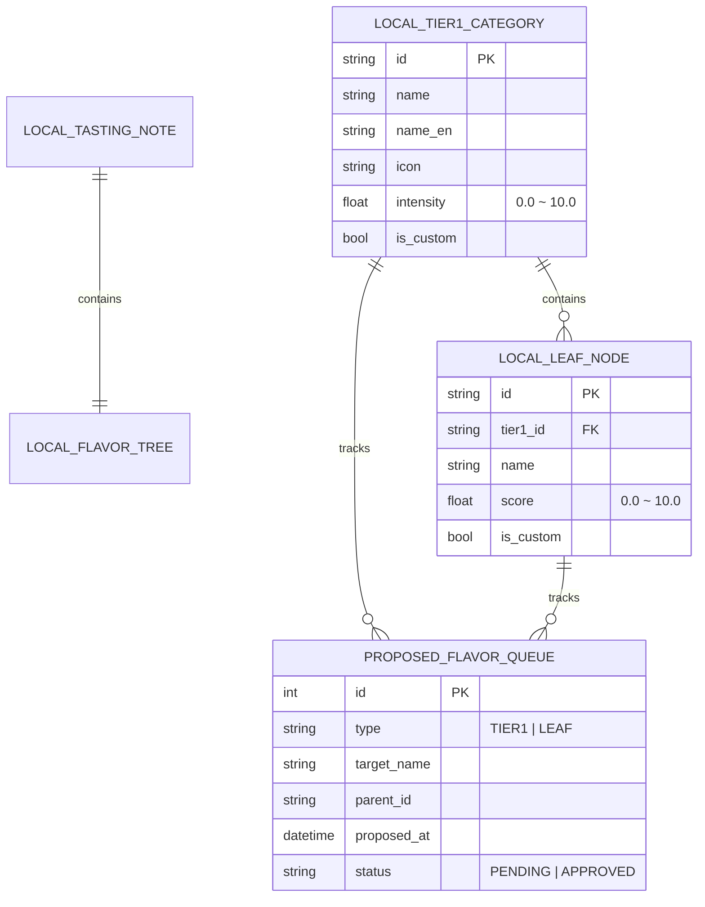

# 🥃 Flavor Wheel (플레이버 휠) - 제품 기획 및 기술 설계서 (PRD & System Spec)

> **"향과 맛 애호가들을 위한 Offline-First 스마트 테이스팅 노트 & 풀스크린 거대 휠(Full-Screen Arc) 플랫폼"**  
> *"화면을 가득 채우는 풀스크린 거대 휠 아크 뷰, 외곽 림 회전 네비게이션, 부채꼴 쐐기 레일 기반 100% 인차트(In-Chart) 직접 조작, 그리고 자가 진화형 크라우드소싱 큐레이션 생태계를 제공합니다."*

---

## 📌 목차 (Table of Contents)
1. [프로젝트 비전 및 핵심 설계 철학](#1-프로젝트-비전-및-핵심-설계-철학)
2. [핵심 아키텍처 규칙 5대 원칙](#2-핵심-아키텍처-규칙-5대-원칙)
   - 2.1 [Offline-First 영속성 및 동기화 규칙](#21-offline-first-영속성-및-동기화-규칙)
   - 2.2 [풀스크린 거대 휠 아크(Full-Screen Arc) 뷰포트 모델](#22-풀스크린-거대-휠-아크full-screen-arc-뷰포트-모델)
   - 2.3 [부채꼴 쐐기 레일(Wedge Rails) 기반 100% 인차트 조작](#23-부채꼴-쐐기-레일wedge-rails-기반-100-인차트-조작)
   - 2.4 [외곽 림 회전 제스처(Wheel Spin) & 마그네틱 스냅](#24-외곽-림-회전-제스처wheel-spin--마그네틱-스냅)
   - 2.5 [인차트 대·소분류 양방향 커스텀 생성 & 큐레이션 생태계](#25-인차트-대소분류-양방향-커스텀-생성--큐레이션-생태계)
3. [시스템 아키텍처 다이어그램](#3-시스템-아키텍처-다이어그램)
4. [상세 기능 요구사항 명세 (FRD)](#4-상세-기능-요구사항-명세-frd)
5. [데이터베이스 스키마 및 JSON 스펙](#5-데이터베이스-스키마-및-json-스펙)
6. [단계별 로드맵 & 마일스톤](#6-단계별-로드맵--마일스톤)
7. [인터랙티브 프로토타입 안내](#7-인터랙티브-프로토타입-안내)

---

## 1. 프로젝트 비전 및 핵심 설계 철학

위스키를 비롯한 주류 및 미식(와인, 커피, 맥주 등) 애호가들이 장소와 네트워크 환경에 구애받지 않고 시음 경험을 정밀하게 기록하고 탐색할 수 있는 플랫폼을 구축합니다.

* **No Blank Screen (항상 즉시 동작)**: 지하 바(Bar)나 위스키 축제 등 오프라인 환경에서도 100% 정상 작동하는 **Offline-First**.
* **Full-Screen Giant Wheel (풀스크린 거대 휠)**: 화면에 작은 원을 축소해 넣는 것이 아니라, **화면 전체를 거대한 원형 플레이버 휠의 확대된 상단 부채꼴 아크(Arc)로 꽉 채워 압도적인 몰입감 제공**.
* **100% In-Chart Direct Manipulation (순수 인차트 조작)**: 외부 슬라이더나 텍스트 폼 목록을 일체 배제하고, **차트 내부의 부채꼴 쐐기 레일 위에서 노브(Knob)를 직접 손가락으로 밀어올려 게이지를 채우는 일체형 컨트롤러**.
* **Analog Wheel Spin Gesture (외곽 림 회전 네비게이션)**: 휠의 테두리(Rim)를 손끝으로 둥글게 쓸어넘기며 대분류를 전환하는 직관적이고 감각적인 아날로그 다이얼 UX.

---

## 2. 핵심 아키텍처 규칙 5대 원칙

### 2.1 Offline-First 영속성 및 동기화 규칙

1. **Local DB = Single Source of Truth**: 모든 읽기/쓰기 작업은 로컬 데이터베이스(`Isar` 또는 `Drift`)를 최우선으로 통과합니다.
2. **낙관적 업데이트 (Optimistic Updates)**: 서버 응답을 기다리지 않고 로컬에 즉시 커밋 후 UI에 0ms로 반영합니다.
3. **ETag & 버전 해시 기반 델타 캐싱**: 향미 마스터 트리는 앱 최초 실행 시 로컬에 저장되며, 서버 호출 시 ETag 헤더를 비교하여 변경사항이 있을 때만 증분 다운로드(`304 Not Modified` 처리)합니다.

---

### 2.2 풀스크린 거대 휠 아크(Full-Screen Arc) 뷰포트 모델

화면 하단 아래쪽$(x_{\text{center}}, y_{\text{bottom}} + \text{offset})$에 가상 원의 중심을 두고, **거대한 반경($R \approx 500\text{px} \sim 650\text{px}$)**의 상단 부채꼴 아크가 모바일 화면 전체(90% 이상)를 꽉 채워 렌더링됩니다.

```
┌──────────────────────────────────────────────────────────┐
│ [ 상단 오버레이 ] 🥃 발베니 12년 • 🍯 Sweet & Vanilla [7.5]   │
├──────────────────────────────────────────────────────────┤
│                                                          │
│   ( 휠 외곽 테두리 림을 쓸어넘기면 휠 전체가 회전 스냅 )         │
│  ────────────── 10.0 [ 최외곽 림 ] ──────────────        │
│                                                          │
│   [ 쐐기 레일 1 ]   [ 쐐기 레일 2 ]   [ 쐐기 레일 3 ]    │
│      ( 바닐라 )        ( 벌  꿀 )        ( 캐러멜 )      │
│          ▲                 ▲                 ▲           │
│          ● 8.5             ● 9.0             ● 6.0       │
│          │                 │                 │           │
│     (네온 차오름)     (네온 차오름)     (네온 차오름)    │
│          │                 │                 │           │
│  ────────────── 0.0 [ 원의 중심 ] ───────────────        │
│                                                          │
│     [ ➕ 새 소분류 레일 ]        [ ➕ 새 대분류 휠 섹터 ] │
│                                                          │
└──────────────────────────────────────────────────────────┘
```

---

### 2.3 부채꼴 쐐기 레일(Wedge Rails) 기반 100% 인차트 조작

선택 및 강도 측정이 모두 차트 그래픽 내부에서 완결됩니다:

1. **부채꼴 쐐기 레일 분할**: 현재 화면에 확대된 대분류 섹터 내부가 소분류별로 쐐기형 부채꼴 레일($\Delta \theta_{\text{sub}}$)로 나뉩니다.
2. **슬라이드 노브(Knob) 조작**: 각 레일 위에 표시된 노브를 터치하여 **원의 중심($0.0$) $\leftrightarrow$ 외곽 림($10.0$) 방향으로 손가락으로 밀어올리면 네온 게이지가 차오르며 강도가 즉시 측정**됩니다.
3. **대분류 점수 자동 연동**: 각 레일의 점수들이 실시간 집계되어 대분류의 총 강도로 반영됩니다.

---

### 2.4 외곽 림 회전 제스처(Wheel Spin) & 마그네틱 스냅

1. **영역 기반 제스처 분리**:
   * **휠 테두리(Rim) 또는 섹터 간 경계 영역 드래그**: 휠 전체가 원형 궤도로 회전하며 대분류(`Sweet` $\rightarrow$ `Woody` $\rightarrow$ `Winey` $\rightarrow$ ...) 전환.
   * **섹터 내부 소분류 쐐기 레일 드래그**: 소분류 노브 슬라이드(0~10 강도 측정).
2. **마그네틱 스냅 (Magnetic Snap)**: 회전 후 손을 떼면 가장 가까운 대분류 섹터의 중앙 각도로 자석처럼 부드럽게 스냅 안착 (`Curves.easeOutCubic`, 60fps).

---

### 2.5 인차트 대·소분류 양방향 커스텀 생성 & 큐레이션 생태계

* **인차트 소분류 추가**: 섹터 마지막 쐐기 레일에 위치한 `[+]` 레일을 탭하여 즉시 새 소분류 노드 생성.
* **인차트 대분류 추가**: 휠을 끝까지 돌리면 나타나는 `[+]` 부채꼴 아크 섹터에서 새 대분류 생성.
* **크라우드소싱 큐레이션**: 로컬에 즉시 반영(0ms)되고, 노트 저장 시 서버로 전송되어 관리자 승인 후 공식 트리로 승격.

---

## 3. 시스템 아키텍처 다이어그램



---

## 4. 상세 기능 요구사항 명세 (FRD)

| ID | 기능 영역 | 세부 기능 | 우선순위 | 상세 기술 명세 |
| :--- | :--- | :--- | :---: | :--- |
| **FR-01** | **거대 휠 아크** | **풀스크린 아크 렌더링** | **P1** | 화면 90% 이상을 채우는 반경 550px+ 거대 휠의 상단 부채꼴 아크 확대 렌더링 |
| **FR-02** | **인차트 조작** | **부채꼴 쐐기 레일 조작** | **P1** | 대분류 섹터 내부를 소분류별 쐐기 레일로 분할하고 노브 슬라이드로 0~10 강도 측정 |
| **FR-03** | **휠 네비게이션**| **외곽 림 회전 & 스냅** | **P1** | 휠 테두리를 원형으로 돌려 대분류를 전환하고 마그네틱 스냅으로 안착 (60fps) |
| **FR-04** | **커스텀 생성** | **인차트 대·소분류 생성** | **P1** | 마지막 쐐기 레일 [+] 및 회전 끝 [+] 섹터에서 차트 위에서 즉시 양방향 생성 |
| **FR-05** | **Offline-First** | **로컬 저장 및 동기화** | **P1** | 로컬 Isar DB에 노트/커스텀 노드 즉시 영속화, 네트워크 복구 시 자동 백그라운드 큐 동기화 |

---

## 5. 데이터베이스 스키마 및 JSON 스펙



---

## 6. 단계별 로드맵 & 마일스톤

| 단계 | 마일스톤 | 산출물 및 검증 기준 | 상태 |
| :--- | :--- | :--- | :---: |
| **1단계** | **설계 & 프로토타입** | • PRD 및 풀스크린 거대 휠 아크 규칙 확립<br>• 부채꼴 쐐기 레일 인차트 조작 HTML 프로토타입 | 🟢 **완료** |
| **2단계** | **Flutter 기반 엔진** | • Isar 로컬 DB 및 Sync Engine 구축<br>• CustomPainter 기반 풀스크린 거대 휠 & 쐐기 레일 위젯 | ⚪ 예정 |
| **3단계** | **동적 API & 큐레이션** | • Dynamic Flavor Tree API & 대/소분류 승격 파이프라인 연동<br>• 음성 STT & LLM 요약 자동 완성 파이프라인 | ⚪ 예정 |
| **4단계** | **검색/추천 & 배포** | • 위스키 색인 오프라인 검색 엔진<br>• 플레이버 벡터 유사도 추천 및 베타 배포 | ⚪ 예정 |

---

## 7. 인터랙티브 프로토타입 안내

프로젝트 내 [prototype/index.html](file:///Users/chanholee/Desktop/project/FlavorWheelProject/prototype/index.html)에서 위 규칙이 모두 반영된 모바일 프로토타입을 즉시 테스트하실 수 있습니다:

* **풀스크린 거대 휠 아크**: 화면 전체를 채우는 웅장한 확대 부채꼴 휠
* **100% 인차트 조작**: 부채꼴 쐐기 레일 위에서 노브를 직접 밀어올려 네온 게이지를 채우는 직관적 조작
* **외곽 림 회전 & 마그네틱 스냅**: 휠 테두리를 둥글게 쓸어넘겨 대분류를 전환
* **차트 위 대/소분류 생성**: 쐐기 레일 `[+]` 및 휠 끝 `[+]` 섹터에서 즉시 생성
