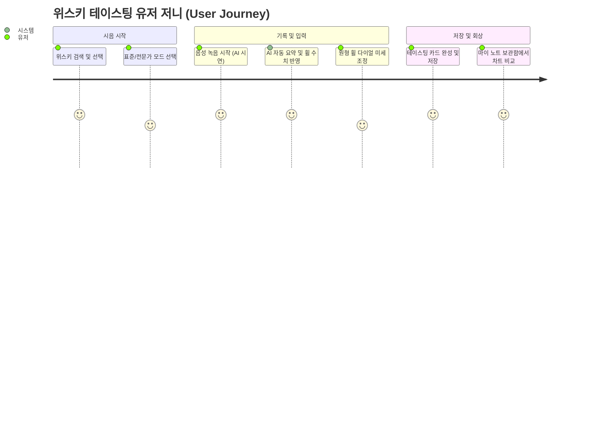
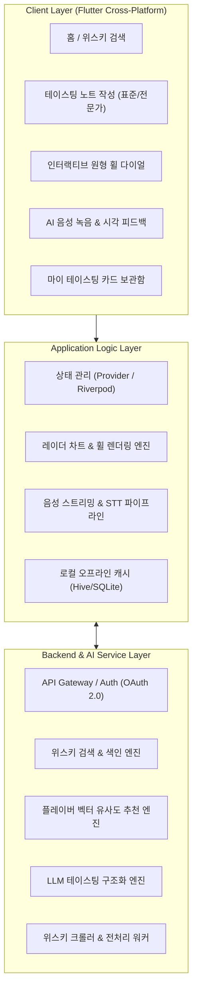
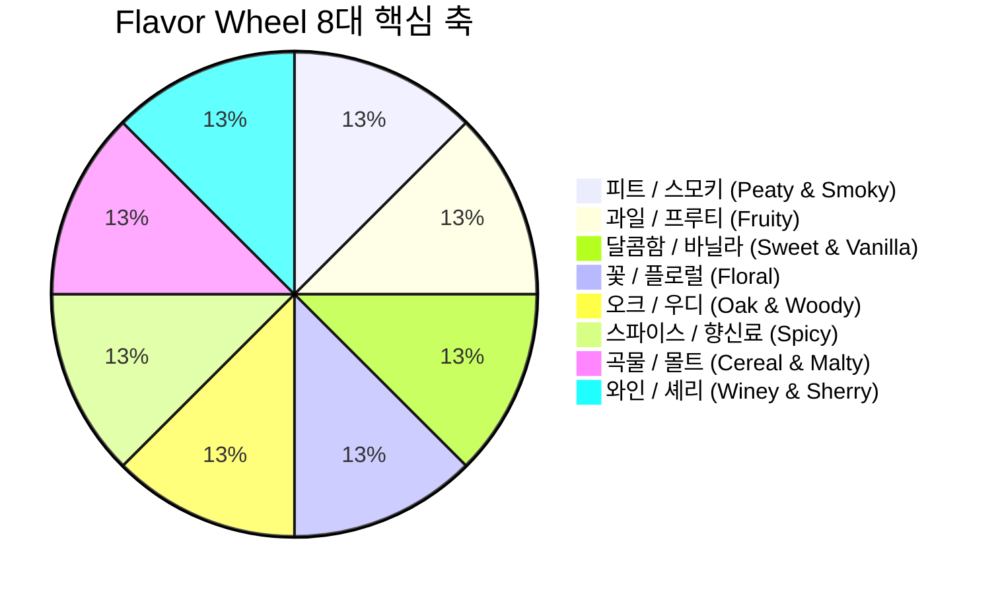
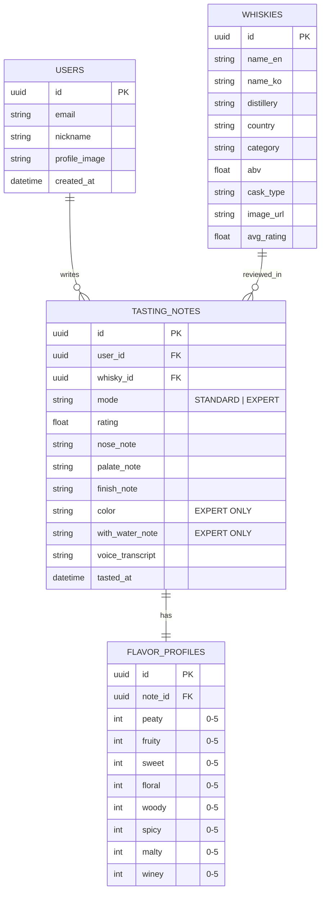

# 🥃 Flavor Wheel (플레이버 휠) - 제품 요구사항 정의서 & 설계서 (PRD)

> **"향과 맛 애호가들을 위한 스마트 테이스팅 노트 & 위스키 큐레이션 플랫폼"**  
> *"복잡한 위스키 향미를 한눈에 보이는 휠로 기록하고, AI 음성 요약으로 손쉽게 테이스팅을 완성하세요."*

---

## 📌 목차 (Table of Contents)
1. [프로젝트 개요 및 비전](#1-프로젝트-개요-및-비전)
2. [타겟 유저 페르소나 및 핵심 시나리오](#2-타겟-유저-페르소나-및-핵심-시나리오)
3. [시스템 아키텍처](#3-시스템-아키텍처)
4. [상세 기능 요구사항 명세 (FRD)](#4-상세-기능-요구사항-명세-frd)
5. [플레이버 휠(향미 데이터) 모델 명세](#5-플레이버-휠향미-데이터-모델-명세)
6. [UI / UX 디자인 가이드라인](#6-ui--ux-디자인-가이드라인)
7. [데이터베이스 스키마 설계](#7-데이터베이스-스키마-설계)
8. [개발 로드맵 & 마일스톤](#8-개발-로드맵--마일스톤)
9. [인터랙티브 프로토타입 안내](#9-인터랙티브-프로토타입-안내)

---

## 1. 프로젝트 개요 및 비전

### 1.1 배경 및 문제 정의 (Problem Statement)
* **어려운 향미 기록**: 위스키 시음 시 느껴지는 향과 맛(Nose, Palate, Finish)은 매우 복잡하며, 텍스트로만 남기면 나중에 직관적으로 회상하기 어렵습니다.
* **입력의 번거로움**: 잔을 들고 시음하는 도중 스마트폰 키보드로 긴 테이스팅 노트를 타이핑하는 것은 시음의 몰입을 방해합니다.
* **파편화된 정보**: 위스키 정보, 도수, 캐스크 정보 및 다른 이들의 평점이 여러 웹사이트에 흩어져 있어 접근성이 떨어집니다.

### 1.2 솔루션 및 핵심 가치 (Value Proposition)
1. **인터랙티브 원형 플레이버 휠 (Interactive Flavor Wheel)**:  
   8대 핵심 향미 축을 다이얼 형태로 직접 터치/드래그하여 즉각적이고 아름다운 레이더 차트로 시각화.
2. **AI 음성 테이스팅 노트 (AI Voice-to-Note)**:  
   시음 중 자연스럽게 말한 음성을 온디바이스/클라우드 AI가 분석하여 향미 수치와 Nose/Palate/Finish 항목으로 자동 분류 및 구조화.
3. **듀얼 모드 테이스팅 폼 (Dual-Mode Tasting)**:  
   입문자를 위한 깔끔한 **'표준 모드'**와 매니아를 위한 물 첨가 전후(With Water), 색상(Color) 비교 등을 지원하는 **'전문가 모드'** 제공.
4. **신뢰도 높은 위스키 DB & 큐레이션**:  
   전문 플랫폼 크롤링 데이터를 기반으로 한 즉각적인 위스키 검색 및 개인화된 향미 기반 추천.

---

## 2. 타겟 유저 페르소나 및 핵심 시나리오

* **페르소나 A (위스키 입문자 / 2030 직장인)**
  * *"내가 마신 위스키가 어떤 느낌이었는지 직관적으로 기억하고 친구들에게 멋지게 공유하고 싶다."*
  * 원형 플레이버 휠을 가볍게 터치해 시각적인 테이스팅 카드를 생성.
* **페르소나 B (위스키 매니아 / 바텐더)**
  * *"원액(Neat) 상태와 가수(With Water) 후의 향미 변화, 색상, 배치(Batch) 번호까지 꼼꼼하게 아카이빙하고 싶다."*
  * 전문가 모드를 활성화하여 정밀한 테이스팅 노트 기록.

---

## 3. 시스템 아키텍처

---

## 4. 상세 기능 요구사항 명세 (FRD)

| ID | 기능 분류 | 기능명 | 우선순위 | 상세 설명 |
| :--- | :--- | :--- | :---: | :--- |
| **FR-01** | **테이스팅 노트** | **인터랙티브 원형 휠** | **P1** | 8개 향미 카테고리를 원형 다이얼로 조작하여 1~5점 강도 실시간 조정 및 레이더 차트 렌더링 |
| **FR-02** | **테이스팅 노트** | **표준 모드 작성** | **P1** | 위스키 기본 정보, Nose/Palate/Finish 텍스트 메모, 종합 평점(1~5★) 입력 |
| **FR-03** | **테이스팅 노트** | **전문가 모드 전환** | **P1** | 토글 스위치를 통해 색상(Color), 투명도, 가수(With Water) 전/후 비교 기록 활성화 |
| **FR-04** | **AI 기능** | **음성 녹음 및 AI 요약** | **P2** | 음성 입력을 받아 LLM이 Nose, Palate, Finish 및 8대 향미 강도를 자동 파싱하여 폼 자동 입력 |
| **FR-05** | **위스키 검색** | **위스키 DB 검색** | **P1** | 이름(영문/국문), 증류소, 캐스크 타입, 알코올 도수(ABV) 기반 실시간 자동완성 검색 |
| **FR-06** | **보관함** | **테이스팅 카드 뷰** | **P1** | 작성된 노트를 아름다운 카드 형태로 조회, 이미지 저장 및 SNS 공유 기능 |
| **FR-07** | **추천** | **향미 유사도 추천** | **P2** | 사용자의 휠 프로필과 유사한 풍미를 지닌 다른 위스키 큐레이션 |
| **FR-08** | **데이터 수집** | **크롤러 및 전처리** | **P1** | 위스키베이스, 데일리샷 등 주요 플랫폼 데이터 주기적 수집 및 정규화 |

---

## 5. 플레이버 휠(향미 데이터) 모델 명세

위스키 테이스팅의 국제 표준(SWA/SMWS 향미 분류)을 기반으로 모바일에 최적화된 **8대 핵심 향미 축**을 정의합니다:

### 8대 향미 카테고리 및 세부 아로마
1. **🔥 피트/스모키 (Peaty & Smoky)**: 이탄 향, 훈연향, 재, 타르, 요오드, 해초
2. **🍎 과일/프루티 (Fruity)**: 사과, 배, 감귤(시트러스), 건과일, 베리, 열대과일
3. **🍯 달콤함/바닐라 (Sweet & Vanilla)**: 바닐라, 꿀, 캐러멜, 토피, 버터스카치, 초콜릿
4. **🌸 꽃/플로럴 (Floral)**: 들꽃, 라벤더, 장미, 풀내음, 허브, 제비꽃
5. **🪵 오크/우디 (Oak & Woody)**: 새 오크, 탄 나무, 삼나무, 가죽, 담뱃잎
6. **🌶️ 스파이스/향신료 (Spicy)**: 계피(시나몬), 흑후추, 정향, 육두구, 생강
7. **🌾 곡물/몰트 (Cereal & Malty)**: 보리, 비스킷, 토스트, 효모, 견과류
8. **🍷 와인/셰리 (Winey & Sherry)**: 건포도, 무화과, 프룬, 포트와인, 다크베리

* **강도 스케일**: 0 (느껴지지 않음) ~ 5 (매우 강렬함)

---

## 6. UI / UX 디자인 가이드라인

* **Color Palette**:
  * **Background Dark**: `#0E1117` (Deep Obsidian Black)
  * **Card Surface**: `#161B22` / Glassmorphism (`rgba(255,255,255,0.05)`)
  * **Primary Accent (Whisky Amber)**: `#E5A93C` ~ `#F59E0B`
  * **Secondary Glow (Sherry Ruby)**: `#D97706` / `#B45309`
  * **Text Primary**: `#F8FAFC` / **Text Secondary**: `#94A3B8`
  * **Accent Neon (Active Wheel)**: `#FBBF24`
* **Typography**:
  * Headings: Modern Sans-Serif (Pretendard / Inter), Bold 700
  * Body: Regular 400 / Medium 500, High Legibility
* **Interactive Principles**:
  * 원형 휠 다이얼 터치 시 즉각적인 햅틱 & 실시간 레이더 면적 팽창 애니메이션.
  * AI 음성 녹음 시 유려한 음파(Waveform) 펄스 효과 제공.

---

## 7. 데이터베이스 스키마 설계

---

## 8. 개발 로드맵 & 마일스톤

| 주차 | 기간 | 주요 목표 및 산출물 | 상태 |
| :--- | :--- | :--- | :---: |
| **1주차** | 06.24 ~ 06.28 | • 요구사항 정의서(PRD) 및 아키텍처 수립 • 인터랙티브 HTML 프로토타입 개발 • 크롤링 PoC | 🟢 **완료** |
| **2주차** | 06.29 ~ 07.03 | • Flutter 프로젝트 기반 UI 프레임워크 구축 • 인터랙티브 플레이버 휠 커스텀 페인터 개발 • 테이스팅 노트 로컬 CRUD (Hive) | ⚪ 예정 |
| **3주차** | 07.04 ~ 07.08 | • 위스키 검색 API 연동 및 DB 색인화 • 음성 STT & LLM 요약 파이프라인 연동 | ⚪ 예정 |
| **4주차** | 07.09 ~ 07.15 | • 플레이버 유사도 기반 위스키 추천 기능 • UI/UX 폴리싱, 테스트 및 베타 배포 | ⚪ 예정 |

---

## 9. 인터랙티브 프로토타입 안내

프로젝트 내 `prototype/index.html` 파일로 실제 동작하는 모바일 프로토타입이 구현되어 있습니다. 브라우저에서 바로 실행하여 아래 기능들을 직접 체험할 수 있습니다:

1. **원형 휠 다이얼 인터랙션**: 8대 향미를 드래그하여 실시간 차트 변형
2. **표준 ↔ 전문가 모드 전환**: 탭 클릭으로 상세 분석 폼 확장
3. **가상 AI 음성 녹음 시연**: 마이크 버튼을 누르면 AI가 음성을 분석해 폼 자동 완성
4. **테이스팅 카드 저장 & 시각화**: 기록 완료 후 카드 형태 뷰 확인
