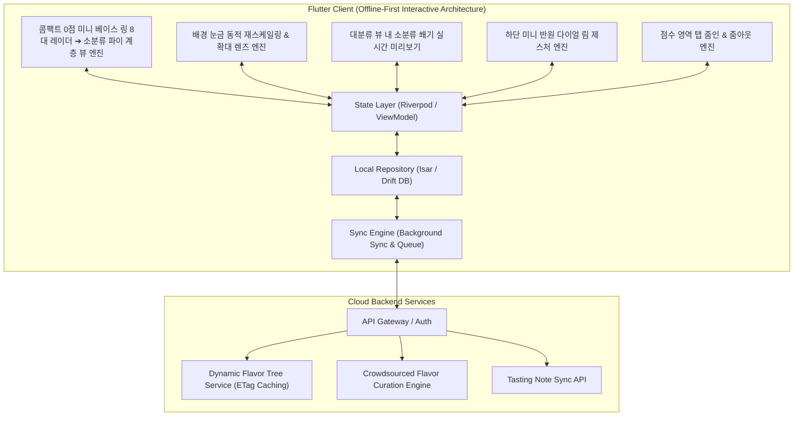

# 🥃 Flavor Wheel (플레이버 휠) - 제품 기획 및 기술 설계서 (PRD & System Spec)

> **"향과 맛 애호가들을 위한 Offline-First 스마트 테이스팅 노트 & 2단계 줌인 플레이버 휠 플랫폼"**  
> *"면적 터치 위아래 드래그 조작, 점수 영역 탭 시 소분류 확대 진입, 4점 이하 적응형 확대 시 배경 눈금 동적 재스케일링, 하단 미니 다이얼 림, 그리고 완성된 차트에서 콤팩트한 0점 미니 베이스 링($R_0 = R_{\max} \times 0.08$) 기반 8대 대분류 레이더 ➔ 탭 시 소분류 파이 전환 ➔ 개별 파이 탭 시 대폭 확대(Mega Pop-out) 인터랙션을 제공합니다."*

---

## 📌 목차 (Table of Contents)
1. [프로젝트 비전 및 핵심 설계 철학](#1-프로젝트-비전-및-핵심-설계-철학)
2. [핵심 아키텍처 규칙 5대 원칙](#2-핵심-아키텍처-규칙-5대-원칙)
   - 2.1 [Offline-First 영속성 및 동기화 규칙](#21-offline-first-영속성-및-동기화-규칙)
   - 2.2 [면적 드래그 조작 & 점수 영역 탭 줌인 모델](#22-면적-드래그-조작--점수-영역-탭-줌인-모델)
   - 2.3 [대분류 4점 이하 적응형 확대 & 배경 눈금 동적 재스케일링](#23-대분류-4점-이하-적응형-확대--배경-눈금-동적-재스케일링)
   - 2.4 [대분류 점수 뷰 내 기입된 소분류 쐐기 영역 실시간 미리보기](#24-대분류-점수-뷰-내-기입된-소분류-쐐기-영역-실시간-미리보기)
   - 2.5 [소분류 줌인 상태 하단 중앙 미니 반원 다이얼 림](#25-소분류-줌인-상태-하단-중앙-미니-반원-다이얼-림)
   - 2.6 [완성형 차트: 콤팩트 0점 미니 베이스 링($R_0$) & 8대 대분류 레이더 ➔ 소분류 파이 계층 뷰](#26-완성형-차트-콤팩트-0점-미니-베이스-링r_0--8대-대분류-레이더--소분류-파이-계층-뷰)
3. [시스템 아키텍처 다이어그램](#3-시스템-아키텍처-다이어그램)
4. [상세 기능 요구사항 명세 (FRD)](#4-상세-기능-요구사항-명세-frd)
5. [데이터베이스 스키마 및 JSON 스펙](#5-데이터베이스-스키마-및-json-스펙)
6. [단계별 로드맵 & 마일스톤](#6-단계별-로드맵--마일스톤)
7. [인터랙티브 프로토타입 안내](#7-인터랙티브-프로토타입-안내)

---

## 1. 프로젝트 비전 및 핵심 설계 철학

위스키를 비롯한 주류 및 미식(와인, 커피, 맥주 등) 애호가들이 장소와 네트워크 환경에 구애받지 않고 시음 경험을 정밀하게 기록하고 탐색할 수 있는 플랫폼을 구축합니다.

* **No Blank Screen (항상 즉시 동작)**: 지하 바(Bar)나 위스키 축제 등 오프라인 환경에서도 100% 정상 작동하는 **Offline-First**.
* **Compact Zero Base Ring (콤팩트 0점 미니 베이스 링)**: 레이더 차트의 중심부에 콤팩트한 $0$점 미니 베이스 링($R_0 = R_{\max} \times 0.08$)을 두어, $0$점인 대분류도 $R_0$ 둘레를 따라 자연스러운 8각형 레이더 다각형으로 닫히며 점수가 높을수록 중심에서 바깥쪽으로 시원하게 확장.
* **Progressive View Separation (대분류 따로 / 소분류 따로 계층형 뷰)**:
  1. **대분류 레이더 뷰**: 진입 시 0점 미니 베이스 링 기반 8대 대분류 레이더 다각형만 우선 노출하여 전체 밸런스를 명료하게 조망.
  2. **소분류 파이 뷰**: 레이더 차트를 탭하면 소분류들이 $R_0$부터 바깥쪽으로 채워지는 파이 차트로 전환되어 세부 향미들을 확인.
  3. **개별 파이 팝아웃 확대**: 특정 파이를 탭하면 해당 파이가 1.45배 확 커져서(Mega Pop-out) 눈에 잘 보이게 하이라이트.
  4. **레이더 복귀**: 파이 바깥쪽 또는 $R_0$ 안쪽을 누르면 다시 대분류 레이더 차트만 표시.

---

## 2. 핵심 아키텍처 규칙 5대 원칙

### 2.1 Offline-First 영속성 및 동기화 규칙

1. **Local DB = Single Source of Truth**: 모든 읽기/쓰기 작업은 로컬 데이터베이스(`Isar` 또는 `Drift`)를 최우선으로 통과합니다.
2. **낙관적 업데이트 (Optimistic Updates)**: 서버 응답을 기다리지 않고 로컬에 즉시 커밋 후 UI에 0ms로 반영합니다.
3. **ETag & 버전 해시 기반 델타 캐싱**: 향미 마스터 트리는 앱 최초 실행 시 로컬에 저장되며, 서버 호출 시 ETag 헤더를 비교하여 변경사항이 있을 때만 증분 다운로드(`304 Not Modified` 처리)합니다.

---

### 2.2 면적 드래그 조작 & 점수 영역 탭 줌인 모델

* **면적 드래그**: 섹터/레일 영역 어디든 터치하고 Y축으로 드래그하면 손가락 높이에 맞춰 점수가 조절됩니다.
* **점수 영역 탭 줌인**: 소분류가 아직 없는 경우 `[🔍 탭하여 소분류 평가하기]` 버튼으로 진입하고, 소분류가 이미 채워진 대분류는 **점수 영역(소분류 쐐기들)을 직접 탭하여 소분류 세부 조작 화면으로 즉시 확대(Zoom-in)**됩니다.

---

### 2.3 대분류 4점 이하 적응형 확대 & 배경 눈금 동적 재스케일링

* **동적 스케일 확장 (Adaptive Zoom)**:
  * 하단 중앙 미니 다이얼($R_{\text{dial}}$) 크기는 그대로 유지.
  * 상단 그래프 영역만 대분류 점수가 4.0점 이하일 때 6.0점대 높이 수준으로 적응형 확대.
* **배경 눈금 라벨 동적 전환**: 확대 렌즈 모드 진입 시 뒷배경의 $2, 4, 6, 8, 10$ 기본 눈금이 대분류 점수 기준 정밀 눈금($1.0\text{점}, 2.0\text{점}, 3.0\text{점 (상한)}$)으로 전환.

---

### 2.4 대분류 점수 뷰 내 기입된 소분류 쐐기 영역 실시간 미리보기

* 1단계 휠 전체 뷰에서도 해당 대분류에 소분류들이 기입되어 있다면, **대분류 점수 영역 내부에 각 소분류 쐐기들이 10점 만점 비례 점수 높이만큼 분할 채워진 모습**이 실시간으로 렌더링됩니다.

---

### 2.5 소분류 줌인 상태 하단 중앙 미니 반원 다이얼 림

* 소분류 줌인 상태 시 화면 하단 중심에 작은 반원 다이얼이 렌더링되며, 이를 좌우로 돌린 후 손을 떼면 1단계 대분류 점수 화면으로 부드럽게 복귀 전환됩니다.

---

### 2.6 완성형 차트: 콤팩트 0점 미니 베이스 링($R_0$) & 8대 대분류 레이더 ➔ 소분류 파이 계층 뷰

* **0점 미니 베이스 링 및 동심원 눈금 수식**:
  $$R_0 = R_{\max} \times 0.08, \quad R(\text{score}) = R_0 + \frac{R_{\max} - R_0}{10} \times \text{score}$$
  * 동심원 눈금: `0점 (미니 링)`, `2점`, `4점`, `6점`, `8점`, `10점`
  * 8대 대분류 축선 전체 표시 (0점 항목도 $R_0$ 위치에 꼭짓점 형성).
* **3단계 계층 인터랙션**:
  ```
  [ Step 1: 기본 진입 (8대 대분류 레이더 뷰) ]
    • 0점 미니 베이스 링 기반 8각형 레이더 다각형만 깔끔하게 표시!
    • 상단: "👆 대분류 레이더 차트를 탭하면 소분류 파이 차트로 전환됩니다"
          │
          ▼ (레이더 차트 내부 탭)
  [ Step 2: 소분류 파이 차트 전환 (소분류 뷰) ]
    • R_0부터 바깥쪽으로 채워지는 각 대분류 섹터별 소분류 파이 조각(Pie Wedges) 렌더링
    • 상단: "🔍 개별 파이 조각을 탭하여 확대하세요 (바깥쪽 터치 시 대분류 레이더 복귀)"
          │
          ▼ (개별 파이 조각 탭)
  [ Step 3: 개별 파이 대폭 확대 (Mega Pop-out) ]
    • 탭한 파이 조각이 1.45배 확 커지며 네온 글로우로 부각! (비선택 파이는 반투명 포커스)
    • 상단: "🌟 Sweet ▶ 바닐라 (8.5 / 10점)"
          │
          ▼ (파이 바깥쪽 / 여백 터치)
  [ Step 1 대분류 레이더 뷰로 즉시 복귀! ]
  ```

---

## 3. 시스템 아키텍처 다이어그램



---

## 4. 상세 기능 요구사항 명세 (FRD)

| ID | 기능 영역 | 세부 기능 | 우선순위 | 상세 기술 명세 |
| :--- | :--- | :--- | :---: | :--- |
| **FR-01** | **결과 렌더링** | **콤팩트 0점 베이스 링**| **P1** | 0점 베이스 링 크기를 maxR * 0.08로 축소 + 8대 대분류 전체 레이더 및 파이 표현 |
| **FR-02** | **결과 렌더링** | **대분류/소분류 계층 뷰**| **P1** | 레이더만 우선 노출 ➔ 탭 시 파이 전환 ➔ 파이 탭 시 1.45x 확대 ➔ 바깥쪽 탭 시 복귀 |
| **FR-03** | **인차트 조작** | **소분류 평가 시스템 유지**| **P1** | 휠 조작 시 면적 드래그, 0~10점 매핑, 탭 줌인, 바텀시트 태그 추가 완벽 유지 |
| **FR-04** | **인차트 조작** | **배경 눈금 동적 재스케일링**| **P1** | 4점 이하 확대 시 배경 눈금 숫자가 대분류 점수 기준(예: 1점, 2점, 3점 상한)으로 전환 |
| **FR-05** | **휠 네비게이션**| **하단 미니 반원 다이얼**| **P1** | 소분류 줌인 상태에서 하단 중앙 미니 반원을 돌려 대분류 손쉬운 전환 |

---

## 5. 단계별 로드맵 & 마일스톤

| 단계 | 마일스톤 | 산출물 및 검증 기준 | 상태 |
| :--- | :--- | :--- | :---: |
| **1단계** | **설계 & 프로토타입** | • PRD 및 콤팩트 0점 베이스 링 기반 8대 대분류 레이더 / 소분류 파이 계층 뷰 확립<br>• 완성형 테이스팅 카드 HTML 프로토타입 | 🟢 **완료** |
| **2단계** | **Flutter 기반 엔진** | • Isar 로컬 DB 및 Sync Engine 구축<br>• CustomPainter 기반 2단계 줌인 & 360도 통합 휠 위젯 | ⚪ 예정 |
| **3단계** | **동적 API & 큐레이션** | • Dynamic Flavor Tree API & 관리자 승격 파이프라인 연동<br>• 음성 STT & LLM 요약 자동 완성 파이프라인 | ⚪ 예정 |
| **4단계** | **검색/추천 & 배포** | • 위스키 색인 오프라인 검색 엔진<br>• 플레이버 벡터 유사도 추천 및 베타 배포 | ⚪ 예정 |

---

## 6. 인터랙티브 프로토타입 안내

프로젝트 내 [prototype/index.html](file:///Users/chanholee/Desktop/project/FlavorWheelProject/prototype/index.html)에서 위 규칙이 모두 반영된 모바일 프로토타입을 즉시 테스트하실 수 있습니다:

* **콤팩트 0점 미니 베이스 링 ($R_0 = R_{\max} \times 0.08$)**:
  * 중심부의 0점 베이스 링이 작고 단단한 미니 코어 링으로 표시
  * 0점인 대분류도 미니 링 둘레를 따라 꼭짓점이 연결되어 시원하게 뻗어나가는 8각형 레이더 다각형 형성
* **완성형 차트 대분류/소분류 분리 뷰**:
  1. 하단 `[🏆 완성된 차트 보기]` 진입 시 **8대 대분류 레이더 차트만 우선 표시**
  2. 레이더 차트를 탭하면 **소분류 파이 차트로 전환** (미니 0점 링에서 바깥쪽으로 채워짐)
  3. 특정 파이 조각을 탭하면 **해당 파이가 1.45배 확 커져서 눈에 확 들어옴**
  4. 파이 바깥쪽을 누르면 다시 **대분류 레이더 차트만 보이는 상태로 복귀**
* **소분류 평가 시스템 완벽 유지**: 면적 드래그 조작, 0~10점 매핑, 탭 줌인, 바텀시트 태그 추가, 하단 미니 다이얼 림 등 기존 휠 기능 100% 정상 작동
