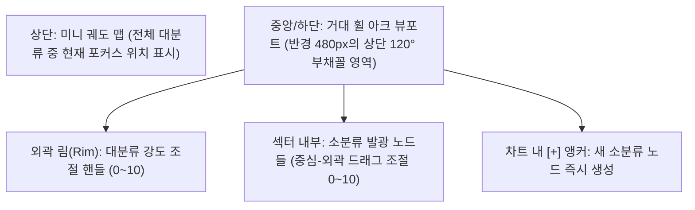
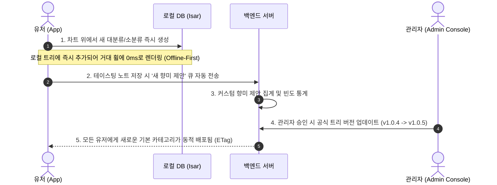
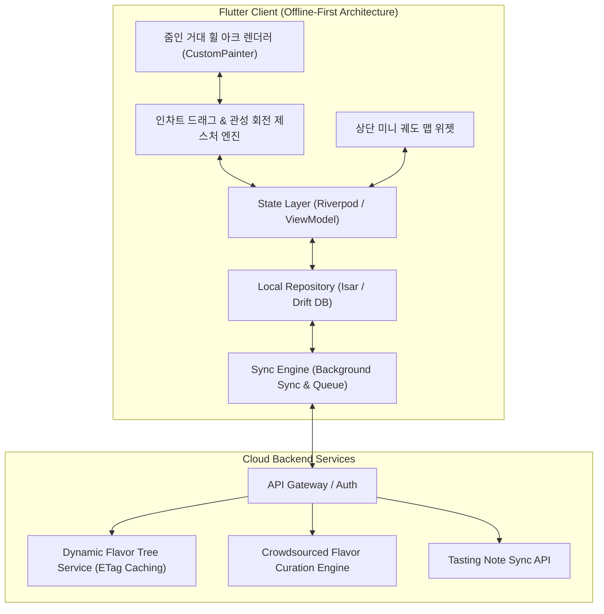
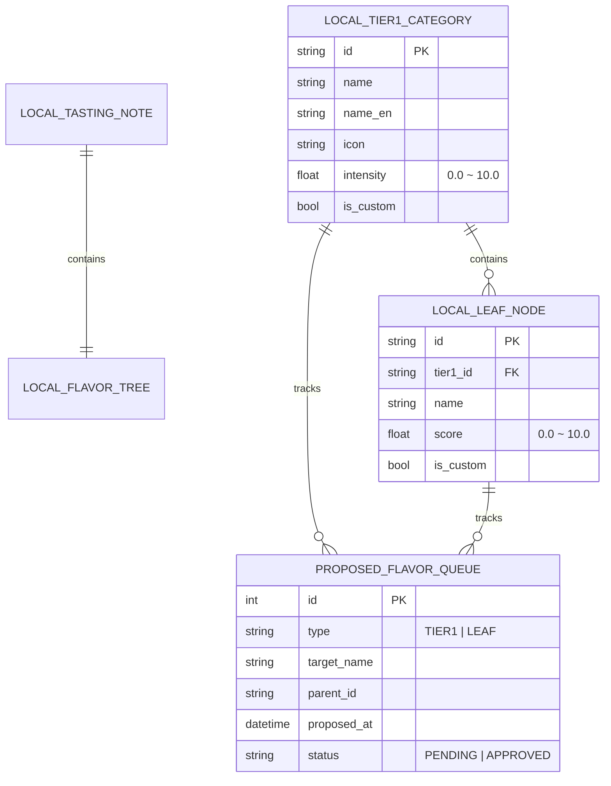

# 🥃 Flavor Wheel (플레이버 휠) - 제품 기획 및 기술 설계서 (PRD & System Spec)

> **"향과 맛 애호가들을 위한 Offline-First 스마트 테이스팅 노트 & 줌인 거대 휠(Zoomed Arc) 플랫폼"**  
> *"확대된 거대 휠 아크 뷰, 100% 인차트(In-Chart) 직접 조작, 관성 회전 및 마그네틱 스냅, 그리고 자가 진화형 크라우드소싱 큐레이션 생태계를 제공합니다."*

---

## 📌 목차 (Table of Contents)
1. [프로젝트 비전 및 핵심 설계 철학](#1-프로젝트-비전-및-핵심-설계-철학)
2. [핵심 아키텍처 규칙 5대 원칙](#2-핵심-아키텍처-규칙-5대-원칙)
   - 2.1 [Offline-First 영속성 및 동기화 규칙](#21-offline-first-영속성-및-동기화-규칙)
   - 2.2 [줌인 거대 휠 아크(Zoomed Arc) 뷰포트 모델](#22-줌인-거대-휠-아크zoomed-arc-뷰포트-모델)
   - 2.3 [100% 인차트(In-Chart) 직접 조작 및 10점 척도 인터랙션](#23-100-인차트in-chart-직접-조작-및-10점-척도-인터랙션)
   - 2.4 [관성 회전(Inertia Spin) & 마그네틱 스냅 네비게이션](#24-관성-회전inertia-spin--마그네틱-스냅-네비게이션)
   - 2.5 [인차트 대·소분류 양방향 커스텀 생성 & 큐레이션 생태계](#25-인차트-대소분류-양방향-커스텀-생성--큐레이션-생태계)
3. [시스템 아키텍처 다이어그램](#3-시스템-아키텍처-다이어그램)
4. [상세 기능 요구사항 명세 (FRD)](#4-상세-기능-요구사항-명세-frd)
5. [데이터베이스 스키마 및 JSON 스펙](#5-데이터베이스-스키마-및-json-스펙)
6. [단계별 로드맵 & 마일스톤](#6-단계별-로드맵--마일스톤)
7. [인터랙티브 프로토타입 안내](#7-인터랙티브-프로토타입-안내)

---

## 1. 프로젝트 비전 및 핵심 설계 철학

위스키를 비롯한 주류 및 미식(와인, 커피, 맥주 등) 애호가들이 장소와 네트워크 환경에 구애받지 않고 시음 경험을 정밀하게 기록하고 탐색할 수 있는 플랫폼을 구축합니다.

* **No Blank Screen (항상 즉시 동작)**: 지하 바(Bar)나 위스키 축제 등 오프라인 환경에서도 100% 정상 작동하는 **Offline-First**.
* **Zoomed Giant Wheel Arc (확대된 거대 휠)**: 작은 원을 억지로 화면에 욱여넣는 대신, **거대한 원형 다이얼의 상단 부채꼴 호가 웅장하게 확대되어 화면에 걸쳐 있는 몰입형 뷰포트**.
* **100% In-Chart Direct Manipulation (순수 인차트 조작)**: 외부 슬라이더나 별도 폼 없이, **차트 그래픽 내부의 점(Point)과 아크 림(Rim)을 직접 손가락으로 드래그하여 점수를 측정하고 노드를 추가하는 일체형 컨트롤러**.
* **Inertial Wheel Navigation (관성 회전 & 마그네틱 스냅)**: 휠을 손끝으로 휙 돌려가며 대분류를 탐색하고 착 달라붙는 감각적인 아날로그 다이얼 인터랙션.

---

## 2. 핵심 아키텍처 규칙 5대 원칙

### 2.1 Offline-First 영속성 및 동기화 규칙

1. **Local DB = Single Source of Truth**: 모든 읽기/쓰기 작업은 로컬 데이터베이스(`Isar` 또는 `Drift`)를 최우선으로 통과합니다.
2. **낙관적 업데이트 (Optimistic Updates)**: 서버 응답을 기다리지 않고 로컬에 즉시 커밋 후 UI에 0ms로 반영합니다.
3. **ETag & 버전 해시 기반 델타 캐싱**: 향미 마스터 트리는 앱 최초 실행 시 로컬에 저장되며, 서버 호출 시 ETag 헤더를 비교하여 변경사항이 있을 때만 증분 다운로드(`304 Not Modified` 처리)합니다.

---

### 2.2 줌인 거대 휠 아크(Zoomed Arc) 뷰포트 모델

화면 하단 중심부 아래$(x_{\text{center}}, y_{\text{center}} + \Delta y)$에 가상 원의 중심을 두고, **거대한 반경($R \approx 450\text{px} \sim 550\text{px}$)**의 상단 부채꼴 아크 영역이 모바일 화면 중앙/하단에 가득 차게 확대 렌더링됩니다.

---

### 2.3 100% 인차트(In-Chart) 직접 조작 및 10점 척도 인터랙션

모든 측정은 **`0.0 ~ 10.0` 10점 척도**로 차트 위에서 직접 손끝으로 이루어집니다:

1. **대분류 강도 조절**:
   * 부채꼴 섹터의 최외곽 림 아크(Outer Rim Arc)를 위아래로 끌어올리거나 내리면 해당 대분류의 기준 강도($0.0 \sim 10.0$)가 실시간 변형.
2. **소분류 노드 강도 조절**:
   * 섹터 내부의 각 소분류 발광 도트(Dot)를 터치하여 **원의 중심 $\leftrightarrow$ 바깥쪽으로 방사형 드래그**하면 반경 거리에 따라 $0.0 \sim 10.0$ 점수가 즉시 실시간 측정.
3. **인차트 소분류 추가**:
   * 섹터 내부에 위치한 점선 원형 `[+]` 앵커 노드를 탭하여 차트 안에서 즉시 새 소분류를 생성.

---

### 2.4 관성 회전(Inertia Spin) & 마그네틱 스냅 네비게이션

1. **좌우 스와이프 회전**: 휠 아크 영역을 좌우로 터치 드래그/플릭(Flick)하면 각속도($\omega$)를 기반으로 거대한 휠이 부드럽게 관성 회전.
2. **마그네틱 스냅**: 회전 속도가 줄어들면 가장 가까운 대분류 섹터의 중앙 각도로 **`Curves.easeOutCubic` 스냅 애니메이션**이 동작하여 착 달라붙음.
3. **새 대분류 아크 슬롯**: 휠을 끝까지 돌리면 휠 자체에 **`[➕ 새 대분류 추가]` 거대 아크 슬롯**이 나타나 차트 위에서 즉시 새 대분류를 추가 가능.

---

### 2.5 인차트 대·소분류 양방향 커스텀 생성 & 큐레이션 생태계

---

## 3. 시스템 아키텍처 다이어그램

---

## 4. 상세 기능 요구사항 명세 (FRD)

| ID | 기능 영역 | 세부 기능 | 우선순위 | 상세 기술 명세 |
| :--- | :--- | :--- | :---: | :--- |
| **FR-01** | **거대 휠 아크** | **줌인 뷰포트 렌더링** | **P1** | 하단에 가상 중심점을 둔 반경 480px+ 거대 휠의 상단 부채꼴 아크 확대 렌더링 |
| **FR-02** | **인차트 조작** | **소분류 방사형 드래그** | **P1** | 차트 안의 소분류 노드를 중심-외곽으로 직접 끌어당겨 0.0~10.0 강도 조절 |
| **FR-03** | **인차트 조작** | **외곽 림 아크 드래그** | **P1** | 대분류 섹터의 최외곽 림을 위아래로 드래그하여 대분류 0.0~10.0 강도 조절 |
| **FR-04** | **휠 네비게이션**| **관성 회전 & 스냅** | **P1** | 휠 좌우 스와이프 시 관성 회전 후 대분류 섹터에 마그네틱 스냅 (60fps) |
| **FR-05** | **커스텀 생성** | **인차트 대·소분류 생성**| **P1** | 휠 끝의 [+ 대분류] 아크 슬롯 및 섹터 내 [+] 노드로 양방향 즉시 생성 |
| **FR-06** | **미니 궤도 맵** | **상단 오빗 인디케이터** | **P1** | 전체 대분류 중 현재 포커스된 대분류 위치를 상단 미니 링으로 실시간 표시 |
| **FR-07** | **Offline-First** | **로컬 저장 및 동기화** | **P1** | 로컬 Isar DB에 노트/커스텀 노드 즉시 영속화, 네트워크 복구 시 자동 백그라운드 큐 동기화 |

---

## 5. 데이터베이스 스키마 및 JSON 스펙

---

## 6. 단계별 로드맵 & 마일스톤

| 단계 | 마일스톤 | 산출물 및 검증 기준 | 상태 |
| :--- | :--- | :--- | :---: |
| **1단계** | **설계 & 프로토타입** | • PRD 및 줌인 거대 휠 아크 규칙 확립 • 100% 인차트 직접 조작 HTML 프로토타입 | 🟢 **완료** |
| **2단계** | **Flutter 기반 엔진** | • Isar 로컬 DB 및 Sync Engine 구축 • CustomPainter 기반 줌인 거대 휠 & 인차트 제스처 위젯 | ⚪ 예정 |
| **3단계** | **동적 API & 큐레이션** | • Dynamic Flavor Tree API & 관리자 승격 파이프라인 연동 • 음성 STT & LLM 요약 자동 완성 파이프라인 | ⚪ 예정 |
| **4단계** | **검색/추천 & 배포** | • 위스키 색인 오프라인 검색 엔진 • 플레이버 벡터 유사도 추천 및 베타 배포 | ⚪ 예정 |

---

## 7. 인터랙티브 프로토타입 안내

프로젝트 내 [prototype/index.html](file:///Users/chanholee/Desktop/project/FlavorWheelProject/prototype/index.html)에서 위 규칙이 모두 반영된 모바일 프로토타입을 즉시 테스트하실 수 있습니다:

* **줌인된 거대 휠 아크**: 화면을 가득 채우는 웅장한 확대 부채꼴 휠
* **100% 인차트 직접 조작**: 차트 내부 소분류 도트를 직접 드래그하여 점수 조절, 외곽 림을 드래그하여 대분류 강도 조절
* **휠 회전 & 마그네틱 스냅**: 좌우로 휠을 휙 돌려 대분류를 전환하고 끝의 `[➕ 새 대분류]` 아크 슬롯에서 즉시 생성
* **미니 궤도 맵**: 상단에서 전체 대분류 위치 확인
