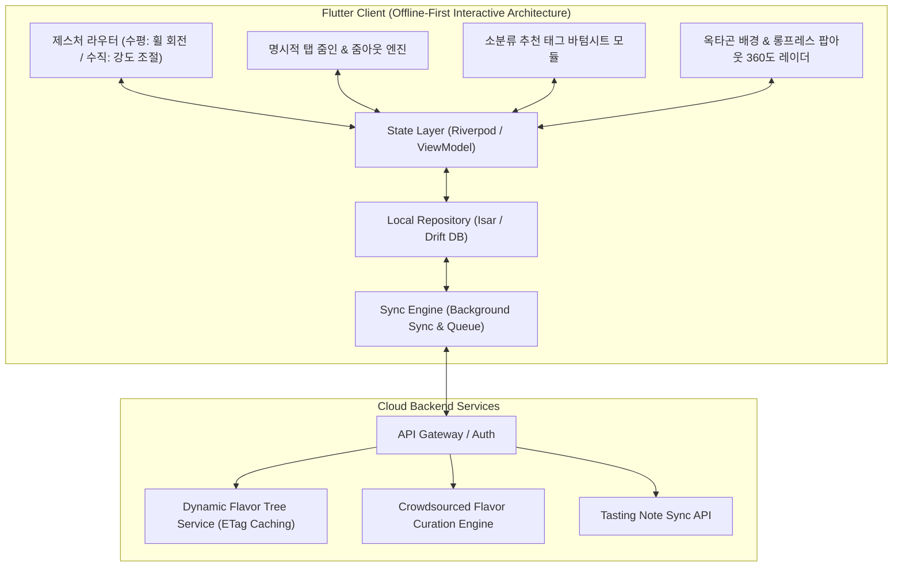

# 🥃 Flavor Wheel (플레이버 휠) - 제품 기획 및 기술 설계서 (PRD & System Spec)

> **"향과 맛 애호가들을 위한 Offline-First 스마트 테이스팅 노트 & 2단계 줌인 플레이버 휠 플랫폼"**  
> *"면적 터치 위아래 드래그 조작, 점수 영역 탭 시 소분류 확대 진입, 소분류 상태에서도 좌우 스크롤을 통한 대분류 연속 회전 전환, 그리고 옥타곤 배경 360도 통합 레이더 차트 완성을 제공합니다."*

---

## 📌 목차 (Table of Contents)
1. [프로젝트 비전 및 핵심 설계 철학](#1-프로젝트-비전-및-핵심-설계-철학)
2. [핵심 아키텍처 규칙 5대 원칙](#2-핵심-아키텍처-규칙-5대-원칙)
   - 2.1 [Offline-First 영속성 및 동기화 규칙](#21-offline-first-영속성-및-동기화-규칙)
   - 2.2 [면적 드래그 조작 & 명시적 탭 줌인(Tap-to-Zoom) 모델](#22-면적-드래그-조작--명시적-탭-줌인tap-to-zoom-모델)
   - 2.3 [소분류 상태에서의 좌우 스와이프 연속 대분류 전환 규칙](#23-소분류-상태에서의-좌우-스와이프-연속-대분류-전환-규칙)
   - 2.4 [바텀시트 기반 소분류 태그 선택식 동적 추가 UX](#24-바텀시트-기반-소분류-태그-선택식-동적-추가-ux)
   - 2.5 [완성형 차트: 옥타곤 대분류 배경 & 소분류 롱프레스 팝아웃 확대](#25-완성형-차트-옥타곤-대분류-배경--소분류-롱프레스-팝아웃-확대)
3. [시스템 아키텍처 다이어그램](#3-시스템-아키텍처-다이어그램)
4. [상세 기능 요구사항 명세 (FRD)](#4-상세-기능-요구사항-명세-frd)
5. [데이터베이스 스키마 및 JSON 스펙](#5-데이터베이스-스키마-및-json-스펙)
6. [단계별 로드맵 & 마일스톤](#6-단계별-로드맵--마일스톤)
7. [인터랙티브 프로토타입 안내](#7-인터랙티브-프로토타입-안내)

---

## 1. 프로젝트 비전 및 핵심 설계 철학

위스키를 비롯한 주류 및 미식(와인, 커피, 맥주 등) 애호가들이 장소와 네트워크 환경에 구애받지 않고 시음 경험을 정밀하게 기록하고 탐색할 수 있는 플랫폼을 구축합니다.

* **No Blank Screen (항상 즉시 동작)**: 지하 바(Bar)나 위스키 축제 등 오프라인 환경에서도 100% 정상 작동하는 **Offline-First**.
* **Zero Initial Bias (초기 0점 출발)**: 모든 향미 평점은 0점에서 시작하여, 사용자가 시음하며 실제로 감지한 향미만 선별적으로 점수를 부여.
* **Controlled Zoom Navigation (제어 가능한 줌 네비게이션)**: 강제 자동 줌인 없이, 점수 설정 후 사용자가 명시적으로 탭할 때 소분류로 확대 진입.
* **Continuous Horizontal Spin (연속 좌우 회전)**: 소분류 줌인 상태에서도 좌우 스와이프로 대분류를 부드럽게 넘나드는 일관된 휠 회전 UX.

---

## 2. 핵심 아키텍처 규칙 5대 원칙

### 2.1 Offline-First 영속성 및 동기화 규칙

1. **Local DB = Single Source of Truth**: 모든 읽기/쓰기 작업은 로컬 데이터베이스(`Isar` 또는 `Drift`)를 최우선으로 통과합니다.
2. **낙관적 업데이트 (Optimistic Updates)**: 서버 응답을 기다리지 않고 로컬에 즉시 커밋 후 UI에 0ms로 반영합니다.
3. **ETag & 버전 해시 기반 델타 캐싱**: 향미 마스터 트리는 앱 최초 실행 시 로컬에 저장되며, 서버 호출 시 ETag 헤더를 비교하여 변경사항이 있을 때만 증분 다운로드(`304 Not Modified` 처리)합니다.

---

### 2.2 면적 드래그 조작 & 명시적 탭 줌인(Tap-to-Zoom) 모델

* **면적 드래그**: 섹터/레일 영역 어디든 터치하고 Y축으로 드래그하면 손가락 높이에 맞춰 $0.0 \sim 10.0$ 점수가 조절됩니다.
* **명시적 탭 줌인**: 대분류 점수를 드래그한 후 손을 떼도 자동으로 확대되지 않으며, 사용자가 **점수 영역 또는 `[🔍 탭하여 소분류 평가]` 뱃지를 탭했을 때 소분류 뷰로 확대(Zoom-in)**됩니다.

---

### 2.3 소분류 상태에서의 좌우 스와이프 연속 대분류 전환 규칙

소분류 줌인 상태에서도 제스처 벡터를 분석하여 완벽히 분기합니다:

```mermaid
graph TD
    TouchStart["터치 시작 (Touch Down)"] --> MoveVector["이동 벡터 계산 (ΔX, ΔY)"]
    MoveVector -->| |ΔX| > |ΔY| (수평 스와이프) | WheelSpin["거대 휠 회전 & 이전/다음 대분류 스냅"]
    MoveVector -->| |ΔY| ≥ |ΔX| (수직 드래그) | ScoreAdjust["해당 쐐기 레일 소분류 강도 조절 (0~Cap)"]
```

---

### 2.4 바텀시트 기반 소분류 태그 선택식 동적 추가 UX

* 소분류 줌인 진입 시 처음에는 레일이 비어있음.
* `[➕ 소분류 태그 추가]` 클릭 시 **하단 바텀시트**에서 추천 태그들(예: 바닐라, 벌꿀, 캐러멜... + 직접 입력)을 선택하여 차트에 쐐기 레일로 동적 생성.

---

### 2.5 완성형 차트: 옥타곤 대분류 배경 & 소분류 롱프레스 팝아웃 확대

* 8대 대분류 점수를 연결한 옥타곤 다각형이 배경에 깔리고, 완성된 차트에서 소분류 쐐기를 **길게 누르면(Long-press)** 해당 쐐기가 앞으로 팝아웃 확대되며 상세 정보가 하이라이트됩니다.

---

## 3. 시스템 아키텍처 다이어그램



---

## 4. 상세 기능 요구사항 명세 (FRD)

| ID | 기능 영역 | 세부 기능 | 우선순위 | 상세 기술 명세 |
| :--- | :--- | :--- | :---: | :--- |
| **FR-01** | **인차트 조작** | **면적 드래그 & 탭 줌인**| **P1** | 면적 드래그로 점수 조절, 점수 영역 탭 시 소분류 확대로 진입 |
| **FR-02** | **휠 네비게이션**| **소분류 연속 좌우 회전**| **P1** | 소분류 줌인 상태에서도 좌우 스와이프 시 휠이 회전하며 대분류 전환 |
| **FR-03** | **소분류 추가** | **바텀시트 태그 선택** | **P1** | [+] 클릭 시 바텀시트에서 추천 태그를 선택하여 차트에 쐐기 레일로 동적 추가 |
| **FR-04** | **결과 렌더링** | **옥타곤 배경 & 롱프레스**| **P1** | 8각형 대분류 배경 + 소분류 롱프레스 시 팝아웃 확대 |
| **FR-05** | **Offline-First**| **로컬 저장 및 동기화** | **P1** | 로컬 Isar DB에 0ms 즉시 영속화 및 자동 백그라운드 큐 동기화 |

---

## 5. 단계별 로드맵 & 마일스톤

| 단계 | 마일스톤 | 산출물 및 검증 기준 | 상태 |
| :--- | :--- | :--- | :---: |
| **1단계** | **설계 & 프로토타입** | • PRD 및 탭 줌인/소분류 좌우 스크롤 규칙 확립<br>• 옥타곤 롱프레스 통합 HTML 프로토타입 | 🟢 **완료** |
| **2단계** | **Flutter 기반 엔진** | • Isar 로컬 DB 및 Sync Engine 구축<br>• CustomPainter 기반 2단계 줌인 & 360도 통합 휠 위젯 | ⚪ 예정 |
| **3단계** | **동적 API & 큐레이션** | • Dynamic Flavor Tree API & 관리자 승격 파이프라인 연동<br>• 음성 STT & LLM 요약 자동 완성 파이프라인 | ⚪ 예정 |
| **4단계** | **검색/추천 & 배포** | • 위스키 색인 오프라인 검색 엔진<br>• 플레이버 벡터 유사도 추천 및 베타 배포 | ⚪ 예정 |

---

## 6. 인터랙티브 프로토타입 안내

프로젝트 내 [prototype/index.html](file:///Users/chanholee/Desktop/project/FlavorWheelProject/prototype/index.html)에서 위 규칙이 모두 반영된 모바일 프로토타입을 즉시 테스트하실 수 있습니다:

* **대분류 점수 드래그 후 탭 줌인**: 점수를 정하고 `[🔍 탭하여 소분류 평가]`를 눌러 확대 진입
* **소분류 상태 좌우 연속 회전**: 소분류 뷰에서도 좌우로 스와이프하여 대분류를 휙휙 전환
* **소분류 바텀시트 추가**: `[➕]` 탭 시 바텀시트에서 원하는 추천 태그들을 골라 쐐기 레일로 생성
* **옥타곤 배경 & 롱프레스 팝아웃**: 하단 `[🏆 완성된 차트 보기]`에서 소분류를 길게 눌러 팝아웃 확대 체험
