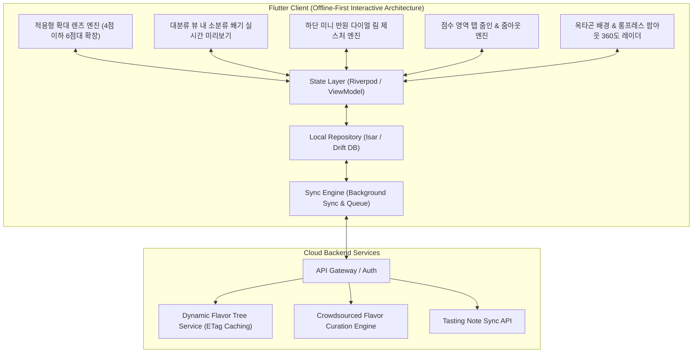

# 🥃 Flavor Wheel (플레이버 휠) - 제품 기획 및 기술 설계서 (PRD & System Spec)

> **"향과 맛 애호가들을 위한 Offline-First 스마트 테이스팅 노트 & 2단계 줌인 플레이버 휠 플랫폼"**  
> *"면적 터치 위아래 드래그 조작, 점수 영역 탭 시 소분류 확대 진입, 4점 이하 대분류 적응형 확대 렌즈 UX, 대분류 영역 내 소분류 10점 만점 매핑, 소분류 쐐기 실시간 미리보기, 하단 미니 다이얼 림, 그리고 옥타곤 배경 360도 통합 레이더 차트 완성을 제공합니다."*

---

## 📌 목차 (Table of Contents)
1. [프로젝트 비전 및 핵심 설계 철학](#1-프로젝트-비전-및-핵심-설계-철학)
2. [핵심 아키텍처 규칙 5대 원칙](#2-핵심-아키텍처-규칙-5대-원칙)
   - 2.1 [Offline-First 영속성 및 동기화 규칙](#21-offline-first-영속성-및-동기화-규칙)
   - 2.2 [면적 드래그 조작 & 점수 영역 탭 줌인 모델](#22-면적-드래그-조작--점수-영역-탭-줌인-모델)
   - 2.3 [대분류 4점 이하 적응형 확대 렌즈 UX (Adaptive Zoom Expansion)](#23-대분류-4점-이하-적응형-확대-렌즈-ux-adaptive-zoom-expansion)
   - 2.4 [대분류 점수 뷰 내 기입된 소분류 쐐기 영역 실시간 미리보기](#24-대분류-점수-뷰-내-기입된-소분류-쐐기-영역-실시간-미리보기)
   - 2.5 [소분류 줌인 상태 하단 중앙 미니 반원 다이얼 림](#25-소분류-줌인-상태-하단-중앙-미니-반원-다이얼-림)
   - 2.6 [완성형 차트: 옥타곤 대분류 배경 & 소분류 롱프레스 팝아웃 확대](#26-완성형-차트-옥타곤-대분류-배경--소분류-롱프레스-팝아웃-확대)
3. [시스템 아키텍처 다이어그램](#3-시스템-아키텍처-다이어그램)
4. [상세 기능 요구사항 명세 (FRD)](#4-상세-기능-요구사항-명세-frd)
5. [데이터베이스 스키마 및 JSON 스펙](#5-데이터베이스-스키마-및-json-스펙)
6. [단계별 로드맵 & 마일스톤](#6-단계별-로드맵--마일스톤)
7. [인터랙티브 프로토타입 안내](#7-인터랙티브-프로토타입-안내)

---

## 1. 프로젝트 비전 및 핵심 설계 철학

위스키를 비롯한 주류 및 미식(와인, 커피, 맥주 등) 애호가들이 장소와 네트워크 환경에 구애받지 않고 시음 경험을 정밀하게 기록하고 탐색할 수 있는 플랫폼을 구축합니다.

* **No Blank Screen (항상 즉시 동작)**: 지하 바(Bar)나 위스키 축제 등 오프라인 환경에서도 100% 정상 작동하는 **Offline-First**.
* **Zero Initial Bias (초기 0점 출발)**: 모든 향미 평점은 0점에서 시작하여, 사용자가 시음하며 실제로 감지한 향미만 선별적으로 점수를 부여.
* **Adaptive Zoom for Low Scores (낮은 점수 적응형 확대 렌즈)**: 대분류 점수가 4점 이하인 경우에도 소분류 줌인 시 6점대 높이로 부드럽게 시각적 스케일을 확장하여 쾌적한 터치 조작성을 보장.
* **In-Wheel Realtime Preview (대분류 뷰 내 소분류 쐐기 미리보기)**: 소분류를 기입하고 1단계 휠 뷰로 돌아왔을 때, 대분류 점수 영역 안에 소분류들이 채워진 상태가 실시간으로 시각화.
* **Bottom Mini Rotary Dial (하단 미니 반원 다이얼 림)**: 소분류 줌인 상태에서 하단 중앙에 같은 비율의 미니 반원 다이얼을 두어 한 손으로 손쉽게 대분류를 전환.

---

## 2. 핵심 아키텍처 규칙 5대 원칙

### 2.1 Offline-First 영속성 및 동기화 규칙

1. **Local DB = Single Source of Truth**: 모든 읽기/쓰기 작업은 로컬 데이터베이스(`Isar` 또는 `Drift`)를 최우선으로 통과합니다.
2. **낙관적 업데이트 (Optimistic Updates)**: 서버 응답을 기다리지 않고 로컬에 즉시 커밋 후 UI에 0ms로 반영합니다.
3. **ETag & 버전 해시 기반 델타 캐싱**: 향미 마스터 트리는 앱 최초 실행 시 로컬에 저장되며, 서버 호출 시 ETag 헤더를 비교하여 변경사항이 있을 때만 증분 다운로드(`304 Not Modified` 처리)합니다.

---

### 2.2 면적 드래그 조작 & 점수 영역 탭 줌인 모델

* **면적 드래그**: 섹터/레일 영역 어디든 터치하고 Y축으로 드래그하면 손가락 높이에 맞춰 점수가 조절됩니다.
* **점수 영역 탭 줌인**: 소분류가 아직 없는 경우 `[🔍 탭하여 소분류 평가하기]` 버튼으로 진입하고, 소분류가 이미 채워진 대분류는 **점수 영역(소분류 쐐기들)을 직접 탭하여 소분류 세부 조작 화면으로 즉시 확대(Zoom-in)**됩니다.

---

### 2.3 대분류 4점 이하 적응형 확대 렌즈 UX (Adaptive Zoom Expansion)

* **문제 해결**: 대분류 점수가 1~4점으로 낮을 경우 소분류 조작 레일이 너무 좁아지는 현상을 방지.
* **동적 스케일 확장 (Visual Expansion)**:
  * 하단 중앙의 **미니 반원 다이얼 사이즈($R_{\text{dial}}$)는 100% 동일하게 유지**.
  * 상단 부채꼴 그래프 영역만 **대분류 점수가 4.0점 이하일 때 6.0점대 높이 수준으로 적응형 확대(Adaptive Zoom)**:
    $$\text{effectiveIntensity} = 4.0 + \text{intensity} \times 0.5 \quad (\text{intensity} \le 4.0)$$
  * 1단계 휠 뷰 복귀 시 및 360도 완성형 차트에서는 본래의 실제 대분류 점수 비율로 렌더링되어 데이터 왜곡 없이 완벽한 조화를 이룹니다.

---

### 2.4 대분류 점수 뷰 내 기입된 소분류 쐐기 영역 실시간 미리보기

* 1단계 휠 전체 뷰에서도 해당 대분류에 소분류들이 기입되어 있다면, **대분류 점수 영역 내부에 각 소분류 쐐기들이 10점 만점 비례 점수 높이만큼 분할 채워진 모습**이 실시간으로 렌더링됩니다.

---

### 2.5 소분류 줌인 상태 하단 중앙 미니 반원 다이얼 림

* 소분류 줌인 상태 시 화면 하단 중심에 작은 반원 다이얼이 렌더링되며, 이를 좌우로 돌린 후 손을 떼면 1단계 대분류 점수 화면으로 부드럽게 복귀 전환됩니다.

---

### 2.6 완성형 차트: 옥타곤 대분류 배경 & 소분류 롱프레스 팝아웃 확대

* 8대 대분류 점수를 연결한 옥타곤 다각형이 배경에 깔리고, 완성된 차트에서 소분류 쐐기를 **길게 누르면(Long-press)** 해당 쐐기가 앞으로 팝아웃 확대되며 상세 정보가 하이라이트됩니다.

---

## 3. 시스템 아키텍처 다이어그램

---

## 4. 상세 기능 요구사항 명세 (FRD)

| ID | 기능 영역 | 세부 기능 | 우선순위 | 상세 기술 명세 |
| :--- | :--- | :--- | :---: | :--- |
| **FR-01** | **인차트 조작** | **적응형 확대 렌즈 UX** | **P1** | 대분류 4점 이하 시 미니 다이얼 크기는 유지하고 그래프만 6점대 높이로 확장 |
| **FR-02** | **인차트 조작** | **대분류 내 소분류 미리보기**| **P1** | 대분류 점수 뷰에서도 기입된 소분류들이 쐐기 영역으로 나뉘어 실시간 표시 |
| **FR-03** | **휠 네비게이션**| **하단 미니 반원 다이얼**| **P1** | 소분류 줌인 상태에서 하단 중앙 미니 반원을 돌려 대분류 손쉬운 전환 |
| **FR-04** | **결과 렌더링** | **옥타곤 배경 & 롱프레스**| **P1** | 8각형 대분류 배경 + 소분류 롱프레스 시 팝아웃 확대 |
| **FR-05** | **Offline-First**| **로컬 저장 및 동기화** | **P1** | 로컬 Isar DB에 0ms 즉시 영속화 및 자동 백그라운드 큐 동기화 |

---

## 5. 단계별 로드맵 & 마일스톤

| 단계 | 마일스톤 | 산출물 및 검증 기준 | 상태 |
| :--- | :--- | :--- | :---: |
| **1단계** | **설계 & 프로토타입** | • PRD 및 적응형 확대 렌즈 / 영역 바운딩 규칙 확립 • 옥타곤 롱프레스 통합 HTML 프로토타입 | 🟢 **완료** |
| **2단계** | **Flutter 기반 엔진** | • Isar 로컬 DB 및 Sync Engine 구축 • CustomPainter 기반 2단계 줌인 & 360도 통합 휠 위젯 | ⚪ 예정 |
| **3단계** | **동적 API & 큐레이션** | • Dynamic Flavor Tree API & 관리자 승격 파이프라인 연동 • 음성 STT & LLM 요약 자동 완성 파이프라인 | ⚪ 예정 |
| **4단계** | **검색/추천 & 배포** | • 위스키 색인 오프라인 검색 엔진 • 플레이버 벡터 유사도 추천 및 베타 배포 | ⚪ 예정 |

---

## 6. 인터랙티브 프로토타입 안내

프로젝트 내 [prototype/index.html](file:///Users/chanholee/Desktop/project/FlavorWheelProject/prototype/index.html)에서 위 규칙이 모두 반영된 모바일 프로토타입을 즉시 테스트하실 수 있습니다:

* **대분류 4점 이하 적응형 확대 렌즈**: 대분류가 4점 이하여도 줌인 시 6점대 높이로 시원하게 확장되어 쾌적한 조작감 제공
* **대분류 점수 뷰 내 소분류 쐐기 미리보기**: 소분류를 작성하고 휠로 돌아왔을 때 대분류 영역 안에 소분류들이 채워진 상태 표시
* **하단 미니 반원 다이얼 림**: 소분류 뷰 하단 중앙의 작은 반원을 좌우로 슥슥 돌려 대분류를 편안하게 전환
* **옥타곤 배경 & 롱프레스 팝아웃**: 하단 `[🏆 완성된 차트 보기]`에서 소분류를 길게 눌러 팝아웃 확대 체험
