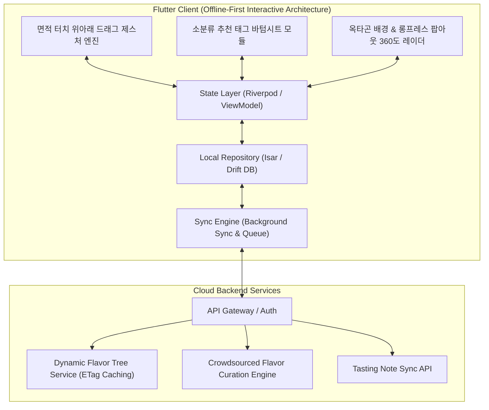

# 🥃 Flavor Wheel (플레이버 휠) - 제품 기획 및 기술 설계서 (PRD & System Spec)

> **"향과 맛 애호가들을 위한 Offline-First 스마트 테이스팅 노트 & 2단계 줌인 플레이버 휠 플랫폼"**  
> *"면적 터치 위아래 드래그 조작, 추천 태그 바텀시트 기반 소분류 동적 추가, 옥타곤(8각형) 대분류 배경 다각형 및 소분류 롱프레스 팝아웃 확대를 제공합니다."*

---

## 📌 목차 (Table of Contents)
1. [프로젝트 비전 및 핵심 설계 철학](#1-프로젝트-비전-및-핵심-설계-철학)
2. [핵심 아키텍처 규칙 5대 원칙](#2-핵심-아키텍처-규칙-5대-원칙)
   - 2.1 [Offline-First 영속성 및 동기화 규칙](#21-offline-first-영속성-및-동기화-규칙)
   - 2.2 [면적 터치 & 위아래 드래그 인차트 조작 모델](#22-면적-터치--위아래-드래그-인차트-조작-모델)
   - 2.3 [바텀시트 기반 소분류 태그 선택식 동적 추가 UX](#23-바텀시트-기반-소분류-태그-선택식-동적-추가-ux)
   - 2.4 [완성형 차트: 옥타곤 대분류 배경 & 소분류 롱프레스 팝아웃 확대](#24-완성형-차트-옥타곤-대분류-배경--소분류-롱프레스-팝아웃-확대)
   - 2.5 [인차트 대·소분류 양방향 커스텀 생성 & 큐레이션 생태계](#25-인차트-대소분류-양방향-커스텀-생성--큐레이션-생태계)
3. [시스템 아키텍처 다이어그램](#3-시스템-아키텍처-다이어그램)
4. [상세 기능 요구사항 명세 (FRD)](#4-상세-기능-요구사항-명세-frd)
5. [데이터베이스 스키마 및 JSON 스펙](#5-데이터베이스-스키마-및-json-스펙)
6. [단계별 로드맵 & 마일스톤](#6-단계별-로드맵--마일스톤)
7. [인터랙티브 프로토타입 안내](#7-인터랙티브-프로토타입-안내)

---

## 1. 프로젝트 비전 및 핵심 설계 철학

위스키를 비롯한 주류 및 미식(와인, 커피, 맥주 등) 애호가들이 장소와 네트워크 환경에 구애받지 않고 시음 경험을 정밀하게 기록하고 탐색할 수 있는 플랫폼을 구축합니다.

* **No Blank Screen (항상 즉시 동작)**: 오프라인 환경에서도 100% 정상 작동하는 **Offline-First**.
* **Direct Area Drag (직관적 면적 드래그)**: 점을 조준할 필요 없이, 차트 영역 어디든 터치하고 위아래로 쓸어올리면 게이지가 차오르는 손쉬운 조작.
* **On-Demand Tag Selection (선택식 소분류 추가)**: 불필요한 기본값 없이, `[+]` 탭 시 바텀시트에서 감지한 향미 태그만 골라 차트에 쐐기 레일로 동적 추가.
* **Octagon Background & Long-press Zoom (옥타곤 배경 & 롱프레스 확대)**: 8대 대분류 점수를 이은 옥타곤 다각형이 배경에 깔리고, 소분류를 길게 누르면 팝아웃 확대되는 완성형 360도 차트 뷰.

---

## 2. 핵심 아키텍처 규칙 5대 원칙

### 2.1 Offline-First 영속성 및 동기화 규칙

1. **Local DB = Single Source of Truth**: 모든 읽기/쓰기 작업은 로컬 데이터베이스(`Isar` 또는 `Drift`)를 최우선으로 통과합니다.
2. **낙관적 업데이트 (Optimistic Updates)**: 서버 응답을 기다리지 않고 로컬에 즉시 커밋 후 UI에 0ms로 반영합니다.
3. **ETag & 버전 해시 기반 델타 캐싱**: 향미 마스터 트리는 앱 최초 실행 시 로컬에 저장되며, 서버 호출 시 ETag 헤더를 비교하여 변경사항이 있을 때만 증분 다운로드(`304 Not Modified` 처리)합니다.

---

### 2.2 면적 터치 & 위아래 드래그 인차트 조작 모델

* **조작성 극대화**: 노브 점을 정밀하게 터치할 필요 없이, **대분류 섹터 또는 소분류 쐐기 레일 영역 어디든 터치하고 Y축(또는 방사형)으로 드래그하면 손가락 높이에 맞춰 $0.0 \sim 10.0$ 게이지가 실시간으로 차오르고 감소**.

---

### 2.3 바텀시트 기반 소분류 태그 선택식 동적 추가 UX

1. **초기 줌인 상태**: 대분류 평점 확정 후 줌인되었을 때, 소분류 레일은 비어있는 클린 상태로 시작.
2. **`[➕ 소분류 태그 추가]` 클릭**: 하단에서 **바텀 시트**가 부드럽게 슬라이드업.
3. **추천 디폴트 태그 선택**: 대분류에 해당하는 추천 태그들(예: 바닐라, 벌꿀, 캐러멜, 토피, 메이플... + 직접 입력)을 탭하여 선택하면 차트에 쐐기 레일로 즉시 생성.
4. **점수 부여**: 생성된 쐐기 레일 영역을 눌러 위아래로 드래그하여 $0.0 \sim \text{대분류점수(Cap)}$ 범위 내에서 평가.

---

### 2.4 완성형 차트: 옥타곤 대분류 배경 & 소분류 롱프레스 팝아웃 확대

1. **옥타곤(8각형) 대분류 배경 다각형**:
   * 각 대분류 점수의 꼭짓점을 연결한 옥타곤 레이더 차트 폴리곤이 차트 뒷배경에 네온 라인 및 반투명 면적으로 렌더링.
2. **소분류 롱프레스(Long-press) 팝아웃 확대**:
   * 완성된 차트에서 특정 소분류 쐐기 영역을 **길게 누르면(Long-press)**,
   * 해당 소분류 쐐기가 부드럽게 앞으로 튀어나오듯 **팝아웃(Pop-out) 확대 렌더링**되며, 뒷배경의 대분류 기준 점수와 소분류 상세 점수가 하이라이트 표시.

---

### 2.5 인차트 대·소분류 양방향 커스텀 생성 & 큐레이션 생태계

* 바텀시트 내 `[+ 직접 입력]`으로 새 소분류 생성, 휠 회전 끝의 `[+]` 섹터에서 새 대분류 생성.
* 로컬에 즉시 반영(0ms)되고, 노트 저장 시 서버 제안 큐로 전달되어 관리자 승인 후 공식 트리로 승격.

---

## 3. 시스템 아키텍처 다이어그램

---

## 4. 상세 기능 요구사항 명세 (FRD)

| ID | 기능 영역 | 세부 기능 | 우선순위 | 상세 기술 명세 |
| :--- | :--- | :--- | :---: | :--- |
| **FR-01** | **인차트 조작** | **면적 터치 위아래 드래그**| **P1** | 섹터/레일 영역 어디든 터치 후 위아래 드래그로 0~10 강도 즉시 조절 |
| **FR-02** | **소분류 추가** | **바텀시트 태그 선택** | **P1** | [+] 클릭 시 바텀시트에서 추천 태그를 선택하여 차트에 쐐기 레일로 동적 추가 |
| **FR-03** | **결과 렌더링** | **옥타곤 배경 레이더** | **P1** | 대분류 점수 꼭짓점을 이은 8각형 다각형이 차트 뒷배경에 네온 라인으로 렌더링 |
| **FR-04** | **결과 인터랙션**| **소분류 롱프레스 팝아웃** | **P1** | 소분류 쐐기 롱프레스 시 해당 쐐기가 확대 팝아웃되며 대/소분류 점수 하이라이트 |
| **FR-05** | **Offline-First**| **로컬 저장 및 동기화** | **P1** | 로컬 Isar DB에 노트/커스텀 노드 즉시 영속화, 네트워크 복구 시 자동 백그라운드 큐 동기화 |

---

## 5. 단계별 로드맵 & 마일스톤

| 단계 | 마일스톤 | 산출물 및 검증 기준 | 상태 |
| :--- | :--- | :--- | :---: |
| **1단계** | **설계 & 프로토타입** | • PRD 및 면적 드래그/옥타곤 롱프레스 규칙 확립 • 바텀시트 태그 선택식 HTML 프로토타입 | 🟢 **완료** |
| **2단계** | **Flutter 기반 엔진** | • Isar 로컬 DB 및 Sync Engine 구축 • CustomPainter 기반 면적 드래그 & 옥타곤 롱프레스 위젯 | ⚪ 예정 |
| **3단계** | **동적 API & 큐레이션** | • Dynamic Flavor Tree API & 관리자 승격 파이프라인 연동 • 음성 STT & LLM 요약 자동 완성 파이프라인 | ⚪ 예정 |
| **4단계** | **검색/추천 & 배포** | • 위스키 색인 오프라인 검색 엔진 • 플레이버 벡터 유사도 추천 및 베타 배포 | ⚪ 예정 |

---

## 6. 인터랙티브 프로토타입 안내

프로젝트 내 [prototype/index.html](file:///Users/chanholee/Desktop/project/FlavorWheelProject/prototype/index.html)에서 위 규칙이 모두 반영된 모바일 프로토타입을 즉시 테스트하실 수 있습니다:

* **면적 터치 위아래 드래그**: 섹터/레일 영역 어디든 터치하고 위아래로 쓸어올려 점수 조절
* **소분류 바텀시트 추가**: `[➕]` 탭 시 바텀시트에서 원하는 추천 태그들을 골라 쐐기 레일로 생성
* **옥타곤 배경 & 롱프레스 팝아웃**: 하단 `[🏆 완성된 차트 보기]`에서 소분류를 길게 눌러 팝아웃 확대 체험
