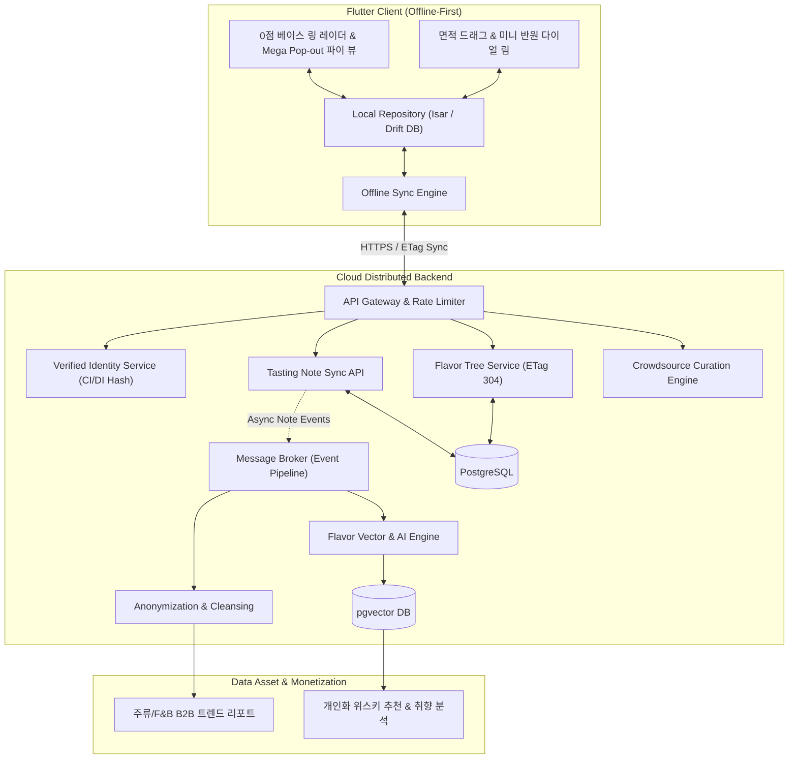

# 🥃 FlavorWheel (플레이버 휠) - 제품 및 시스템 아키텍처 (Master Specification)

> **"향과 맛 애호가들을 위한 Offline-First 스마트 테이스팅 노트 플랫폼 & 고부가가치 플레이버 데이터 에셋"**

---

## 📌 목차 (Table of Contents)
1. [프로젝트 비전 및 핵심 가치](#1-프로젝트-비전-및-핵심-가치)
2. [4대 핵심 영역 아키텍처 요약](#2-4대-핵심-영역-아키텍처-요약)
   - 🎨 [Frontend (클라이언트 & UI/UX 엔진)](#-frontend-클라이언트--uiux-엔진)
   - ⚙️ [Backend (백엔드 & 데이터 파이프라인)](#️-backend-백엔드--데이터-파이프라인)
   - 🏢 [Business Strategy (사업 전략 & 수익화 모델)](#-business-strategy-사업-전략--수익화-모델)
   - 📐 [Domain Logic (도메인 모델 & 캘리브레이션 알고리즘)](#-domain-logic-도메인-모델--캘리브레이션-알고리즘)
3. [통합 시스템 아키텍처 다이어그램](#3-통합-시스템-아키텍처-다이어그램)
4. [단계별 로드맵 & 마일스톤](#4-단계별-로드맵--마일스톤)
5. [상세 기술 문서 (Detailed Documentation)](#5-상세-기술-문서-detailed-documentation)
6. [인터랙티브 프로토타입 실행 안내](#6-인터랙티브-프로토타입-실행-안내)

---

## 1. 프로젝트 비전 및 핵심 가치

FlavorWheel은 사용자가 위스키를 비롯한 주류 및 미식(와인, 커피, 맥주 등)의 시음 경험을 오프라인 환경에서도 직관적이고 정밀하게 기록하고 탐색할 수 있는 **Offline-First 스마트 테이스팅 플랫폼**입니다.

* **No Blank Screen (항상 즉시 동작)**: 지하 바(Bar)나 시음 행사 등 열악한 네트워크 환경에서도 100% 동작하는 오프라인 퍼스트 아키텍처.
* **Sensory Structuring (감각의 계층적 구조화)**: 주관적인 맛과 향을 8대 대분류 및 30+개 소분류 트리로 객관화하고 0.0~100.0점 정밀 척도로 기록.
* **Calibrated Data Assetization (과학적 보정 기반 데이터 자산화)**: 앵커 기준점 가이드, A/B 짝비교, Z-Score 정규화로 일반인 데이터 노이즈를 보정하여 고신뢰도 F&B 데이터 에셋 구축.

---

## 2. 4대 핵심 영역 아키텍처 요약

### 🎨 Frontend (클라이언트 & UI/UX 엔진)
* **콤팩트 0점 베이스 링 ($R_0 = R_{\max} \times 0.08$)**: 0점인 항목도 $R_0$ 둘레에 꼭짓점을 형성하여 형태적 밸런스를 갖춘 8각형 레이더 차트 렌더링.
* **3단계 계층 뷰 전환**: 8대 레이더 ➔ 소분류 파이 ➔ 1.45배 Mega Pop-out 하이라이트.
* **인터랙티브 제스처**: Y축 면적 드래그 점수 매핑, 하단 중앙 미니 반원 다이얼 림 회전 네비게이션.
* 🔗 **상세 문서**: [docs/Implementation Plan/frontend.md](file:///Users/chanholee/Desktop/project/FlavorWheelProject/docs/Implementation%20Plan/frontend.md)

---

### ⚙️ Backend (백엔드 & 데이터 파이프라인)
* **프레임워크 독립 표준 아키텍처**: REST / gRPC 및 Event-Driven 마이크로서비스 설계.
* **ETag Delta Sync Engine**: 향미 마스터 트리 ETag 기반 `304 Not Modified` 캐싱 및 오프라인 델타 동기화.
* **데이터 정제 & 파이프라인**: 비식별화, 이상치 필터링, 플레이버 벡터 임베딩 생성.
* 🔗 **상세 문서**: [docs/Implementation Plan/backend.md](file:///Users/chanholee/Desktop/project/FlavorWheelProject/docs/Implementation%20Plan/backend.md)

---

### 🏢 Business Strategy (사업 전략 & 수익화 모델)
* **카테고리 확장**: 위스키 MVP ➔ 스페셜티 커피, 와인, 맥주, 디저트/치즈 페어링 확장.
* **현실적 수익 모델**: B2B 매장용 태블릿 큐레이션 SaaS, 스마트오더/바 제휴 수수료, F&B R&D 데이터 공급.
* **온보딩 정책 & 법률 준수**: 100% 무가입 로컬 허용, 선택적 전문가 Verified 뱃지, 주류 통신판매 규제 합법 준수.
* 🔗 **상세 문서**: [docs/business_strategy.md](file:///Users/chanholee/Desktop/project/FlavorWheelProject/docs/business_strategy.md)

---

### 📐 Domain Logic (도메인 모델 & 캘리브레이션 알고리즘)
* **재귀적 N-Depth 감각 트리**: 단일 루트(Depth 0: 아이템명 + 종합 평점)부터 말단(Leaf) 노드까지 무한 확장되는 단일 트리 모델.
* **전 노드 독립 스코어링**: 자식이 있으면 상위 분류(Parent), 없으면 말단(Leaf)으로 동작하며 모든 깊이의 노드가 $0.0 \sim 100.0$점 독립 점수 보유.
* **감각 캘리브레이션 & 추천**: 앵커 기준점 매핑, Bradley-Terry 짝비교 확률 모델, Z-Score 개인 편향 정규화, 테이스터 신뢰도 가중치($w_u$).
* **상태 전이 머신 & 다국어 온톨로지**: 노트 생명주기(Draft ➔ Finalized ➔ Synced ➔ Cleansed) 및 문화권별 감각 동의어 사전.
* 🔗 **상세 문서**: [docs/domain_logic.md](file:///Users/chanholee/Desktop/project/FlavorWheelProject/docs/domain_logic.md)

---

## 3. 통합 시스템 아키텍처 다이어그램

---

## 4. 단계별 로드맵 & 마일스톤

| 단계 | 마일스톤 | 산출물 및 검증 기준 | 상태 |
| :--- | :--- | :--- | :---: |
| **1단계** | **설계 & 프로토타입** | • PRD 및 3대 영역(Frontend / Backend / Business Logic) 기술 명세 확립 • 0점 베이스 링 + Mega Pop-out 인터랙티브 프로토타입 완성 | 🟢 **완료** |
| **2단계** | **Flutter 클라이언트 엔진** | • Isar 로컬 DB 및 Sync Engine 구축 • CustomPainter 2단계 줌인 & 360도 통합 휠 및 다이얼 림 위젯 구현 | ⚪ 예정 |
| **3단계** | **백엔드 API & 동기화 파이프라인** | • ETag 델타 동기화 API 및 신규 향미 크라우드소싱 파이프라인 연동 • 유기명 본인인증(CI/DI) 모듈 연동 | ⚪ 예정 |
| **4단계** | **데이터 상품화 & 추천 엔진** | • 플레이버 벡터 유사도 기반 추천 및 B2B 트렌드 분석 리포트 파이프라인 • 글로벌 다국가 규제 모듈 적용 및 베타 배포 | ⚪ 예정 |

---

## 5. 상세 기술 문서 (Detailed Documentation)

각 영역별 세부 설계 및 구현 명세는 아래 전용 문서에서 확인하실 수 있습니다:

* 🎨 **[Frontend 상세 기술 명세서](file:///Users/chanholee/Desktop/project/FlavorWheelProject/docs/Implementation%20Plan/frontend.md)**: Canvas 렌더링 수식, N-Depth 드릴다운 뷰, 제스처 매핑, Riverpod 상태 관리.
* ⚙️ **[Backend 상세 기술 명세서](file:///Users/chanholee/Desktop/project/FlavorWheelProject/docs/Implementation%20Plan/backend.md)**: 프레임워크 독립 표준 아키텍처, ETag 델타 동기화, 데이터 파이프라인, JSON 스키마.
* 🏢 **[Business Strategy 사업 전략서](file:///Users/chanholee/Desktop/project/FlavorWheelProject/docs/business_strategy.md)**: B2B 매장용 SaaS, 스마트오더 제휴, 단계별 로드맵, 법률 및 온보딩 정책.
* 📐 **[Domain Logic 도메인 명세서](file:///Users/chanholee/Desktop/project/FlavorWheelProject/docs/domain_logic.md)**: 유비쿼터스 언어, N-Depth 재귀 트리 모델, 감각 캘리브레이션 수식, 상태 머신, 다국어 온톨로지.
* 📚 **[학술 논문 및 참조 자료실](file:///Users/chanholee/Desktop/project/FlavorWheelProject/docs/references/README.md)**: 감각 과학, 캘리브레이션 논문, 렌더링 기법 자동 색인 자료실.

---

## 6. 인터랙티브 프로토타입 실행 안내

프로젝트 내 [prototype/index.html](file:///Users/chanholee/Desktop/project/FlavorWheelProject/prototype/index.html) (또는 루트 [index.html](file:///Users/chanholee/Desktop/project/FlavorWheelProject/index.html))에서 프론트엔드 핵심 인터랙션을 브라우저에서 직접 테스트할 수 있습니다:

1. **콤팩트 0점 베이스 링 ($R_0$)**: $0$점인 대분류도 중심 링에 자연스럽게 닫히는 레이더 다각형 확인.
2. **3단계 계층 뷰**: 레이더 뷰 ➔ 파이 뷰 ➔ 개별 파이 1.45배 Mega Pop-out 하이라이트.
3. **제스처 조작**: Y축 면적 드래그 점수 조정, 하단 미니 반원 다이얼 림 회전.
