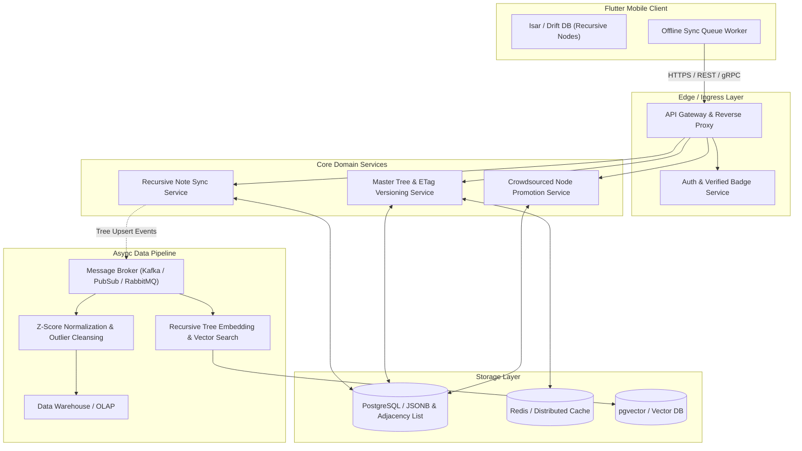

# ⚙️ FlavorWheel Backend 기술 명세서 (Backend Specification)

> **"N-Depth 재귀 트리 동기화, ETag 델타 캐싱, 빅데이터 정제 및 상품화 파이프라인을 지원하는 표준 분산 백엔드"**

---

## 📌 목차 (Table of Contents)
1. [백엔드 아키텍처 개요 (Framework-Agnostic)](#1-백엔드-아키텍처-개요-framework-agnostic)
2. [핵심 서비스 및 서브시스템](#2-핵심-서비스-및-서브시스템)
   - 2.1 [API Gateway & Auth Service](#21-api-gateway--auth-service)
   - 2.2 [Recursive Tasting Note Sync Engine (N-Depth 델타 동기화)](#22-recursive-tasting-note-sync-engine-n-depth-델타-동기화)
   - 2.3 [Dynamic Flavor Master Tree Service (ETag 304 캐싱)](#23-dynamic-flavor-master-tree-service-etag-304-캐싱)
   - 2.4 [Crowdsourced Node Promotion Engine (신규 하위 노드 승격 파이프라인)](#24-crowdsourced-node-promotion-engine-신규-하위-노드-승격-파이프라인)
3. [데이터 파이프라인 & 상품화 정제 엔진](#3-데이터-파이프라인--상품화-정제-엔진)
4. [데이터베이스 스키마 및 JSON 직렬화 규격](#4-데이터베이스-스키마-및-json-직렬화-규격)
   - 4.1 [N-Depth 테이스팅 노트 데이터 모델](#41-n-depth-테이스팅-노트-데이터-모델)
   - 4.2 [향미 마스터 트리 데이터 모델](#42-향미-마스터-트리-데이터-모델)
   - 4.3 [동기화 델타 프로토콜 (JSON)](#43-동기화-델타-프로토콜-json)
5. [배포 및 인프라 확장 전략](#5-배포-및-인프라-확장-전략)

---

## 1. 백엔드 아키텍처 개요 (Framework-Agnostic)

FlavorWheel 백엔드는 **재귀적 N-Depth 감각 트리(Recursive Sensory Tree)**를 안전하게 수집·동기화하고 정제하기 위한 마이크로서비스 지향 분산 아키텍처를 채택합니다.



---

## 2. 핵심 서비스 및 서브시스템

### 2.1 API Gateway & Auth Service
* **무가입 로컬 ➔ 소셜 간편 로그인(Apple, Google, Kakao)** 토큰 검증.
* **전문가(Verified Badge) 권한 확인**: 자격증(소믈리에, 바텐더 등) 인증 유저 메타데이터 바인딩.

---

### 2.2 Recursive Tasting Note Sync Engine (N-Depth 델타 동기화)
* **임의 깊이의 트리 동기화 지원**:
  * 트리 전체를 통째로 교체하는 방식과 특정 `nodeId` 단위의 부분 업데이트(Partial Mutation)를 모두 지원.
* **충돌 해결 규칙 (Conflict Resolution)**:
  * 노드 단위 Last-Write-Wins (LWW) with Timestamp.
  * 커스텀 추가된 자식 노드는 고유 UUID 기반으로 자동 병합.

---

### 2.3 Dynamic Flavor Master Tree Service (ETag 304 캐싱)
* 공식 표준 향미 트리(Master Tree)를 계층형 JSON으로 클라이언트에 공급.
* `ETag` 헤더 비교를 통해 변경이 없을 시 `304 Not Modified`로 응답하여 대역폭 절약.

---

### 2.4 Crowdsourced Node Promotion Engine (신규 하위 노드 승격 파이프라인)
* 사용자들이 특정 부모 노드 아래에 새로 추가한 커스텀 자식 노드(`isCustom = true`)들을 수집.
* **승격 단계**:
  ```
  [커스텀 자식 노드 추가] 
       ➔ [유사 어휘 AI 클러스터링] 
       ➔ [Verified 유저 검증 및 사용 빈도 집계] 
       ➔ [공식 마스터 트리의 하위 정식 노드로 편입 & 버전 갱신]
  ```

---

## 3. 데이터 파이프라인 & 상품화 정제 엔진

1. **Z-Score 편향 제거 Worker**:
   * 각 유저의 채점 성향($\mu_u, \sigma_u$)을 제거하여 객관화된 정규화 점수($Z$) 산출.
2. **트리 구조 평탄화 및 벡터 임베딩 Worker**:
   * 재귀 트리의 깊이별 가중치(Depth Decay Factor)를 적용하여 고정 $D$차원 임베딩 벡터 생성.
3. **B2B 시장 통계 리포트 생성 Worker**:
   * 주류/음료 제품별, 연령대별, 카테고리별 실시간 향미 분포 집계.

---

## 4. 데이터베이스 스키마 및 JSON 직렬화 규격

### 4.1 N-Depth 테이스팅 노트 데이터 모델 (JSON)

```json
{
  "note_id": "tn_9f8a7c6e-1234-4567-89ab-cdef01234567",
  "user_id": "usr_verified_8820",
  "item_metadata": {
    "category": "whisky",
    "brand": "Macallan",
    "name": "Macallan 12 Double Cask",
    "abv": 40.0
  },
  "root_node": {
    "node_id": "root_macallan_12",
    "name": "Macallan 12 Double Cask",
    "depth": 0,
    "score": 85.0,
    "is_custom": false,
    "children": [
      {
        "node_id": "maj_sweet",
        "name": "Sweet",
        "depth": 1,
        "score": 75.0,
        "is_custom": false,
        "children": [
          {
            "node_id": "sub_vanilla",
            "name": "Vanilla",
            "depth": 2,
            "score": 85.0,
            "is_custom": false,
            "children": []
          }
        ]
      },
      {
        "node_id": "maj_fruity",
        "name": "Fruity",
        "depth": 1,
        "score": 80.0,
        "is_custom": false,
        "children": [
          {
            "node_id": "sub_dried_fruit",
            "name": "Dried Fruit",
            "depth": 2,
            "score": 85.0,
            "is_custom": false,
            "children": [
              {
                "node_id": "subsub_fig",
                "name": "Fig",
                "depth": 3,
                "score": 80.0,
                "is_custom": false,
                "children": [
                  {
                    "node_id": "custom_black_fig",
                    "name": "Black Mission Fig",
                    "depth": 4,
                    "score": 95.0,
                    "is_custom": true,
                    "children": []
                  }
                ]
              }
            ]
          }
        ]
      }
    ]
  },
  "created_at": "2026-09-04T10:30:00Z",
  "updated_at": "2026-09-04T14:30:00Z"
}
```

---

### 4.2 향미 마스터 트리 데이터 모델 (JSON)

```json
{
  "tree_version": "v2.0.0",
  "etag": "\"w/master-tree-v2\"",
  "category": "whisky",
  "major_branches": [
    {
      "node_id": "maj_sweet",
      "name_ko": "단맛/바닐라",
      "name_en": "Sweet & Vanilla",
      "color_hex": "#FFB74D",
      "children": [
        {
          "node_id": "sub_vanilla",
          "name_ko": "바닐라",
          "name_en": "Vanilla",
          "children": []
        }
      ]
    }
  ]
}
```

---

### 4.3 동기화 델타 프로토콜 (JSON)

```json
{
  "sync_client_id": "client_abc123",
  "last_synced_timestamp": "2026-09-04T14:00:00Z",
  "mutations": [
    {
      "action": "UPSERT_NODE",
      "note_id": "tn_9f8a7c6e-1234-4567-89ab-cdef01234567",
      "parent_node_id": "subsub_fig",
      "node_data": {
        "node_id": "custom_black_fig",
        "name": "Black Mission Fig",
        "depth": 4,
        "score": 9.5,
        "is_custom": true
      }
    }
  ]
}
```

---

## 5. 배포 및 인프라 확장 전략

* **PostgreSQL JSONB + 계층형 인덱스(LTREE / Adjacency List)**를 활용한 빠른 트리 탐색 및 쿼리 최적화.
* **글로벌 리전 확장 및 데이터 주권(Data Residency)** 분리 배포 지원.
