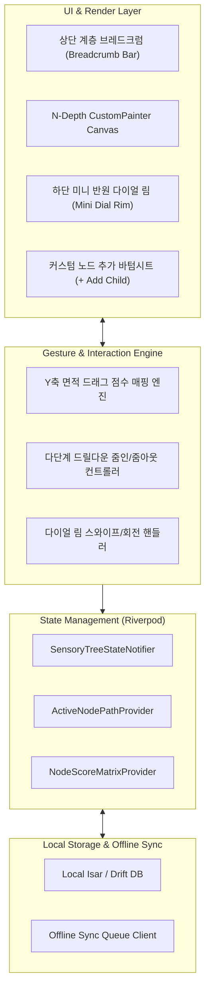

# 🎨 FlavorWheel Frontend 기술 명세서 (Frontend Specification)

> **"지하 바(Bar)와 페스티벌 현장에서도 끊김 없는 0ms 반응성, N-Depth 재귀 트리 드릴다운 휠 인터랙션"**

---

## 📌 목차 (Table of Contents)
1. [프론트엔드 아키텍처 개요](#1-프론트엔드-아키텍처-개요)
2. [렌더링 엔진 및 수학적 모델](#2-렌더링-엔진-및-수학적-모델)
   - 2.1 [콤팩트 0점 미니 베이스 링 ($R_0$) 모델](#21-콤팩트-0점-미니-베이스-링-r_0-모델)
   - 2.2 [N-Depth 다단계 드릴다운 (Drill-Down) 휠 네비게이션](#22-n-depth-다단계-드릴다운-drill-down-휠-네비게이션)
   - 2.3 [개별 파이 1.45배 Mega Pop-out & 네온 글로우](#23-개별-파이-145배-mega-pop-out--네온-글로우)
   - 2.4 [적응형 줌(Adaptive Zoom) & 배경 눈금 동적 재스케일링](#24-적응형-줌adaptive-zoom--배경-눈금-동적-재스케일링)
   - 2.5 [부모 뷰 내 하위 자식 노드 쐐기 실시간 미리보기](#25-부모-뷰-내-하위-자식-노드-쐐기-실시간-미리보기)
3. [제스처 및 인터랙션 엔진](#3-제스처-및-인터랙션-엔진)
   - 3.1 [Y축 면적 드래그 점수 매핑 (0.0 ~ 10.0점)](#31-y축-면적-드래그-점수-매핑-00--100점)
   - 3.2 [하단 중앙 미니 반원 다이얼 림 회전](#32-하단-중앙-미니-반원-다이얼-림-회전)
   - 3.3 [상단 브레드크럼 (Breadcrumb Path) 계층 이동](#33-상단-브레드크럼-breadcrumb-path-계층-이동)
4. [상태 관리 및 오프라인 영속성](#4-상태-관리-및-오프라인-영속성)
   - 4.1 [Flutter Riverpod 재귀 상태 모델](#41-flutter-riverpod-재귀-상태-모델)
   - 4.2 [로컬 DB (Isar / Drift) 영속화 및 낙관적 UI 업데이트](#42-로컬-db-isar--drift-영속화-및-낙관적-ui-업데이트)
5. [컴포넌트 구조 및 위젯 트리](#5-컴포넌트-구조-및-위젯-트리)

---

## 1. 프론트엔드 아키텍처 개요

FlavorWheel 프론트엔드는 **Flutter (Dart)** 기반으로 구축되며, **재귀적 N-Depth 감각 트리(Recursive Sensory Tree)**를 사용자가 한 손으로 손쉽게 드릴다운하고 탐색할 수 있도록 고성능 `CustomPainter` 기반 렌더링 파이프라인을 갖춥니다.



---

## 2. 렌더링 엔진 및 수학적 모델

### 2.1 콤팩트 0점 미니 베이스 링 ($R_0$) 모델

중심부(0점) 뭉침을 해소하고 0점인 항목도 형태적 밸런스를 유지하도록 콤팩트한 $0$점 미니 베이스 링을 배치합니다.

* **반지름 스케일 수식**:
  $$R_0 = R_{\max} \times 0.08, \quad R(\text{score}) = R_0 + \left(\frac{R_{\max} - R_0}{100}\right) \times \text{score} \quad (\text{score} \in [0, 100])$$
* **특징**: $0$점인 노드도 $R_0$ 둘레에 꼭짓점을 형성하여 자연스러운 다각형 형성.

---

### 2.2 N-Depth 다단계 드릴다운 (Drill-Down) 휠 네비게이션

트리의 깊이가 얼마이든 **'현재 포커스된 부모 노드'와 '그 직계 자식 노드들'**을 휠로 렌더링하며, 사용자가 원하는 만큼 깊이 드릴다운할 수 있습니다.

```
[ Depth 0: 최상위 아이템 뷰 (8대 대분류 레이더) ]
  • 상단 브레드크럼: [ 🥃 Macallan 12 Double Cask (85.0점) ]
  • 휠 화면: Sweet, Fruity, Peaty 등 8대 대분류 레이더 다각형
        │
        ▼ (특정 대분류 섹터 탭: 예: Fruity 80.0점)
[ Depth 1: Fruity 서브 휠 드릴다운 ]
  • 상단 브레드크럼: [ Macallan 12 ] > [ 🍎 Fruity (80.0점) ]
  • 휠 화면: Dried Fruit, Fresh Apple, Citrus 등 Fruity의 자식 파이 조각들
        │
        ▼ (하위 브랜치 탭: 예: Dried Fruit 85.0점)
[ Depth 2: Dried Fruit 서브 휠 드릴다운 ]
  • 상단 브레드크럼: [ Macallan 12 ] > [ Fruity ] > [ 🍇 Dried Fruit (85.0점) ]
  • 휠 화면: Raisin(90.0), Fig(80.0), Prune(65.0) 등 세부 뉘앙스 파이들
        │
        ▼ (상단 브레드크럼 터치 또는 휠 중심부 탭)
[ 상위 부모 휠로 부드럽게 줌아웃 복귀 ]
```

---

### 2.3 개별 파이 1.45배 Mega Pop-out & 네온 글로우

* 최하위 말단 노드(Leaf) 또는 특정 파이 조각을 탭하면, 해당 섹터가 **1.45배 반경으로 확대(Mega Pop-out)**되고 네온 글로우 하이라이트가 적용됩니다.
* 비선택 파이 조각들은 반투명(`Opacity: 0.35`) 처리되어 선택된 향미에 대한 몰입도를 높입니다.

---

### 2.4 적응형 줌(Adaptive Zoom) & 배경 눈금 동적 재스케일링

* 현재 노드의 점수가 40.0점 이하일 때 캔버스가 60.0점대 높이로 적응형 확대(Adaptive Zoom)되어 저점수대의 세밀한 미세 조정을 보조합니다.
* 배경 눈금 라벨은 기본 $20, 40, 60, 80, 100$에서 $10\text{점}, 20\text{점}, 30\text{점 (상한)}$으로 자동 전환됩니다.

---

### 2.5 부모 뷰 내 하위 자식 노드 쐐기 실시간 미리보기

상위 부모 휠을 보고 있을 때도, 하위 자식 노드들에 입력된 점수들이 부모 섹터 내부의 **미니 쐐기 파이(Wedges)** 형태로 실시간 렌더링됩니다.

---

## 3. 제스처 및 인터랙션 엔진

### 3.1 Y축 면적 드래그 점수 매핑 (0.0 ~ 100.0점)
* **터치 영역**: 현재 활성화된 섹터의 패스 내부 어디든 터치하여 상하 드래그.
* **수식**: $\text{score} = \text{clamp}\left(\frac{Y_{\text{bottom}} - Y_{\text{touch}}}{Y_{\text{bottom}} - Y_{\text{top}}} \times 100, \; 0, \; 100\right)$
* **피드백**: $1.0$점 / $0.5$점 단위 햅틱 진동.

### 3.2 하단 중앙 미니 반원 다이얼 림 회전
* 같은 깊이의 형제 노드(Sibling Nodes) 간의 빠른 전환을 지원하는 회전 다이얼.

### 3.3 상단 브레드크럼 (Breadcrumb Path) 계층 이동
* 현재 트리 깊이를 가로 스크롤 가능한 칩(Chip) 형태로 표시하며, 이전 단계 칩을 누르면 즉시 해당 상위 깊이로 애니메이션과 함께 복귀.

---

## 4. 상태 관리 및 오프라인 영속성

### 4.1 Flutter Riverpod 재귀 상태 모델

```dart
@freezed
class SensoryNodeState with _$SensoryNodeState {
  const factory SensoryNodeState({
    required String nodeId,
    required String name,
    required int depth,
    required double score,
    required bool isCustom,
    required List<SensoryNodeState> children,
  }) = _SensoryNodeState;
}

@freezed
class TastingTreeViewState with _$TastingTreeViewState {
  const factory TastingTreeViewState({
    required String noteId,
    required SensoryNodeState rootNode,
    required List<String> navigationPathNodeIds, // 현재 포커스 브레드크럼 경로
    required String? highlightedChildNodeId,
    required bool isAdaptiveZoom,
  }) = _TastingTreeViewState;
}
```

### 4.2 로컬 DB (Isar / Drift) 영속화 및 낙관적 UI 업데이트
* 모든 노드의 점수 변경과 자식 노드 추가는 로컬 DB에 선(先) 커밋된 후 UI에 0ms로 반영됩니다.

---

## 5. 컴포넌트 구조 및 위젯 트리

```
com_flavorwheel_wishcore/lib/
├── presentation/
│   ├── wheel/
│   │   ├── recursive_wheel_screen.dart    # N-Depth 재귀 휠 컨테이너
│   │   ├── widgets/
│   │   │   ├── breadcrumb_path_bar.dart   # 상단 계층 브레드크럼 바
│   │   │   ├── recursive_wheel_painter.dart # N-Depth Canvas CustomPainter
│   │   │   ├── mini_dial_rim.dart         # 하단 반원 다이얼 림
│   │   │   └── add_custom_node_sheet.dart # '+ 하위 항목 추가' 바텀시트
│   ├── note/
│   │   └── tasting_card_preview.dart      # 완성형 테이스팅 카드 뷰
├── application/
│   ├── tree_view_controller.dart          # Riverpod StateNotifier
├── domain/
│   └── models/
│       └── sensory_node.dart              # 재귀 SensoryNode 엔티티
└── infrastructure/
    └── local_db/                          # Isar / Drift 로컬 스토리지
```
