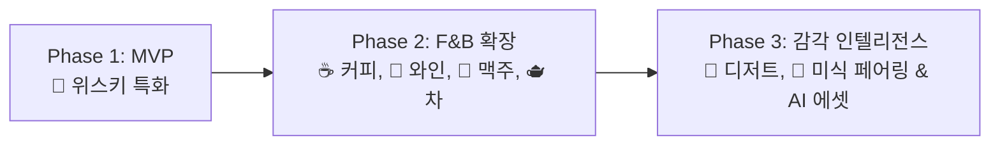
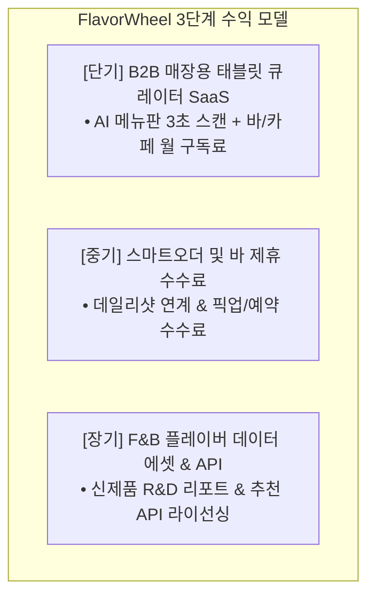

# 🏢 FlavorWheel 사업 전략 및 제품 기획서 (Business Strategy & Product Planning)

> **"주류를 넘어 F&B 미식 전반으로 확장하는 스마트 테이스팅 플랫폼, 현실적인 수익화 모델 및 글로벌 규제 대응 전략"**

---

## 📌 목차 (Table of Contents)
1. [사업 비전 및 시장 기회](#1-사업-비전-및-시장-기회)
2. [카테고리 확장 로드맵 (Phase 1 ~ Phase 3)](#2-카테고리-확장-로드맵-phase-1--phase-3)
3. [현실적 비즈니스 모델 및 수익화 전략](#3-현실적-비즈니스-모델-및-수익화-전략)
   - 3.1 [단기/중기: B2B 매장용 큐레이션 태블릿 SaaS & 3초 AI 메뉴판 스캐너](#31-단기중기-b2b-매장용-큐레이션-태블릿-saas--3초-ai-메뉴판-스캐너)
   - 3.2 [중기: 스마트오더 및 바(Bar) 제휴 수수료 모델](#32-중기-스마트오더-및-바bar-제휴-수수료-모델)
   - 3.3 [장기: F&B 신제품 R&D 데이터 에셋 및 추천 API 라이선싱](#33-장기-fb-신제품-rd-데이터-에셋-및-추천-api-라이선싱)
4. [사용자 획득 및 프로필 정책](#4-사용자-획득-및-프로필-정책)
   - 4.1 [무마찰(Zero-Friction) 온보딩 & 이원화 앵커(Dual Anchor) 전략](#41-무마찰zero-friction-온보딩--이원화-앵커dual-anchor-전략)
   - 4.2 [신뢰 기반 전문가 'Verified 뱃지' 시스템](#42-신뢰-기반-전문가-verified-뱃지-시스템)
5. [국내외 법률 규제 및 리스크 대응 전략](#5-국내외-법률-규제-및-리스크-대응-전략)
   - 5.1 [국내 주류 통신판매 규제 및 스마트오더 연계](#51-국내-주류-통신판매-규제-및-스마트오더-연계)
   - 5.2 [개인정보보호(PIPA/GDPR) 및 데이터 주권](#52-개인정보보호pipagdpr-및-데이터-주권)
   - 5.3 [글로벌 다국가 규제 모듈화 아키텍처](#53-글로벌-다국가-규제-모듈화-아키텍처)

---

## 1. 사업 비전 및 시장 기회

미식(Gourmet) 및 프리미엄 주류 시장은 급성장하고 있으나, 소비자의 감각 경험은 여전히 **주관적이고 파편화된 메모나 정성적 블로그 후기**에 머물러 있습니다.

FlavorWheel은 개인이 느끼는 맛과 향을 **계층적 휠(Flavor Wheel)을 통해 직관적으로 구조화하고 데이터화**함으로써:
1. **소비자**에게는 자신의 취향을 명확히 발견하고 최적의 음료/음식을 추천받는 경험을 제공합니다.
2. **F&B 매장(바, 카페, 바틀샵)**에는 고객 맞춤형 큐레이션 및 매출 증대 솔루션을 제공합니다.
3. **제조사 및 브랜드**에는 실제 소비자 감각 피드백 기반의 고부가가치 시장 데이터 에셋을 공급합니다.

---

## 2. 카테고리 확장 로드맵 (Phase 1 ~ Phase 3)

* **Phase 1 (MVP - 위스키 특화)**:
  * 마니아층의 기록 욕구가 가장 강하고, 향미 스펙트럼(피트, 바닐라, 과일, 스파이시 등)이 명확한 싱글몰트/버번 위스키 시장 집중 공략.
* **Phase 2 (미식 음료 카테고리 확장)**:
  * 스페셜티 커피(SCA 기준), 와인, 수제 맥주(Untappd 영역), 프리미엄 전통주 및 차(Tea) 카테고리 확장.
* **Phase 3 (미식 전반 & 크로스 페어링)**:
  * 초콜릿, 치즈, 프리미엄 육류 등 미식 전반으로 확장하며, 주류와 음식 간의 크로스 플레이버 매칭 제공.

---

## 3. 현실적 비즈니스 모델 및 수익화 전략

기존 플랫폼(Vivino, Untappd 등)의 실패 사례를 교훈 삼아, 초기에는 불확실한 '순수 데이터 판매' 대신 **확실한 매장 B2B SaaS 및 제휴 수익**에 집중합니다.

### 3.1 단기/중기: B2B 매장용 큐레이션 태블릿 SaaS & 3초 AI 메뉴판 스캐너
* **타겟 고객**: 위스키 바(Bar), 와인 바, 바틀샵, 스페셜티 로스터리 카페.
* **점주 온보딩 혁신 (AI 메뉴판 OCR 스캐너)**:
  * 점주들이 수백 종의 위스키 재고를 수동으로 입력하는 불편을 없애기 위해, **종이 메뉴판 사진 1장을 찍으면 Vision AI/OCR이 3초 만에 매장 메뉴 및 보유 보틀을 자동 디지털화**하여 등록.
* **매장 고객 경험**:
  * 매장 내 태블릿에서 고객이 원하는 맛(예: "달콤하고 바닐라 풍미가 강한 위스키")을 터치하면, **현재 매장 메뉴 중 90% 이상 일치하는 보틀/메뉴를 즉시 추천**.
  * 점주에게는 실시간 인기 메뉴 통계 및 고객 선호 향미 분석 대시보드 제공.
* **과금 모델**: 매장당 월 구독형(SaaS) 과금 (예: 월 3~5만 원 선).

---

### 3.2 중기: 스마트오더 및 바(Bar) 제휴 수수료 모델
* 사용자가 앱에서 위스키 노트를 작성하고 유사 보틀을 추천받았을 때:
  * **"내 주변에서 이 위스키를 잔(Glass)으로 파는 바(Bar) 예약"** 연계.
  * **"인근 바틀샵에서 픽업 가능한 스마트오더(데일리샷 등 제휴)"** 구매 링크 제공.
* 거래 건당 3~5% 수준의 중개/어필리에이트 수수료 수취.

---

### 3.3 장기: F&B 신제품 R&D 데이터 에셋 및 추천 API 라이선싱
* 캘리브레이션과 LII 모순도 필터링을 거쳐 정제된 **'소비자 실제 감각 체감 골드 데이터셋'**을 주류/식품 대기업 및 유통사에 공급.
* 이커머스 및 배달 플랫폼 대상 **'취향 기반 페어링 추천 API'** 라이선싱.

---

## 4. 사용자 획득 및 프로필 정책

### 4.1 무마찰(Zero-Friction) 온보딩 & 이원화 앵커(Dual Anchor) 전략
* **초기 진입 장벽 제거**: 앱 설치 즉시 회원가입이나 본인인증 없이 로컬 DB(`Isar`/`Drift`)에 무제한 테이스팅 노트 기록 가능.
* **이원화 앵커 가이드**:
  * 위스키를 잘 모르는 입문자에게는 **'모닥불 연기', '빨간약', '투게더 바닐라'** 같은 일상 감각 앵커를 제공하여 콜드스타트 진입 장벽을 완전히 분쇄.
  * 전문가에게는 **'탈리스커 10년', '아드벡 10년'** 등 대표 제품 앵커 제공.

### 4.2 신뢰 기반 전문가 'Verified 뱃지' 시스템
* 일반 유저에게 실명을 강제하여 발생하는 **'남 눈치 보기(Social Bias)' 및 데이터 왜곡을 방지**하기 위해 닉네임 기반 자유로운 평가 보장.
* 대신 바텐더, 소믈리에, Q-Grader, 조주기능사 등 전문 패널에게만 **'Verified 전문가 뱃지'**를 부여하여 데이터 신뢰도를 투-트랙으로 관리.

---

## 5. 국내외 법률 규제 및 리스크 대응 전략

### 5.1 국내 주류 통신판매 규제 및 스마트오더 연계
* **현행법**: 한국 국세청 고시상 전통주를 제외한 일반 주류의 온라인 택배 판매는 불법.
* **대응**: 앱 내 직접 결제/배송 시스템을 두지 않고, **'순수 테이스팅 정보 아카이빙 + 합법적 스마트오더 플랫폼(픽업) 연동'**으로 규제 리스크 원천 차단.

### 5.2 개인정보보호(PIPA/GDPR) 및 데이터 주권
* 본인인증 정보(CI/DI)는 단방향 암호화 해시로만 다루며, 유저 탈퇴 시 작성된 테이스팅 데이터는 **완전 비식별화 통계 에셋**으로 전환하여 B2B 데이터셋의 연속성을 보존.

### 5.3 글로벌 다국가 규제 모듈화 아키텍처
* **한국**: 만 19세 성인 확인, 주류 정보 제공 중심.
* **미국/유럽/일본**: 21세/20세 Age Gate 및 현지 주류 배송 파트너(Drizly, Uber Eats 등) 연동 플러그인 확장.
