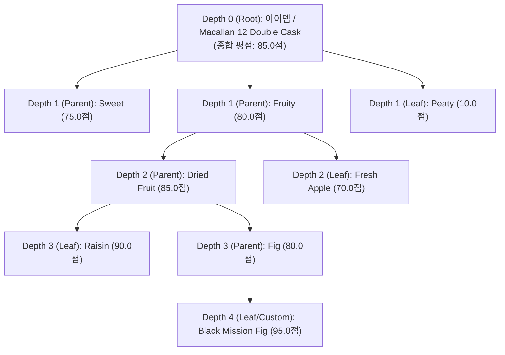
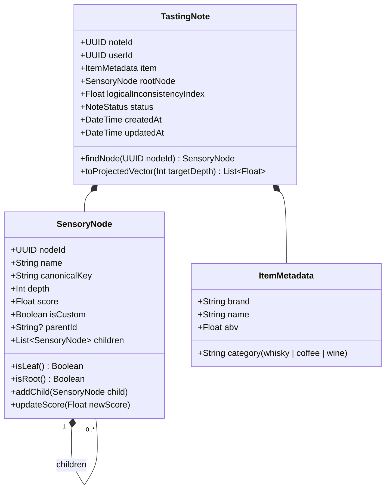
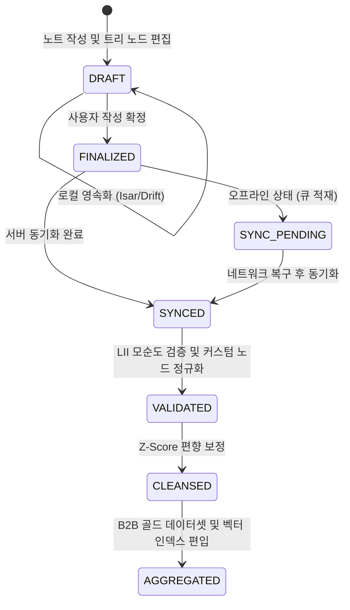

# ⚙️ FlavorWheel 도메인 명세서 (Domain Logic Specification)

> **"소프트웨어 구현 기술과 무관하게 동작하는 순수 비즈니스 법칙, 재귀적 N-Depth 도메인 모델, 캘리브레이션 알고리즘 및 상태 머신"**

---

## 📌 목차 (Table of Contents)
1. [도메인 개요 및 유비쿼터스 언어 사전](#1-도메인-개요-및-유비쿼터스-언어-사전)
2. [재귀적 N-Depth 감각 트리 도메인 모델 (Recursive Sensory Tree)](#2-재귀적-n-depth-감각-트리-도메인-모델-recursive-sensory-tree)
   - 2.1 [트리 구조 정의 (Single Root to Arbitrary Leaves)](#21-트리-구조-정의-single-root-to-arbitrary-leaves)
   - 2.2 [감각 노드 엔티티 (SensoryNode Entity)](#22-감각-노드-엔티티-sensorynode-entity)
   - 2.3 [테이스팅 노트 집합체 (TastingNote Aggregate Root)](#23-테이스팅-노트-집합체-tastingnote-aggregate-root)
   - 2.4 [이원화 기준 앵커 (Dual Anchor Reference)](#24-이원화-기준-앵커-dual-anchor-reference)
3. [비즈니스 규칙 및 불변 조건 (Invariants & Validation Rules)](#3-비즈니스-규칙-및-불변-조건-invariants--validation-rules)
   - 3.1 [점수 유효 범위 및 주관 보존 원칙](#31-점수-유효-범위-및-주관-보존-원칙)
   - 3.2 [논리적 모순도(Logical Inconsistency Index, $\text{LII}$) 필터링](#32-논리적-모순도logical-inconsistency-index-textlii-필터링)
   - 3.3 [커스텀 노드 어휘 파편화 방지 및 AI 정규화 규칙](#33-커스텀-노드-어휘-파편화-방지-및-ai-정규화-규칙)
4. [감각 캘리브레이션 및 핵심 도메인 알고리즘](#4-감각-캘리브레이션-및-핵심-도메인-알고리즘)
   - 4.1 [개인별 감각 편향 Z-Score 정규화 공식](#41-개인별-감각-편향-z-score-정규화-공식)
   - 4.2 [A/B 짝비교 (Pairwise Comparison) Bradley-Terry 확률 모델](#42-ab-짝비교-pairwise-comparison-bradley-terry-확률-모델)
   - 4.3 [테이스터 신뢰도 지수 (Taster Reliability Index, $w_u$)](#43-테이스터-신뢰도-지수-taster-reliability-index-w_u)
   - 4.4 [깊이 감쇠 투영(Tree Projection) 기반 N-Depth 코사인 유사도](#44-깊이-감쇠-투영tree-projection-기반-n-depth-코사인-유사도)
5. [테이스팅 노트 생명주기 및 상태 전이 (Lifecycle State Machine)](#5-테이스팅-노트-생명주기-및-상태-전이-lifecycle-state-machine)
6. [재귀 트리 데이터 스키마 및 직렬화 (JSON Schema)](#6-재귀-트리-데이터-스키마-및-직렬화-json-schema)
7. [문화권별 감각 동의어(Synonym) 온톨로지 매핑 규칙](#7-문화권별-감각-동의어synonym-온톨로지-매핑-규칙)

---

## 1. 도메인 개요 및 유비쿼터스 언어 사전

기획자, 개발자, 감각평가 전문가가 공통으로 사용하는 표준 도메인 어휘입니다.

| 도메인 용어 | 영문 명칭 | 정의 및 도메인적 의미 |
| :--- | :--- | :--- |
| **테이스팅 노트** | `Tasting Note` | 특정 아이템(위스키, 커피 등)의 시음 경험 전체를 아우르는 최상위 집합체 (Aggregate Root). |
| **루트 노드 (Depth 0)** | `Root Node` | 시음 대상이 되는 **단일 아이템(제품명 + 메타데이터 + 종합 평점)**. |
| **감각 노드** | `Sensory Node` | 트리를 구성하는 기본 단위. 자식이 있으면 **상위 분류(Parent)**, 없으면 **말단 항목(Leaf)**이 되며, **깊이에 상관없이 모두 개별 점수를 가짐**. |
| **이원화 앵커** | `Dual Anchor` | 입문자를 위한 **'일상 감각 앵커'**와 전문가를 위한 **'대표 제품 앵커'**로 이원화된 척도 기준점. |
| **논리적 모순도** | `Logical Inconsistency` | 부모 노드 점수와 자식 노드 점수 간의 비정상적 괴리 수준을 측정하는 지수 ($\text{LII}$). |
| **트리 프로젝션** | `Tree Projection` | 서로 다른 깊이로 작성된 노트를 상위 레벨로 감쇠 투영하여 공정하게 비교하는 정규화 기법. |

---

## 2. 재귀적 N-Depth 감각 트리 도메인 모델 (Recursive Sensory Tree)

### 2.1 트리 구조 정의 (Single Root to Arbitrary Leaves)



* **동적 역할 전환**: 자식 노드(`children`)가 존재하면 상위 분류(Parent/Branch)가 되고, 자식 노드가 없으면 말단 노드(Leaf)가 됩니다.

---

### 2.2 감각 노드 엔티티 (SensoryNode Entity)



---

### 2.3 테이스팅 노트 집합체 (TastingNote Aggregate Root)
* `TastingNote`는 단 하나의 `rootNode`(Depth 0: 아이템)를 최상위 진입점으로 가지며, 모든 서브트리의 탐색과 변경은 이 루트 노드를 통해 일관되게 관리됩니다.

---

### 2.4 이원화 기준 앵커 (Dual Anchor Reference)

초보자에게 낯선 전문 위스키 명칭 대신, 누구나 아는 일상 사물과 전문 제품을 함께 제공합니다.

| 향미 축 | 점수 | 🔰 일상 감각 앵커 (General User) | 🥃 전문 제품 앵커 (Expert Taster) |
| :--- | :---: | :--- | :--- |
| **피트/스모키** | 10.0 | 숯불 고기집 옷에 밴 냄새 | 조니워커 블랙 라벨 |
| **피트/스모키** | 60.0 | 바닷가 짠내 + 모닥불 연기 | 탈리스커 10년 (Talisker 10) |
| **피트/스모키** | 95.0 | 치과 소독약, 빨간약, 정향 | 아드벡 10년 (Ardbeg 10) |
| **단맛/바닐라** | 50.0 | 코카콜라 오리지널 단맛 | 투게더 바닐라 아이스크림 |
| **산미/시트러스** | 80.0 | 레몬 생과일 과즙 | 에티오피아 예가체프 워시드 |

---

## 3. 비즈니스 규칙 및 불변 조건 (Invariants & Validation Rules)

### 3.1 점수 유효 범위 및 주관 보존 원칙
1. **점수 유효 범위**: 모든 노드는 $0.0 \le \text{score} \le 100.0$ 범위의 실수(Float)여야 합니다.
2. **주관적 독립 평가 보존**: 하위 자식 노드의 점수가 입력/수정되어도 부모 노드의 점수를 강제로 덮어쓰지 않습니다.

---

### 3.2 논리적 모순도(Logical Inconsistency Index, $\text{LII}$) 필터링

사용자가 UI에서 자유롭게 입력하되, 명백히 모순된 데이터(예: 부모 `Fruity = 0.0점`인데 자식 `Dried Fruit > Raisin = 100.0점`)가 B2B 상품화 데이터셋을 오염시키는 것을 방지합니다.

* **모순도 연산식**:
  $$\text{LII}(Node_p) = \max_{c \in \text{children}} \left( \max(0, \; \text{Score}(c) - \text{Score}(p) - \delta_{\text{margin}}) \right)$$
  *(단, 허용 여유 마진 $\delta_{\text{margin}} = 30.0$)*
* **데이터 필터링 규칙**:
  * $\text{LII} \le 20.0$: 정상 테이스팅 데이터 (100% 가중치 반영)
  * $20.0 < \text{LII} \le 40.0$: 소프트 경고 플래그 + B2B 가중치 50% 감쇠
  * $\text{LII} > 40.0$: 비정상 모순 데이터 판정 ➔ 개인 보관은 허용하되 B2B 집계 가중치 0% 제외

---

### 3.3 커스텀 노드 어휘 파편화 방지 및 AI 정규화 규칙

사용자가 자유롭게 하위 노드를 생성할 때 어휘가 수만 갈래로 쪼개지는 바벨탑 문제를 원천 차단합니다:

1. **클라이언트 실시간 자동완성 (Type-ahead Auto-complete)**:
   * 사용자가 "바닐..." 입력 시 기존 마스터 트리의 `바닐라 (Vanilla)`, `바닐라빈 (Vanilla Bean)`을 우선 추천하여 표준 노드 재사용 유도.
2. **백엔드 AI 시맨틱 클러스터링 & 정규화 (Semantic Canonicalization)**:
   * 사용자가 완전히 새로운 단어(예: `군밤`, `탄 설탕`)를 등록할 경우, 백엔드 LLM 임베딩 모델이 의미론적 유사도($\ge 0.88$)를 계산하여 표준 대표 키(`canonicalKey`)에 자동 매핑.
   * 집계 시에는 표준 대표 키 단위로 통합 집계하여 데이터 파편화 방지.

---

## 4. 감각 캘리브레이션 및 핵심 도메인 알고리즘

### 4.1 개인별 감각 편향 Z-Score 정규화 공식
$$Z_{u, n} = \frac{x_{u, n} - \mu_u}{\sigma_u}$$

---

### 4.2 A/B 짝비교 (Pairwise Comparison) Bradley-Terry 확률 모델
$$P(A > B) = \frac{1}{1 + e^{-(\gamma_A - \gamma_B)}}$$

---

### 4.3 테이스터 신뢰도 지수 (Taster Reliability Index, $w_u$)
$$w_u = \beta_1 \cdot R_{\text{consistency}} + \beta_2 \cdot R_{\text{verified}} + \beta_3 \cdot R_{\text{activity}} \cdot (1 - \text{LII}_{\text{penalty}})$$

---

### 4.4 깊이 감쇠 투영(Tree Projection) 기반 N-Depth 코사인 유사도

라이트 유저(Depth 1만 작성)와 헤비 유저(Depth 4까지 작성)의 노트를 공정하게 비교하기 위해, 하위 노드 점수를 상위 부모 노드로 감쇠 투영(Depth Decay Projection)하여 고정 차원 벡터로 정규화합니다.

* **투영 점수 산출식 ($\lambda = 0.7$)**:
  $$\text{ProjectedScore}(Node_p) = \text{Score}(p) + \lambda \cdot \left( \frac{1}{|children|} \sum_{c \in children} \text{ProjectedScore}(c) \right)$$
* **정규화 코사인 유사도**:
  $$\text{Similarity}(T_A, T_B) = \frac{\sum_{k=1}^K \text{Proj}_A(k) \cdot \text{Proj}_B(k)}{\sqrt{\sum_k \text{Proj}_A(k)^2} \cdot \sqrt{\sum_k \text{Proj}_B(k)^2}}$$

---

## 5. 테이스팅 노트 생명주기 및 상태 전이 (Lifecycle State Machine)



---

## 6. 재귀 트리 데이터 스키마 및 직렬화 (JSON Schema)

```json
{
  "note_id": "tn_9f8a7c6e-1234-4567-89ab-cdef01234567",
  "user_id": "usr_verified_8820",
  "item_metadata": {
    "category": "whisky",
    "brand": "Macallan",
    "name": "Macallan 12 Double Cask",
    "abv": 40.0
  },
  "root_node": {
    "node_id": "root_macallan_12",
    "name": "Macallan 12 Double Cask",
    "depth": 0,
    "score": 85.0,
    "is_custom": false,
    "children": [
      {
        "node_id": "maj_fruity",
        "canonical_key": "fruity",
        "name": "Fruity",
        "depth": 1,
        "score": 80.0,
        "is_custom": false,
        "children": [
          {
            "node_id": "sub_dried_fruit",
            "canonical_key": "dried_fruit",
            "name": "Dried Fruit",
            "depth": 2,
            "score": 85.0,
            "is_custom": false,
            "children": [
              {
                "node_id": "custom_black_fig",
                "canonical_key": "fig",
                "name": "Black Mission Fig",
                "depth": 3,
                "score": 95.0,
                "is_custom": true,
                "children": []
              }
            ]
          }
        ]
      }
    ]
  },
  "logical_inconsistency_index": 5.0,
  "created_at": "2026-09-04T10:30:00Z",
  "updated_at": "2026-09-04T14:50:00Z"
}
```

---

## 7. 문화권별 감각 동의어(Synonym) 온톨로지 매핑 규칙

| Canonical Key | Depth | 표준 영문명 | 한국어 매핑 동의어 (ko_KR) | 일상 앵커 예시 |
| :--- | :---: | :--- | :--- | :--- |
| `peat_smoke` | 1 | Peat & Smoke | 훈연, 피트, 스모키 | 모닥불, 숯불 옷 냄새 |
| `peat_medicinal`| 2 | Medicinal Peat | 약품, 요오드, 병원 냄새 | 빨간약, 치과 소독약 |
| `cassis` | 2 | Cassis / Blackcurrant | 복분자, 오디, 포도껍질 | 복분자주 냄새 |
| `liquorice` | 2 | Liquorice & Anise | 감초, 한약재, 수정과, 정향 | 쌍화탕, 수정과 계피향 |
